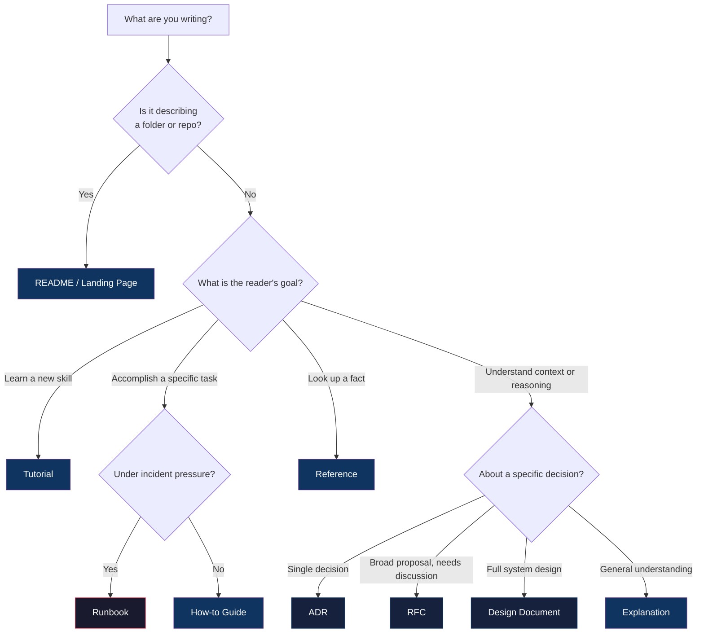
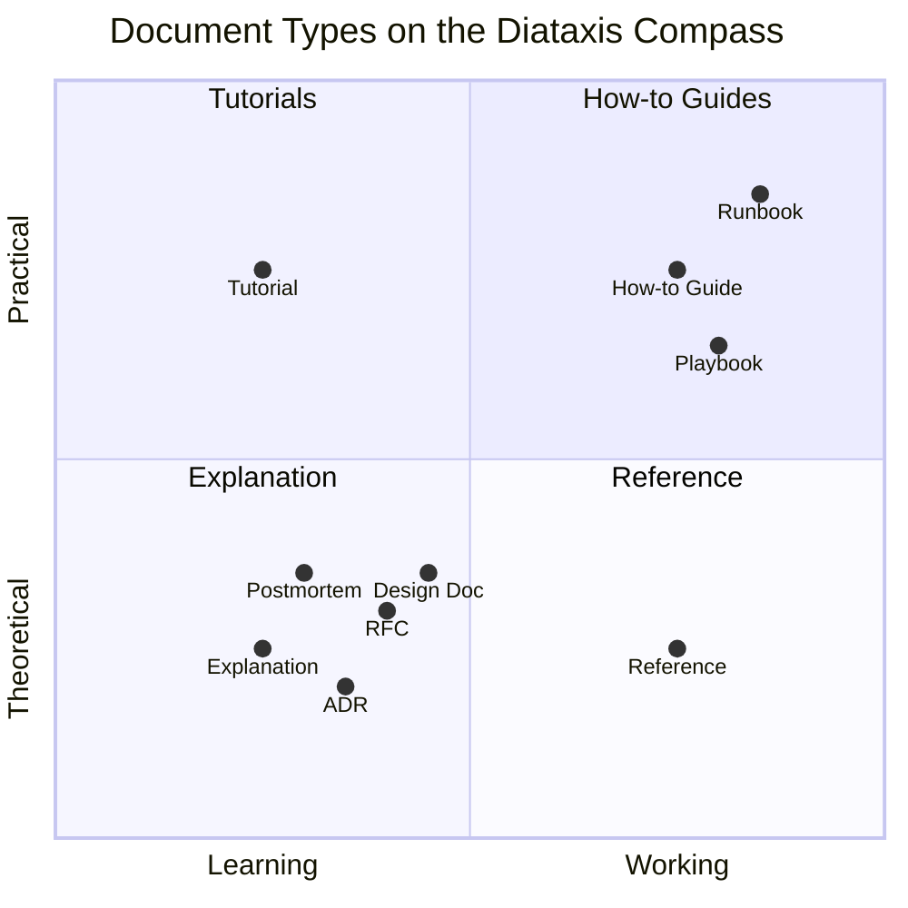

# Document Types

> **Goal:** Define what kinds of documents exist, when to use each, and how to classify them — so humans find what they need and AI agents parse the right context. Every recommendation here is backed by a published source; if you think one is wrong, check the [references](#15-sources-and-references) before opening an issue.

---

## 1. Why document types matter

A document should have **one purpose**. Mix types and you get "Franken-docs" — a tutorial that suddenly turns into an API reference, a runbook that digresses into architecture explanation, a README that tries to be everything at once. I've seen this kill documentation cultures. The reader loses context, the AI agent extracts the wrong information, and six months later nobody trusts the docs because they can't find anything.

Google learned this the hard way. Their *Software Engineering at Google* ([Chapter 10](https://abseil.io/resources/swe-book/html/ch10.html)) describes how early Google teams had "monolithic wiki pages with bunches of links (many broken or obsolete), some conceptual information about how the system worked, an API reference, and so on, all sprinkled together. Such documents fail because they don't serve a single purpose." Their fix was the "one purpose per document" rule — and it's the single most impactful principle in documentation architecture.

Daniele Procida, creator of the [Diataxis framework](https://diataxis.fr/), came at it differently: "There isn't one thing called documentation, there are four." His [PyCon Australia 2017 talk](https://www.youtube.com/watch?v=t4vKPhjcMZg) argued that mixing types is the root cause of most documentation problems — and the widespread adoption of his framework proved him right.

There's a reason this works beyond "it feels right." When you mix document types, you're forcing the reader to constantly switch between "learning mode," "doing mode," and "looking things up mode." Cognitive science calls this extraneous load — unnecessary mental overhead caused by bad design, not hard material ([Sweller, 1988](https://en.wikipedia.org/wiki/Cognitive_load)). Separate the types and you cut the overhead. [NNg's research](https://www.nngroup.com/articles/minimize-cognitive-load/) confirmed it in practice: reducing clutter and matching established mental models improved task completion across all literacy levels.

### 1.1 The cost of getting this wrong

Here's what actually happens when you don't think about document types:

* **Users can't find things.** [NNg's information scent research](https://www.nngroup.com/articles/information-scent/) shows that users follow "scent" — trigger words and structural cues — to navigate. When a tutorial and a reference live in the same document, the scent is mixed, and users bounce.
* **AI agents extract wrong context.** [Kapa.ai](https://kapa.ai/) found that when documentation mixes types, RAG (Retrieval-Augmented Generation) systems retrieve chunks that blend tutorial steps with reference specs, producing confused answers. Well-typed documents with clear headings produce significantly better retrieval results.
* **Maintenance becomes impossible.** A document that serves three purposes needs updating for three different reasons. Nobody updates it for all three. It drifts. It becomes the doc everyone knows is wrong but nobody fixes.
* **McKinsey's research** found that knowledge workers spend [9.3 hours per week](https://www.mckinsey.com/industries/technology-media-and-telecommunications/our-insights/the-social-economy) searching for and gathering information. Good document typing is the single biggest lever for reducing that number.

### 1.2 Document types for AI agents

This is where typed documentation stops being a nice-to-have. AI coding agents need to know *what kind of document they're reading* to use it correctly. An ADR tells an agent "this decision is settled, don't propose alternatives." A tutorial tells an agent "this is pedagogical, don't treat it as a spec." A reference doc says "these are the facts, trust them."

Without type information, agents dump everything into the same context window and treat it all equally. I've watched agents cite a getting-started tutorial as if it were an architecture spec, then generate code that matched the tutorial but broke the actual system. [Redocly](https://redocly.com/) found that clear heading hierarchies and document typing significantly improve how LLMs build mental models of a codebase. The [llms.txt specification](https://llmstxt.org/) (Jeremy Howard, 2024) exists for this reason — AI tools need structured pointers to the right kind of documentation, and the `type` frontmatter field is what makes filtering possible.

> For how AI agents consume documentation context, see [04-AI_AGENTS.md](./04-AI_AGENTS.md). For how to structure ADRs specifically for AI consumption, see [33-ADR.md](./33-ADR.md).

---

## 2. Two dimensions: Type and Category

Every document has two independent classification dimensions:

* **Type** — the format and structure of the document. *What the document IS.* A tutorial, a reference, an ADR, a runbook.
* **Category** — the subject domain the document covers. *What the document is ABOUT.* Security, infrastructure, API design, data pipelines.

This distinction isn't something I invented. Librarians figured it out almost a century ago — [Ranganathan's classification system](https://en.wikipedia.org/wiki/Colon_classification) (1933) separated "form" (what a work IS) from "subject" (what it is ABOUT) as independent facets. [Dublin Core](https://www.dublincore.org/specifications/dublin-core/dcmi-terms/), the international metadata standard, has separate fields for `type` and `subject`. [DITA](https://docs.oasis-open.org/dita/dita/v1.3/errata02/os/complete/part3-all-inclusive/archSpec/technicalContent/dita-technicalContent-InformationTypes.html), the OASIS documentation standard, separates **topic types** (concept, task, reference) from **subject schemes** (the taxonomy that says what domain you're in). Every major system that has solved this problem arrived at the same answer: type and category are different things, track them separately.

### 2.1 Why this matters in practice

A security tutorial and an API tutorial are both tutorials — same structure, same writing rules, same reader expectations. But they cover different domains. A security tutorial and a security reference are both about security — but they serve completely different purposes and need completely different structures.

I've seen teams get this wrong in two ways. You end up with a `security/` folder that mixes tutorials, references, runbooks, and ADRs — nobody can find anything. Or you end up with a `tutorials/` folder that mixes security, infrastructure, and API content — nobody knows which domain they're in.

The fix: classify documents on both dimensions independently, using YAML frontmatter.

### 2.2 Frontmatter schema

```yaml
---
title: "Configuring mTLS between services"
type: "how-to"          # Document type (structure/format)
category: "security"     # Subject domain
status: "approved"
owner: "@platform-team"
classification: "internal"
created: "2026-01-15"
last_updated: "2026-03-10"
version: "1.0.0"
tags: ["infrastructure", "networking"]  # Secondary concerns
---
```

The `type` field determines the document's structure — which template to use, which sections are required, what writing style to apply. The `category` field determines the subject domain — where the document lives in your information architecture, who the subject-matter expert is, and which team owns it. Both fields are required. If you skip `type`, your doc has no structure. If you skip `category`, nobody knows who owns it.

---

## 3. Core frameworks

Three frameworks dominate how the industry thinks about document types. You don't need to pick one — they work at different levels and complement each other.

### 3.1 Diataxis (information architecture)

The [Diataxis framework](https://diataxis.fr/) by Daniele Procida is the most widely adopted documentation architecture in open source. If you only learn one framework, learn this one. It classifies documentation along two axes into four types:

|  | Acquisition (Learning) | Application (Working) |
|---|---|---|
| **Practical (Action)** | Tutorial | How-to Guide |
| **Theoretical (Cognition)** | Explanation | Reference |

Diataxis has been adopted by [Django](https://docs.djangoproject.com/), [Canonical/Ubuntu](https://ubuntu.com/blog/diataxis-a-new-foundation-for-canonical-documentation), [Cloudflare](https://blog.cloudflare.com/new-dev-docs/) (who called it their "north star for information architecture"), [NumPy](https://numpy.org/doc/stable/dev/howto-docs.html), [Python (CPython)](https://discuss.python.org/t/adopting-the-diataxis-framework-for-python-documentation/15072), [Qiskit (IBM Quantum)](https://qiskit.github.io/qiskit_sphinx_theme/), and [hundreds of other projects](https://diataxis.fr/colophon/).

Procida's core insight: "However hard you work on documentation, it won't work for your software — unless you do it the right way." The framework works because it maps to how humans actually use documentation — sometimes you're learning, sometimes you're doing, sometimes you're looking something up, sometimes you're trying to understand why.

**Criticism:** The framework [has limitations](https://idratherbewriting.com/blog/what-is-diataxis-documentation-framework). Tom Johnson (I'd Rather Be Writing) notes limited empirical validation. [Emmanuel Bernard](https://emmanuelbernard.com/blog/2024/12/19/diataxis/) recommends "soft applying it" rather than treating it religiously. [Guido van Rossum](https://discuss.python.org/t/adopting-the-diataxis-framework-for-python-documentation/15072) raised practical concerns about handling documents that naturally span multiple types. And Procida himself warns: "the first thing Diataxis does is make existing documentation look worse, not better." These are fair criticisms — which is why this standard extends Diataxis with additional types (ADRs, RFCs, runbooks, READMEs) rather than using it as the sole organizing principle.

### 3.2 Google's five document types (content design)

Google's *Software Engineering at Google* ([Chapter 10](https://abseil.io/resources/swe-book/html/ch10.html)) defines five types based on internal documentation practices at scale:

| Type | Purpose | Key Rule |
|------|---------|----------|
| **Reference** | Document usage of code (API docs, comments) | Structure must mirror the code it documents |
| **Design Documents** | Record design decisions before implementation | Written before code, reviewed by stakeholders |
| **Tutorials** | Learning-oriented, step-by-step for skills | Must work end-to-end — broken tutorials are worse than none |
| **Conceptual** | Deep explanations of the "why" | Augments (doesn't replace) reference docs |
| **Landing Pages** | Navigation only — be a "traffic cop" | Zero substantive content; links and brief descriptions only |

The "traffic cop" metaphor for landing pages is one of Google's most useful contributions. A landing page that tries to explain things is a landing page that fails — its only job is to route readers to the right document.

### 3.3 DITA (formal standard)

[DITA](https://docs.oasis-open.org/dita/dita/v1.3/errata02/os/complete/part3-all-inclusive/archSpec/technicalContent/dita-technicalContent-InformationTypes.html) (Darwin Information Typing Architecture) is the OASIS standard for documentation typing. It's heavy — XML-based, enterprise-oriented — but the typing system underneath is solid and worth knowing about. Five core topic types:

| Topic Type | Definition (per OASIS spec) | Maps to Diataxis |
|-----------|---------------------------|-----------------|
| **Concept** | "Answer 'What is...?' questions" — explanatory information | Explanation |
| **Task** | "Answer 'How do I?' questions" — well-defined procedure structure | How-to Guide |
| **Reference** | "Describe regular features of a subject or product" | Reference |
| **Glossary Entry** | "Define a single sense of one term" | Reference (subset) |
| **Troubleshooting** | "Corrective action information such as troubleshooting and alarm clearing" | How-to Guide (subset) |

DITA's key architectural principle: it is "specializable, which allows for the introduction of specific semantics for specific purposes" — you can extend the base types without breaking the system. That's exactly what this standard does with operational types like runbooks, ADRs, and RFCs.

### 3.4 Cross-framework comparison

| Framework | Focus | Types | Strength | Limitation |
|-----------|-------|-------|----------|------------|
| **Diataxis** | Information architecture | 4 | Elegant, widely adopted | Doesn't cover operational docs (runbooks, ADRs) |
| **Google SWE** | Content design at scale | 5 | Pragmatic, battle-tested | Google-specific, less formalized |
| **DITA** | Formal standard | 5 | Rigorous, specializable | Heavy, XML-centric, steep learning curve |
| **GitHub Docs** | Content model | 7 | Most granular public model | GitHub-specific |
| **Kubernetes** | Contributor guide | 4 | Clean Diataxis mapping | Project-specific |
| **Information Mapping** | Structured writing | 7 | Cognitive science foundations | Commercial, dated |

---

## 4. Document types

This standard defines twelve document types. You don't need all twelve — most projects use 4-6. The types are organized into three groups: **core types** (the Diataxis four that every project should know about), **decision and design types** (for architecture and engineering decisions), and **operational types** (for running systems in production).

### 4.1 Core types

#### Tutorial

**Purpose:** Help someone *learn* by doing something meaningful. Not about producing a result — about building understanding.

**Key characteristics:**

* Learning-oriented, practical
* The teacher bears responsibility for success — not the student
* Every step produces a visible, comprehensible result
* Never explains *why* during the lesson — that kills the learning flow

**Language:** "We will...", "In this tutorial...", "First, do X. Now, do Y."

> Procida's [cooking analogy](https://diataxis.fr/tutorials/): "It really doesn't matter what the child makes, or how correctly they do it. The value of a lesson lies in what the child gains, not what they produce."

**Common mistakes:** Explaining too much (breaking the flow), steps that don't produce visible output, assuming knowledge the reader doesn't have. Procida warns: "One must see it for oneself, to see the focused attention of a student dissolve into air, when a teacher's well-intentioned explanation breaks the magic spell of learning."

**Who does this well:** [Stripe](https://docs.stripe.com/get-started) (quickstarts), [Twilio](https://www.twilio.com/docs) (tutorials with sub-20-line initial code samples had [30% higher completion rates](https://www.twilio.com/en-us/blog/new-era-for-twilio-documentation)).

#### How-to guide

**Purpose:** Help someone *accomplish a specific task*. Assumes competence. Gets to the point.

**Key characteristics:**

* Goal-oriented, practical
* Assumes the reader already knows what they want to do
* Excludes teaching and historical context
* Titles must be action-focused: "How to configure mTLS" — not "mTLS Configuration"

**Language:** Imperative. "Run the migration script." "Add the following to your config."

> Diataxis compares how-to guides to recipes: they "exclude teaching and historical context" and "assume basic competence from the user." The best how-to documentation "appears to anticipate the user" — like "a helper who has the tool you were about to reach for, ready to place it in your hand."

**Common mistakes:** Teaching (that's a tutorial), explaining why (that's explanation), providing exhaustive detail (that's reference). Keep it focused on the goal.

**Distinction from tutorial:** Tutorials teach; how-to guides assume competence. A tutorial says "Let's learn about database migrations." A how-to guide says "How to run a database migration."

#### Reference

**Purpose:** Describe the machinery. Accurate, complete, structured for lookup — not reading.

**Key characteristics:**

* Information-oriented, applied
* Users *consult* reference material — they don't *read* it
* Structure must mirror the product structure (code-led, not user-need-led)
* Style must be "austere and uncompromising — neutral, objective, factual" ([Diataxis](https://diataxis.fr/reference/))

**Language:** Neutral, precise. "Returns the resource or `404`." "Accepts a JSON body with the following fields."

**Common mistakes:** Mixing recipes or opinions with factual information (Diataxis calls this "literally dangerous"), generating API docs without any explanatory context, letting reference docs go stale relative to the code.

**Who does this well:** [Stripe's three-column layout](https://docs.stripe.com/api) (navigation, explanation, live code examples), auto-generated API docs supplemented with human-written descriptions.

#### Explanation

**Purpose:** Help someone *understand*. Context, reasoning, history, alternatives, trade-offs.

**Key characteristics:**

* Understanding-oriented, theoretical
* Takes a "higher, wider perspective" than other types
* Answers "Can you tell me about...?"
* Admits opinion and perspective — unlike reference, which must be neutral

**Language:** Analytical, discursive. "We chose X because Y." "The trade-off here is..."

> Procida notes that explanation is the most neglected type: "Though less urgent than other types, it is equally important." Without it, "practitioners' craft knowledge becomes loose and fragmented and fragile, and their exercise of it is anxious."

**Maps to:** ADRs, architecture overviews, design rationale, "Background" sections.

### 4.2 Decision and design types

These types extend the core four for engineering decision-making. They all live in the Explanation quadrant of Diataxis but serve distinct purposes.

#### Architecture Decision Record (ADR)

**Purpose:** Capture the "why" behind a single architectural decision.

**Scope:** One decision, one ADR. 1-2 pages. Immutable once accepted.

**Full standard:** [33-ADR.md](./33-ADR.md)

#### Request for Comments (RFC)

**Purpose:** Propose and discuss a change that needs cross-team input before a decision is made.

**Scope:** Broader than an ADR — explores a problem space, gathers feedback, may yield multiple ADRs.

**Full standard:** [34-RFC.md](./34-RFC.md)

#### Design document

**Purpose:** Describe a complete system or feature design before implementation.

**Scope:** 10-20 pages. Covers problem, goals, non-goals, design, alternatives, and trade-offs. [Google](https://www.industrialempathy.com/posts/design-docs-at-google/) uses them for "relatively large or otherwise risky features" — not every change. [Uber](https://blog.pragmaticengineer.com/scaling-engineering-teams-via-writing-things-down-rfcs/), [Meta](https://engineering.fb.com/), and most large engineering organizations have some form of design document process.

**Full standard:** [35-DESIGN_DOCUMENTS.md](./35-DESIGN_DOCUMENTS.md)

**The natural sequence:** A design document explores the design space. An RFC gathers cross-team feedback on a controversial proposal. ADRs capture the specific decisions that emerge. See [33-ADR.md, section 3](./33-ADR.md#3-adrs-vs-rfcs-vs-design-documents) for the full comparison.

### 4.3 Operational types

#### Runbook

**Purpose:** Step-by-step instructions for responding to a specific operational event — an alert firing, a deployment failing, a service degrading.

**Key characteristics:**

* Written for someone under pressure at 3 AM
* Every step must be a command or action, not an explanation
* Assumes the reader has basic access and permissions
* Must be tested and verified — an untested runbook is a liability

**Language:** Urgent, imperative. "Restart the service immediately." "Check the dashboard at [URL]."

> [PagerDuty's runbook standards](https://www.pagerduty.com/resources/learn/what-is-a-runbook/): "Every step should be a command, not a story." The [Google SRE Book](https://sre.google/sre-book/table-of-contents/) treats runbooks as the primary operational documentation artifact.

**Distinction from how-to guide:** A how-to guide is "How to scale the database." A runbook is "DB-001: Database disk usage above 90%." How-to guides are proactive; runbooks are reactive. How-to guides explain a task; runbooks prescribe a response to a specific condition.

#### Playbook

**Purpose:** Decision framework for handling a *class* of situations where judgement is required.

**Key characteristics:**

* Higher-level than a runbook — covers when to escalate, who to notify, what trade-offs to consider
* Includes decision trees, not just steps
* Used for incident response, security events, capacity planning

> [Atlassian](https://www.atlassian.com/incident-management/kbase/incident-management-documentation) distinguishes three documentation types for incident management: runbooks (step-by-step), playbooks (decision frameworks), and postmortems (retrospective analysis). The distinction matters — a runbook says "run this command"; a playbook says "if the error rate exceeds X%, decide between rolling back and scaling up based on these criteria."

#### README

**Purpose:** First-contact document for a repository, directory, or project. Orients the reader and routes them to detailed documentation.

**Key characteristics:**

* Must answer: What is this? How do I use it? Where do I find more?
* Lives at the root of a repository or the top of a directory
* GitHub [truncates READMEs at 500 KiB](https://docs.github.com/en/repositories/managing-your-repositorys-settings-and-features/customizing-your-repository/about-readmes) — keep them focused

> Tom Preston-Werner's [Readme Driven Development](https://tom.preston-werner.com/2010/08/23/readme-driven-development.html) (2010) argued that writing the README first forces you to think about the user experience before writing code: "Until you've written about your software, you have no idea what you'll be coding." The [Standard Readme](https://github.com/RichardLitt/standard-readme) spec by Richard Litt formalizes the expected sections.

**Relationship to landing pages:** A README *is* a landing page for a code repository. Google's "traffic cop" metaphor applies — a README that tries to be a tutorial, reference, and architecture doc all at once serves none of those purposes well. Route readers to the right document instead.

#### Landing page

**Purpose:** Navigation only. Route readers to the right document.

**Key characteristics:**

* Zero substantive content
* Links and brief (one-line) descriptions
* Organized by user need, not by internal structure
* Must be updated when documents are added or removed

> Google's *Software Engineering at Google* describes landing pages as "traffic cops" — their only job is "directing the reader to a more relevant document." [NNg's research on information scent](https://www.nngroup.com/articles/information-scent/) identifies four components: relevance, specificity, credibility, and comprehensiveness. A good landing page maximizes all four by providing clear, descriptive links.

Landing pages take the form of `INDEX.md` files, directory READMEs, or documentation home pages. They fail when they try to explain things instead of routing.

#### Postmortem / Incident report

**Purpose:** Document what went wrong, why, and what changed as a result.

**Key characteristics:**

* Blameless — focus on systems, not individuals
* Must include: timeline, root cause, impact, action items with owners and deadlines
* Written within 48-72 hours of incident resolution

> The [Google SRE Book](https://sre.google/sre-book/postmortem-culture/) established the modern postmortem culture. [Etsy's Debriefing Facilitation Guide](https://extfiles.etsy.com/DebriefingFacilitationGuide.pdf) added the blameless lens that became industry standard.

---

## 5. Document categories

The `category` frontmatter field indicates the subject domain a document covers. Categories are independent of types — a tutorial about security and a reference about security are both in the `security` category, but they're different document types with different structures.

### 5.1 Valid categories

| Category | Description | Example Documents |
|----------|-------------|-------------------|
| **security** | Authentication, authorization, encryption, compliance | Auth flow tutorials, security runbooks, compliance ADRs |
| **infrastructure** | Deployment, networking, cloud, containers, IaC | Terraform guides, Kubernetes references, infra ADRs |
| **api** | API design, endpoints, specifications, integrations | OpenAPI specs, API tutorials, integration how-to guides |
| **data** | Databases, data pipelines, ML, analytics, schemas | Schema references, pipeline runbooks, data model explanations |
| **operations** | Monitoring, SRE, incident response, on-call, SLOs | Runbooks, playbooks, postmortems, SLO dashboards |
| **development** | Code, libraries, SDKs, testing, development practices | Getting started tutorials, coding standards, test guides |
| **architecture** | System design, decisions, technical strategy | ADRs, design docs, architecture overviews |
| **process** | Team workflows, policies, governance, migration | Migration guides, review processes, onboarding |

### 5.2 Multi-category documents

Some documents span multiple domains. When this happens:

1. **Primary category first** — use the most important category in the `category` field
2. **Secondary concerns in tags** — use the `tags` field for additional domains
3. **Consider splitting** — if a document covers more than two domains equally, it's probably trying to do too much

```yaml
---
category: "api"                          # Primary domain
tags: ["security", "authentication"]     # Secondary concerns
---
```

This is the same principle behind [faceted navigation](https://www.nngroup.com/articles/filters-vs-facets/) — let users filter by multiple independent dimensions instead of forcing everything into a single hierarchy. [NNg's taxonomy research](https://www.nngroup.com/articles/taxonomy-101/) found that faceted systems consistently outperform rigid hierarchies for findability.

---

## 6. Anti-patterns

### 6.1 The Franken-doc

You've seen these. The tutorial that suddenly includes 50 lines of API reference. The how-to guide that digresses into architecture history. The README that's actually a tutorial, reference, and design doc stitched together.

Procida identifies the root cause: "a gravitational pull" between types. Reference material "breaks off from describing the machinery to show how to do something." Tutorials "interrupt their own lesson to digress into explanation." It happens naturally, and it's the primary thing this standard exists to prevent.

**Fix:** When you feel the pull to explain something in a how-to guide, write a separate explanation document and link to it. When your tutorial needs a reference table, put the table in a reference doc and link to it.

### 6.2 The wall of text

A document with no clear type, no headings that signal purpose, and no structural conventions. Technically it's documentation. Practically, it's a wall that nobody reads.

[NNg's F-pattern eyetracking research](https://www.nngroup.com/articles/f-shaped-pattern-reading-web-content/) shows that users scan — they don't read. A document without structural cues (headings, type-appropriate sections, clear purpose statement) gets the F-pattern treatment: readers scan the first line of each paragraph and give up.

**Fix:** Every document must have a `type` in its frontmatter and must follow the structural conventions for that type.

### 6.3 Documentation sprawl

Too many document types, too many categories, too many places to look. The opposite problem from mixing types — over-engineering the taxonomy until nobody can figure out where to put a new doc.

**Fix:** Start with 3-5 types from the core set. Add decision types when your team starts making architectural choices. Add operational types when you're running services in production. Don't create a type until you need it.

### 6.4 Empty shells

Procida warns against this explicitly: "It certainly does not mean that you should create empty structures for tutorials/how-to guides/reference/explanation with nothing in them. Don't do that. It's horrible." Having folders labeled "Tutorials" and "How-to Guides" with nothing in them is worse than having no structure at all — it signals that the team doesn't actually write docs.

**Fix:** Only create document types and folder structures for types you're actively using.

### 6.5 The engineer's documentation fallacy

Starting with explanation ("How it works") rather than practical learning. Engineers love explaining how things work — it's natural. But [Sequin](https://blog.sequinstream.com/we-fixed-our-documentation-with-the-diataxis-framework/) found that when they led with conceptual explanations, users called it "tedious, like studying for a test." Nobody grasped the product until they could get their hands on it. John Carroll's research on [Minimalism](https://mitpress.mit.edu/9780262031639/the-nurnberg-funnel/) nailed this decades ago: "Choose an action-oriented approach. Let users start immediately with real tasks."

**Fix:** Lead with tutorials and how-to guides. Explanation supports — it doesn't lead.

---

## 7. Decision tree

Use this to select the right document type:



### Quick decision table

| Question | If Yes → | If No → |
|----------|----------|---------|
| Describing a repository or directory? | README | ↓ |
| Reader responding to an operational event? | Runbook | ↓ |
| Reader needs to make a judgement call during an incident class? | Playbook | ↓ |
| Recording a specific architectural decision? | ADR | ↓ |
| Proposing a change that needs cross-team discussion? | RFC | ↓ |
| Designing a complete system or feature? | Design Document | ↓ |
| Documenting what went wrong and why? | Postmortem | ↓ |
| Describing an API or system interface? | Reference | ↓ |
| Is the reader trying to learn something new? | Tutorial | ↓ |
| Is the reader trying to accomplish a specific task? | How-to Guide | Explanation |

---

## 8. Type-specific writing guidance

Each document type has a voice. Using the wrong voice is almost as bad as mixing types — a chatty runbook kills trust during an incident, and a dry tutorial kills motivation during onboarding. NNg's [tone research](https://www.nngroup.com/articles/tone-voice-users/) found that 52% of desirability scores came from trustworthiness. Match the voice to the type and you get trust for free. See the [tone matrix in Standard 11](./11-STYLE_GUIDE.md) for the full breakdown.

| Type | Voice | Verb Mood | Example |
|------|-------|-----------|---------|
| Tutorial | Encouraging, collaborative | First-person plural | "We're going to deploy our first service." |
| How-to Guide | Practical, imperative | Imperative | "Run the migration script." |
| Reference | Neutral, precise | Indicative | "Returns the resource or `404`." |
| Explanation | Analytical, discursive | Mixed | "We chose X because Y. The trade-off is..." |
| ADR | Analytical, evidence-based | Active voice | "We will use Kafka because..." |
| RFC | Exploratory, questioning | Mixed | "This RFC proposes... Feedback welcome." |
| Design Document | Thorough, structured | Mixed | "The system handles X by..." |
| Runbook | Urgent, imperative | Imperative | "Restart the service immediately." |
| Playbook | Authoritative, conditional | Conditional | "If error rate exceeds 5%, escalate to..." |
| README | Welcoming, concise | Mixed | "This service handles user authentication." |
| Landing Page | Minimal, directive | Imperative | "See [API Reference](./api.md) for endpoints." |
| Postmortem | Factual, blameless | Past tense | "At 14:32 UTC, the auth service began..." |

---

## 9. Frontmatter `type` values

The `type` field in YAML frontmatter uses these controlled values:

| Value | Document Type | Diataxis Quadrant |
|-------|--------------|-------------------|
| `tutorial` | Tutorial | Learning + Practical |
| `how-to` | How-to Guide | Working + Practical |
| `reference` | Reference | Working + Theoretical |
| `explanation` | Explanation | Learning + Theoretical |
| `adr` | Architecture Decision Record | Explanation (specialized) |
| `rfc` | Request for Comments | Explanation (specialized) |
| `design-doc` | Design Document | Explanation (specialized) |
| `runbook` | Runbook | How-to (specialized) |
| `playbook` | Playbook | How-to (specialized) |
| `readme` | README | Landing Page |
| `landing-page` | Landing Page | Navigation |
| `postmortem` | Postmortem / Incident Report | Explanation (specialized) |
| `standard` | Standards document (like this one) | Reference (specialized) |

[GitHub Docs](https://docs.github.com/en/contributing/writing-for-github-docs/using-yaml-frontmatter) validates frontmatter against a schema with a controlled `type` vocabulary — we follow the same pattern. If you need a type not listed here, you probably need one of the existing types. If you genuinely don't, open a PR and make the case.

---

## 10. How industry does it

Every major documentation team arrived at a similar taxonomy independently. That convergence is the evidence — document typing isn't academic theory, it's what happens when smart teams solve the same problem at scale.

| Organization | Types Defined | Notable Pattern | Source |
|-------------|---------------|-----------------|--------|
| **GitHub Docs** | 7 types: conceptual, referential, procedural, quickstart, tutorial, troubleshooting, release note | Most granular public content model; validates type in frontmatter | [Content Model](https://docs.github.com/en/contributing/style-guide-and-content-model/about-the-content-model) |
| **Kubernetes** | 4 types: concept, task, tutorial, reference | Clean Diataxis mapping; KEPs as a distinct design doc type | [Page Content Types](https://kubernetes.io/docs/contribute/style/page-content-types/) |
| **GitLab** | 4 core + extras: concept, task, reference, troubleshooting, tutorial, glossary | Title rules enforced per type; troubleshooting as first-class type | [Topic Types](https://docs.gitlab.com/development/documentation/topic_types/) |
| **Stripe** | Quickstart, guide, API reference, sample project | Three-column API reference layout; built [Markdoc](https://markdoc.dev/) for content types | [Stripe Docs](https://docs.stripe.com/) |
| **AWS** | User guide, developer guide, API reference, getting started, prescriptive guidance, whitepaper | Service-first organization with consistent types per service | [AWS Docs](https://docs.aws.amazon.com/) |
| **Spotify** | TechDocs + Golden Paths | Golden Paths are "opinionated and supported paths to build something" — a tutorial variant | [Golden Paths](https://engineering.atspotify.com/2020/08/how-we-use-golden-paths-to-solve-fragmentation-in-our-software-ecosystem) |
| **Cloudflare** | Diataxis four: tutorial, how-to, reference, explanation | Diataxis as "north star"; migrated 1,600 pages from Gatsby to Hugo | [Blog](https://blog.cloudflare.com/new-dev-docs/) |

The pattern is consistent: **everyone separates "learning" from "doing" from "looking up."** Nobody arrived at this by reading Diataxis — they arrived at it by watching users struggle with mixed documentation and fixing it. The convergence tells you this is real. Quickstarts are increasingly treated as distinct from tutorials — shorter, less formal, for users who already understand the product.

---

## 11. Tutorial vs How-to Guide

These are the two types people confuse most often. The distinction is critical because mixing them produces a document that's too long for someone who knows what they're doing and too terse for someone who's learning.

| Aspect | Tutorial | How-to Guide |
|--------|----------|--------------|
| **Reader's goal** | "Help me learn" | "Help me accomplish this task" |
| **Assumes** | Nothing — the reader is new | Competence — the reader knows the domain |
| **Responsibility** | On the teacher | On the reader |
| **Length** | Longer, explanatory | Shorter, direct |
| **Language** | "We will..." (collaborative) | "Run..." (imperative) |
| **Explains why?** | No — learning by doing | No — just get it done |
| **Diataxis analogy** | Teaching a child to cook | A recipe for an experienced cook |
| **Failure mode** | Reader gets lost | Reader can't find the specific step they need |

### Tutorial example

```markdown
## Your first deployment

In this tutorial, you'll deploy a service to our platform.
By the end, you'll understand how our deployment pipeline works.

### Step 1: Create a configuration file

Create a file called `deploy.yaml` in your project root.
You should see the file appear in your editor's sidebar.

### Step 2: Add the service definition

Add the following to `deploy.yaml`:
...

Notice that the `replicas` field is set to 1. We'll increase
this later when we learn about scaling.
```

### How-to guide example

```markdown
## Deploy a service

1. Create `deploy.yaml` at the project root
2. Add the service definition:
   ```yaml
   service:
     name: my-service
     replicas: 3
   ```
3. Run `platform deploy --config deploy.yaml`
4. Verify: `platform status my-service`

> If deployment fails with `QUOTA_EXCEEDED`, request a quota
> increase in the platform dashboard.
```

---

## 12. Landing pages

Landing pages deserve special attention because they're the most common failure point. A landing page that tries to explain things is a landing page that fails.

### What landing pages do

| Do | Don't |
|----|-------|
| Link to other documents | Contain explanations |
| Provide brief (one-line) descriptions | Duplicate content from linked docs |
| Organize by user need | Include procedures or tutorials |
| Show document hierarchy | Have paragraphs of text |
| Update when documents are added/removed | Become stale |

### Template

```markdown
# [Section Name]

> Brief one-line description of this section.

## Quick Links

| Document | Purpose |
|----------|---------|
| [Getting Started](./getting-started.md) | New user onboarding (tutorial) |
| [API Reference](./api/README.md) | Complete API documentation |
| [Troubleshooting](./troubleshooting.md) | Common issues and fixes |

## By Audience

### New users
- [Installation](./install.md) — Set up your development environment
- [First Steps](./first-steps.md) — Deploy your first service

### Developers
- [Architecture](./architecture.md) — System design and decisions
- [Contributing](./CONTRIBUTING.md) — How to contribute
```

> [NNg's information scent research](https://www.nngroup.com/articles/information-scent/) identifies four components of effective navigation: relevance, specificity, credibility, and comprehensiveness. Good landing pages maximize all four through descriptive link text and clear organization by user need.

---

## 13. Mapping document types to Diataxis

For teams adopting Diataxis, here's how this standard's twelve types map to the four quadrants:



The core four types map directly. The extended types (ADR, RFC, design doc, runbook, playbook, postmortem) are specializations — they inherit the characteristics of their parent quadrant but add structure specific to their use case. An ADR is explanation with a decision template. A runbook is a how-to guide written for someone at 3 AM.

---

## 14. Related documents

| Document | What It Covers |
|----------|---------------|
| [Know Your Audience](./02-KNOW_YOUR_AUDIENCE.md) | Audience analysis — who you're writing for |
| [AI Agents](./04-AI_AGENTS.md) | How AI agents consume documentation context |
| [Style Guide](./11-STYLE_GUIDE.md) | Writing style, tone matrix, tooling |
| [ADRs](./33-ADR.md) | Architecture Decision Record standard |
| [RFCs](./34-RFC.md) | Request for Comments standard |
| [Design Documents](./35-DESIGN_DOCUMENTS.md) | Design document standard |

---

## 15. Sources and references

### Frameworks and standards

| # | Source | URL |
|---|--------|-----|
| 1 | Diataxis Framework (Daniele Procida) | <https://diataxis.fr/> |
| 2 | Diataxis — Tutorials | <https://diataxis.fr/tutorials/> |
| 3 | Diataxis — How-to Guides | <https://diataxis.fr/how-to-guides/> |
| 4 | Diataxis — Reference | <https://diataxis.fr/reference/> |
| 5 | Diataxis — Explanation | <https://diataxis.fr/explanation/> |
| 6 | Diataxis — The Compass | <https://diataxis.fr/compass/> |
| 7 | Diataxis — Quality | <https://diataxis.fr/quality/> |
| 8 | Diataxis — How to Use Diataxis | <https://diataxis.fr/how-to-use-diataxis/> |
| 9 | DITA 1.3 — Information Types (OASIS Standard) | <https://docs.oasis-open.org/dita/dita/v1.3/errata02/os/complete/part3-all-inclusive/archSpec/technicalContent/dita-technicalContent-InformationTypes.html> |
| 10 | DITA — Subject Scheme Maps | <https://docs.oasis-open.org/dita/v1.2/os/spec/archSpec/subjectSchema.html> |
| 11 | ISO/IEC/IEEE 26514:2022 — Design and Development of Information for Users | <https://www.iso.org/standard/77451.html> |
| 12 | ISO/IEC/IEEE 26511:2018 — Requirements for Managers of Information for Users | <https://www.iso.org/standard/73825.html> |
| 13 | Dublin Core Metadata Terms (ISO 15836) — `type` vs `subject` | <https://www.dublincore.org/specifications/dublin-core/dcmi-terms/> |

### Google and industry

| # | Source | URL |
|---|--------|-----|
| 14 | Winters, Manshreck & Wright, *Software Engineering at Google*, Chapter 10 — Documentation | <https://abseil.io/resources/swe-book/html/ch10.html> |
| 15 | Procida, D. "What Nobody Tells You About Documentation" (PyCon AU 2017) | <https://www.youtube.com/watch?v=t4vKPhjcMZg> |
| 16 | Procida, D. "Get Your Documentation Right" (EuroPython 2018) slides | <https://ep2018.europython.eu/media/conference/slides/get-your-documentation-right.pdf> |
| 17 | Canonical — "Diataxis, a new foundation for Canonical documentation" | <https://ubuntu.com/blog/diataxis-a-new-foundation-for-canonical-documentation> |
| 18 | Ubl, M. "Design Docs at Google" (2020) | <https://www.industrialempathy.com/posts/design-docs-at-google/> |
| 19 | Orosz, G. "Engineering Planning with RFCs, Design Documents and ADRs" (*The Pragmatic Engineer*) | <https://newsletter.pragmaticengineer.com/p/rfcs-and-design-docs> |
| 20 | Frazelle, J. "RFD 1: Requests for Discussion" (Oxide Computer) | <https://oxide.computer/blog/rfd-1-requests-for-discussion> |

### Diataxis criticism and discussion

| # | Source | URL |
|---|--------|-----|
| 21 | Johnson, T. "What is Diataxis and should you be using it?" (I'd Rather Be Writing) | <https://idratherbewriting.com/blog/what-is-diataxis-documentation-framework> |
| 22 | Bernard, E. "Exploring Diataxis" (2024) | <https://emmanuelbernard.com/blog/2024/12/19/diataxis/> |
| 23 | van Rossum, G. et al. "Adopting the Diataxis framework for Python documentation" (Python Discourse) | <https://discuss.python.org/t/adopting-the-diataxis-framework-for-python-documentation/15072> |
| 24 | Sequin — "We fixed our documentation with the Diataxis framework" | <https://blog.sequinstream.com/we-fixed-our-documentation-with-the-diataxis-framework/> |
| 25 | Ekline — "A Technical Guide to the Diataxis Framework" | <https://ekline.io/blog/a-technical-guide-to-the-diataxis-framework-for-modern-documentation> |

### Industry implementations

| # | Source | URL |
|---|--------|-----|
| 26 | GitHub Docs — About the Content Model | <https://docs.github.com/en/contributing/style-guide-and-content-model/about-the-content-model> |
| 27 | GitHub Docs — Using YAML Frontmatter | <https://docs.github.com/en/contributing/writing-for-github-docs/using-yaml-frontmatter> |
| 28 | Kubernetes — Page Content Types | <https://kubernetes.io/docs/contribute/style/page-content-types/> |
| 29 | GitLab — Documentation Topic Types | <https://docs.gitlab.com/development/documentation/topic_types/> |
| 30 | Stripe — "How Stripe builds interactive docs with Markdoc" | <https://stripe.com/blog/markdoc> |
| 31 | Cloudflare — "We rebuilt Cloudflare's developer documentation" | <https://blog.cloudflare.com/new-dev-docs/> |
| 32 | Cloudflare — "Working in public — our docs-as-code approach" | <https://blog.cloudflare.com/our-docs-as-code-approach/> |
| 33 | Spotify — "How We Use Golden Paths" | <https://engineering.atspotify.com/2020/08/how-we-use-golden-paths-to-solve-fragmentation-in-our-software-ecosystem> |
| 34 | Spotify — TechDocs in Backstage | <https://backstage.io/docs/features/techdocs/> |
| 35 | NumPy — Documentation how-to guide (Diataxis adoption) | <https://numpy.org/doc/stable/dev/howto-docs.html> |
| 36 | AWS Documentation Homepage | <https://docs.aws.amazon.com/> |
| 37 | Twilio — "A New Era for Twilio's Documentation" | <https://www.twilio.com/en-us/blog/new-era-for-twilio-documentation> |

### Cognitive science and research

| # | Source | URL |
|---|--------|-----|
| 38 | Sweller, J. "Cognitive load during problem solving." *Cognitive Science* 12(2), 1988 | — |
| 39 | NNg — "Minimize Cognitive Load to Maximize Usability" | <https://www.nngroup.com/articles/minimize-cognitive-load/> |
| 40 | NNg — "Information Scent" | <https://www.nngroup.com/articles/information-scent/> |
| 41 | NNg — "F-Shaped Pattern for Reading Web Content" | <https://www.nngroup.com/articles/f-shaped-pattern-reading-web-content/> |
| 42 | NNg — "Tone of Voice Impact on Users" | <https://www.nngroup.com/articles/tone-voice-users/> |
| 43 | NNg — "Taxonomy 101" | <https://www.nngroup.com/articles/taxonomy-101/> |
| 44 | NNg — "Filters vs. Facets: Definitions" | <https://www.nngroup.com/articles/filters-vs-facets/> |
| 45 | Carroll, J.M. *The Nurnberg Funnel: Designing Minimalist Instruction.* MIT Press, 1990 | <https://mitpress.mit.edu/9780262031639/the-nurnberg-funnel/> |
| 46 | Horn, R.E. "Structured Writing as a Paradigm" (Information Mapping, 1998) | — |
| 47 | McKinsey — "The social economy" (9.3 hours/week searching for information) | <https://www.mckinsey.com/industries/technology-media-and-telecommunications/our-insights/the-social-economy> |

### Information architecture

| # | Source | URL |
|---|--------|-----|
| 48 | Rosenfeld, L. & Morville, P. *Information Architecture for the World Wide Web* (4th ed.) | <https://www.oreilly.com/library/view/information-architecture-4th/9781491913529/> |
| 49 | Ranganathan, S.R. Colon Classification (1933) | <https://en.wikipedia.org/wiki/Colon_classification> |
| 50 | Hedden — "Faceted Classification and Faceted Taxonomies" | <https://www.hedden-information.com/faceted-classification-and-faceted-taxonomies/> |
| 51 | Hane, C. "Content Models & Taxonomies: BFFs" (Tanzen Consulting) | <https://www.tanzenconsulting.com/blog/2019/11/25/content-models-amp-taxonomies-bffs> |
| 52 | Lovinger, R. "Content Modelling: A Master Skill." *A List Apart* No. 349, 2012 | <https://alistapart.com/article/content-modelling-a-master-skill/> |
| 53 | Baker, M. *Every Page is Page One.* XML Press, 2013 | — |

### READMEs and operational docs

| # | Source | URL |
|---|--------|-----|
| 54 | Preston-Werner, T. "Readme Driven Development" (2010) | <https://tom.preston-werner.com/2010/08/23/readme-driven-development.html> |
| 55 | Litt, R. Standard Readme specification | <https://github.com/RichardLitt/standard-readme> |
| 56 | GitHub — About READMEs | <https://docs.github.com/en/repositories/managing-your-repositorys-settings-and-features/customizing-your-repository/about-readmes> |
| 57 | Google SRE Book — Table of Contents | <https://sre.google/sre-book/table-of-contents/> |
| 58 | Google SRE Book — Postmortem Culture | <https://sre.google/sre-book/postmortem-culture/> |
| 59 | PagerDuty — "What is a Runbook?" | <https://www.pagerduty.com/resources/learn/what-is-a-runbook/> |
| 60 | Atlassian — Incident Management Documentation | <https://www.atlassian.com/incident-management/kbase/incident-management-documentation> |
| 61 | Etsy — Debriefing Facilitation Guide | <https://extfiles.etsy.com/DebriefingFacilitationGuide.pdf> |

### AI agents and documentation

| # | Source | URL |
|---|--------|-----|
| 62 | llms.txt specification (Jeremy Howard, 2024) | <https://llmstxt.org/> |
| 63 | Redocly — Documentation and LLMs | <https://redocly.com/> |
| 64 | Kapa.ai — RAG for documentation | <https://kapa.ai/> |

---

**Previous:** [02 - Know Your Audience](./02-KNOW_YOUR_AUDIENCE.md)
**Next:** [04 - AI Agents](./04-AI_AGENTS.md)
