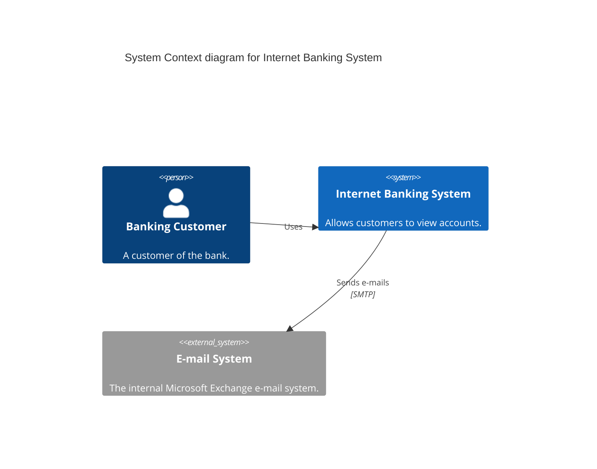
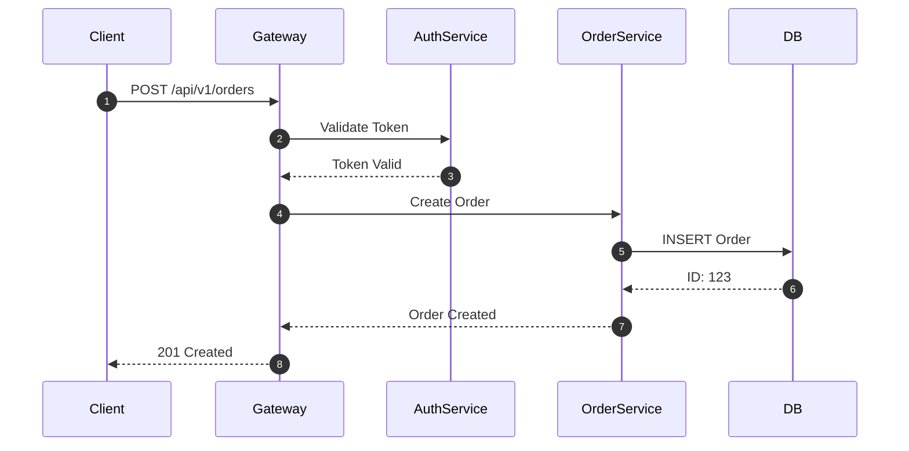

# Visual Communication & Diagrams

> **Goal:** Treat "Diagrams as Code." Visual assets should be version-controlled, searchable, and consistent. Avoid binary blobs (PNG/JPG) for technical diagrams.

---

## 1. The Standard: Mermaid.js

We use **Mermaid.js** exclusively for architectural, sequence, and flow diagrams.

**Why?**

* **Version Control:** Text-based source means diffs are readable in PRs.
* **Maintenance:** No proprietary tools (Visio, Lucidchart) required to edit.
* **Consistency:** Styling is CSS-driven, ensuring brand consistency automatically.
* **Searchability:** Text inside diagrams is indexed by search engines.

**Exceptions:**

* Screenshots (UI states)
* High-fidelity marketing assets
* Complex cloud topology (allow C4-PlantUML if strict C4 adherence needed)

---

## 2. Architectural Framework: C4 Model

For system architecture, we adhere to the **C4 Model** levels 1-3.

### Level 1: System Context

**Audience:** Non-technical, Managers.
**Show:** System + Users + External Systems.



### Level 2: Container

**Audience:** Architects, Developers.
**Show:** Applications, Databases, Microservices.

```mermaid
graph TD
    User -->|HTTPS| WebApp[Web App (React)]
    WebApp -->|JSON/API| API[API Gateway (FastAPI)]
    API -->|gRPC| Auth[Auth Service]
    API -->|SQL| DB[(PostgreSQL)]
```

### Level 3: Component

**Audience:** Developers.
**Show:** Controllers, Services, Repositories within a container.

---

## 3. Sequence Diagrams (The Interactions)

Use sequence diagrams for **every** complex protocol or multi-service flow.

**Rule:** If a flow involves > 2 services, it needs a sequence diagram.



---

## 4. Accessibility for Visuals

**Rule:** Every diagram must have a textual description or adjacent summary.

* Mermaid renders accessible SVGs, but complex logic needs prose explanation.
* **Do not** rely solely on the diagram to convey critical architectural constraints.

**Example:**
> "The following sequence diagram illustrates the order creation flow. Note specifically step 4, where the database transaction is committed before the confirmation email is sent."

---

## 5. File Formats

| Asset Type | Preferred Format | Forbidden |
|------------|------------------|-----------|
| **Architecture** | Mermaid (Code) | Gliffy, Visio |
| **Screenshots** | WEBP | BMP, TIFF |
| **Logos/Icons** | SVG | JPG |
| **Photos** | JPG/WEBP | PNG (too large) |

---

## 6. Related Documents

| Document | Purpose |
|----------|---------|
| [Accessibility](./10-ACCESSIBILITY.md) | Alt text rules |
| [Document Types](./03-DOCUMENT_TYPES.md) | When to use architecture docs |

---

**Previous:** [13 - Feedback](./13-FEEDBACK.md)
**Next:** [15 - CLI Tools](./15-CLI_TOOLS.md)
