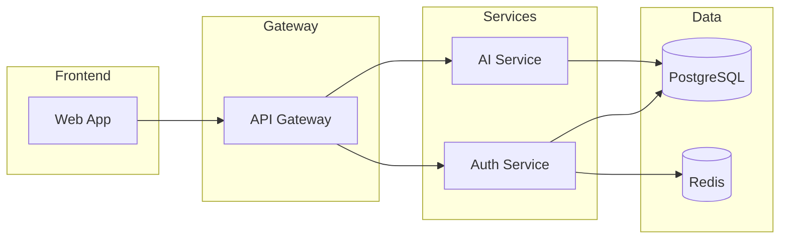

# Service Catalog Standard

> 💡 **Open Source Projects:** This standard is optional for most OSS projects.
> See [36-CONTEXT_GUIDANCE](./36-CONTEXT_GUIDANCE.md) for what you actually need.

> **Goal:** Document microservices in a consistent, machine-readable format for Internal Developer Portals (IDPs) and service discovery.

---

## 1. Why Service Catalogs Matter

In microservices architectures, developers need to:

- **Discover** what services exist
- **Understand** dependencies and ownership
- **Connect** to the right APIs
- **Contact** the right team when issues arise

A service catalog is the **single source of truth** for all services.

---

## 2. Required Service Metadata

Every service MUST have a `catalog-info.yaml` (Backstage format) or equivalent:

```yaml
# catalog-info.yaml (Backstage format)
apiVersion: backstage.io/v1alpha1
kind: Component
metadata:
  name: backend-gateway
  title: Backend Gateway
  description: API gateway handling authentication and routing
  annotations:
    github.com/project-slug: org/your-gateway
    pagerduty.com/service-id: P1234567
    grafana/dashboard-url: https://grafana.example.com/d/gateway
  tags:
    - python
    - fastapi
    - tier-1
  links:
    - url: https://docs.example.com/gateway
      title: Documentation
    - url: https://api.example.com/gateway/health
      title: Health Check
spec:
  type: service
  lifecycle: production
  owner: team-backend
  system: platform-name
  providesApis:
    - gateway-api
  consumesApis:
    - auth-api
    - ai-service-api
  dependsOn:
    - resource:default/postgres-main
    - resource:default/redis-cache
```

---

## 3. Required Fields

### Minimum Viable Catalog Entry

| Field | Required | Description |
|-------|----------|-------------|
| `name` | ✅ | Unique identifier (kebab-case) |
| `title` | ✅ | Human-readable name |
| `description` | ✅ | One-line purpose statement |
| `owner` | ✅ | Team or individual (matches CODEOWNERS) |
| `lifecycle` | ✅ | `experimental`, `production`, `deprecated` |
| `type` | ✅ | `service`, `website`, `library`, `tool` |

### Recommended Fields

| Field | Purpose |
|-------|---------|
| `tags` | Technology stack, tier, domain |
| `providesApis` | APIs this service exposes |
| `consumesApis` | APIs this service calls |
| `dependsOn` | Databases, caches, queues |
| `links` | Documentation, dashboards, runbooks |
| `annotations` | Tool integrations (PagerDuty, Grafana, etc.) |

---

## 4. Service Types

### Standard Types

| Type | Description | Example |
|------|-------------|---------|
| `service` | Backend microservice | API, worker |
| `website` | Frontend application | Dashboard, portal |
| `library` | Shared code package | SDK, utilities |
| `tool` | Internal tooling | CLI, scripts |
| `resource` | Infrastructure | Database, queue |
| `api` | API definition | OpenAPI spec |

---

## 5. Dependency Documentation

### Service Dependency Diagram

Generate from catalog using Mermaid:



### Dependency Matrix

For complex systems, maintain a dependency matrix:

| Service | Depends On | Depended By | Criticality |
|---------|------------|-------------|-------------|
| API Gateway | Auth, AI | Web App | P0 |
| Auth Service | PostgreSQL, Redis | Gateway | P0 |
| AI Service | PostgreSQL | Gateway | P1 |

---

## 6. Ownership Rules

### Team Ownership

```yaml
# catalog-info.yaml
spec:
  owner: group:backend-team  # Prefixed with group:
  # OR
  owner: user:john.doe       # Individual (temporary only)
```

### Escalation Path

Document in service README:

```markdown
## Ownership & Support

| Level | Contact | Response SLA |
|-------|---------|--------------|
| **Primary** | @backend-team | 30 min (P0) |
| **Secondary** | @platform-team | 2 hours |
| **Escalation** | @engineering-leads | 4 hours |
```

---

## 7. Health & Status

### Service Health Annotations

```yaml
metadata:
  annotations:
    # Monitoring
    prometheus.io/scrape: "true"
    prometheus.io/path: "/metrics"

    # Dashboards
    grafana/dashboard-url: "https://grafana.example.com/d/svc-gateway"

    # Alerting
    pagerduty.com/service-id: "P1234567"
    opsgenie.com/team: "backend-team"

    # Runbooks
    runbook/url: "https://docs.example.com/runbooks/gateway"
```

### SLO Documentation

Link to SLO definitions:

```yaml
metadata:
  links:
    - url: https://docs.example.com/slo/gateway
      title: SLO Dashboard
      icon: dashboard
```

---

## 8. Internal Developer Portal Integration

### Backstage Requirements

For Backstage IDP:

1. `catalog-info.yaml` at repo root
2. Register in `app-config.yaml` locations
3. Refresh schedule configured

### Port.io Requirements

For Port IDP:

1. `.port/spec.yaml` or blueprints
2. Entity definitions matching catalog schema
3. Scorecards for quality tracking

---

## 9. Catalog Validation

### CI Check

```yaml
# .github/workflows/catalog-validate.yml
- name: Validate catalog-info.yaml
  run: |
    npx @backstage/cli catalog:validate catalog-info.yaml
```

### Required Checks

| Check | Tool | Failure Behavior |
|-------|------|------------------|
| Schema valid | Backstage CLI | ❌ Block PR |
| Owner exists | Custom script | ❌ Block PR |
| Links reachable | Link checker | ⚠️ Warning |
| APIs documented | OpenAPI lint | ❌ Block PR |

---

## 10. Template

### Minimal catalog-info.yaml

```yaml
apiVersion: backstage.io/v1alpha1
kind: Component
metadata:
  name: my-service
  title: My Service
  description: Brief description of what this service does
  tags:
    - python
spec:
  type: service
  lifecycle: production
  owner: team-name
```

---

## 11. TechDocs Integration (Backstage)

### Directory Structure

For Backstage TechDocs, maintain this structure:

```
service-repo/
├── catalog-info.yaml
├── docs/
│   ├── index.md           # Required: Main entry point
│   ├── getting-started.md
│   ├── architecture.md
│   └── mkdocs.yml         # TechDocs configuration
└── README.md
```

### mkdocs.yml Template

```yaml
site_name: 'Service Name'
site_description: 'Service documentation'

nav:
  - Home: index.md
  - Getting Started: getting-started.md
  - Architecture: architecture.md
  - API Reference: api/openapi.md

plugins:
  - techdocs-core

markdown_extensions:
  - admonition
  - pymdownx.superfences:
      custom_fences:
        - name: mermaid
          class: mermaid
          format: !!python/name:pymdownx.superfences.fence_code_format
```

### Entity Annotation

Add TechDocs annotation to `catalog-info.yaml`:

```yaml
metadata:
  annotations:
    backstage.io/techdocs-ref: dir:.
    # For external docs:
    # backstage.io/techdocs-ref: url:https://github.com/org/repo/tree/main/docs
```

### Validation

```yaml
# CI check for TechDocs
- name: Validate TechDocs
  run: |
    npx @techdocs/cli generate --no-docker
    npx @techdocs/cli publish --local
```

---

## 12. Service Structure Metadata

### Catalog Metadata for Structure Compliance

Add structure validation annotations to `catalog-info.yaml`:

```yaml
metadata:
  annotations:
    # Structure validation
    structure/entry-point: "main.py"
    structure/version: "1.0"  # Canonical structure version

    # Python-specific
    python/framework: "fastapi"
    python/version: "3.11"
    python/package-manager: "uv"  # or "pip"
```

### Service Health Indicators

Track microservice quality with these scorecards:

```yaml
# Port.io scorecard example
metadata:
  annotations:
    port.io/scorecard: |
      - identifier: "structure-compliance"
        title: "Structure Compliance"
        rules:
          - identifier: "uses-main-py"
            title: "Uses main.py entry point"
            level: "Gold"
          - identifier: "has-core-package"
            title: "Has core/ utilities package"
            level: "Gold"
          - identifier: "has-init-files"
            title: "All packages have __init__.py"
            level: "Silver"
```

---

## 13. Related Documents

| Document | Purpose |
|----------|---------|
| [API Documentation](./18-API_DOCUMENTATION.md) | API spec requirements |
| [Operations](./06-OPERATIONS.md) | Runbook linking |
| [Governance](./07-GOVERNANCE.md) | Ownership model |
| [Infrastructure Code](./25-INFRASTRUCTURE_CODE.md) | Microservice structure standard |
| [Microservice Best Practices](../learning/MICROSERVICE_ARCHITECTURE_BEST_PRACTICES.md) | Comprehensive architecture guide |

---

**Previous:** [20 - Anti-Patterns](./20-ANTI_PATTERNS.md)
**Next:** [22 - CI/CD Pipelines](./22-CICD_PIPELINES.md)
