> **Goal:** Every CI/CD pipeline should be self-documenting. Developers must understand what runs, when, and why without reading YAML line-by-line.

---

## 1. Pipeline Overview Documentation

### Required README

Every `.github/workflows/` or `.gitlab-ci.yml` directory needs a `README.md`:

```markdown
# CI/CD Pipelines

## Pipeline Overview

| Workflow | Trigger | Purpose | Duration |
|----------|---------|---------|----------|
| `ci.yml` | Push to any branch | Lint, test, build | ~5 min |
| `deploy-staging.yml` | Merge to `main` | Deploy to staging | ~8 min |
| `deploy-prod.yml` | Release tag | Deploy to production | ~10 min |
| `security-scan.yml` | Daily at 2 AM | SAST/DAST scanning | ~15 min |

### Required Pipeline Checks

Every production pipeline MUST include these checks:

| Check | Purpose | Failure | Tool |
|-------|---------|---------|------|
| **Linting** | Code style | Block | `ruff`, `eslint` |
| **Tests** | Correctness | Block | `pytest`, `vitest` |
| **Changelog** | Documentation update | Block | `check-changelog.sh` |
| **Security** | Vulnerabilities | Block | `trivy`, `dependabot` |

## Environment Matrix

| Environment | Branch/Trigger | URL | Approvals |
|-------------|----------------|-----|-----------|
| Development | Feature branches | dev.example.com | None |
| Staging | `main` branch | staging.example.com | None |
| Production | Release tags | example.com | 2 required |

## Secrets Required

| Secret | Source | Rotation | Used By |
|--------|--------|----------|---------|
| `AWS_ACCESS_KEY_ID` | AWS IAM | 90 days | deploy-* |
| `DOCKER_TOKEN` | Docker Hub | Annual | ci.yml |
| `SONAR_TOKEN` | SonarCloud | Never | security-scan |
```

---

## 2. Individual Pipeline Documentation

### Inline Header Comments

Every workflow file MUST start with documentation:

```yaml
# ==============================================================================
# CI Pipeline - Build, Test, Lint
# ==============================================================================
#
# TRIGGERS:
#   - Push to any branch
#   - Pull request to main
#
# WHAT IT DOES:
#   1. Lints code with ruff (Python) and eslint (TypeScript)
#   2. Runs unit tests with pytest and vitest
#   3. Builds Docker images (no push on PR)
#   4. Uploads coverage to Codecov
#
# DURATION: ~5 minutes
#
# SECRETS REQUIRED:
#   - CODECOV_TOKEN: For coverage upload
#
# TROUBLESHOOTING:
#   - See docs/ci/TROUBLESHOOTING.md
#
# OWNER: @devops-team
# LAST REVIEWED: 2025-12-01
# ==============================================================================

name: CI
on:
  push:
    branches: ['**']
  pull_request:
    branches: [main]
```

---

## 3. Job Documentation

### Document Each Job

```yaml
jobs:
  # ============================================================================
  # LINT JOB
  # Runs static analysis to catch issues before tests
  # Duration: ~1 min | Parallelizable: Yes
  # ============================================================================
  lint:
    name: "🔍 Lint Code"
    runs-on: ubuntu-latest
    steps:
      - uses: actions/checkout@v4

      # Why: Cache dependencies for faster builds
      - name: Cache dependencies
        uses: actions/cache@v4
        with:
          path: ~/.cache/pip
          key: ${{ runner.os }}-pip-${{ hashFiles('**/requirements*.txt') }}

      # Why: ruff is 10-100x faster than pylint/flake8
      - name: Run Python linter
        run: ruff check src/

  # ============================================================================
  # TEST JOB
  # Runs full test suite with coverage
  # Duration: ~3 min | Requires: Database service
  # ============================================================================
  test:
    name: "🧪 Run Tests"
    needs: [lint]  # Only test if lint passes
    runs-on: ubuntu-latest
    services:
      # Why: Integration tests need PostgreSQL
      postgres:
        image: postgres:15
        env:
          POSTGRES_PASSWORD: postgres
```

---

## 4. Step Documentation

### Comment Non-Obvious Steps

```yaml
steps:
  # Standard checkout - no comment needed
  - uses: actions/checkout@v4

  # WHY: Fetch full history for semantic-release version detection
  - uses: actions/checkout@v4
    with:
      fetch-depth: 0

  # WHY: Node 20 required for native fetch API in tests
  - uses: actions/setup-node@v4
    with:
      node-version: '20'

  # WHY: Prevent rate limiting from npm registry
  - name: Configure npm registry
    run: |
      echo "//registry.npmjs.org/:_authToken=${{ secrets.NPM_TOKEN }}" > ~/.npmrc

  # WHY: Matrix strategy splits tests across 4 runners for speed
  - name: Run tests (shard ${{ matrix.shard }}/4)
    run: pytest --shard=${{ matrix.shard }}/4
```

---

## 5. Environment & Deployment Docs

### Deployment Pipeline Requirements

```yaml
# ==============================================================================
# PRODUCTION DEPLOYMENT
# ==============================================================================
#
# PRE-REQUISITES:
#   - All CI checks passing
#   - Release tag created (vX.Y.Z format)
#   - Changelog updated
#
# DEPLOYMENT STRATEGY:
#   - Blue-green deployment via AWS ECS
#   - 10% canary → 50% → 100% rollout
#   - Automatic rollback on health check failure
#
# ROLLBACK:
#   - Automatic: If health checks fail within 5 min
#   - Manual: Run workflow with rollback=true input
#
# POST-DEPLOYMENT:
#   - Slack notification to #deployments
#   - Datadog deployment event marker
#   - Automated smoke tests
#
# EMERGENCY CONTACTS:
#   - Primary: @sre-oncall
#   - Escalation: #incident-response
# ==============================================================================
```

---

## 6. Pipeline Diagrams

### Mermaid Pipeline Visualization

Include in README:

```mermaid
flowchart LR
    subgraph PR["Pull Request"]
        Lint[🔍 Lint]
        Test[🧪 Test]
        Build[🏗️ Build]
    end

    subgraph Merge["Merge to Main"]
        DeployStage[🚀 Deploy Staging]
        SmokeTest[💨 Smoke Tests]
    end

    subgraph Release["Release Tag"]
        DeployProd[🚀 Deploy Prod]
        Notify[📢 Notify]
    end

    Lint --> Test --> Build
    Build -->|Merge| DeployStage --> SmokeTest
    SmokeTest -->|Tag| DeployProd --> Notify
```



### Complex Pipeline Example


---

## 7. Supply Chain Security (New 2025)

### SBOM Generation

Every build pipeline MUST generate a Software Bill of Materials (SBOM) to track components and vulnerabilities.

* **Format:** CycloneDX (preferred) or SPDX.
* **Timing:** Generate at build time, before packaging.
* **Storage:** Store as a build artifact alongside the binary/image.

```yaml
# GitHub Actions Example
- name: Generate SBOM (CycloneDX)
  uses: CycloneDX/gh-actions/sbom@v1
  with:
    path: ./package.json  # or ./pom.xml, ./go.mod
    output: sbom.json
```

### Artifact Signing & Attestation

* **Signing:** Cryptographically sign all artifacts (images, binaries, SBOMs).
* **Attestation:** Generate build provenance (SLSA) to prove *where* and *how* the artifact was built.

```yaml
# Sign with Cosign (Sigstore)
- name: Sign image
  run: cosign sign --key env://COSIGN_PRIVATE_KEY ${{ env.IMAGE_DIGEST }}
```

### SLSA Provenance Levels

Document build provenance for SLSA compliance:

| SLSA Level | Requirements | Documentation |
|------------|--------------|---------------|
| **Level 1** | Signed build provenance | Attestation exists, documented |
| **Level 2** | Hosted build service | Build platform documented |
| **Level 3** | Hardened builds | Isolation, ephemeral environment documented |
| **Level 4** | Two-party review | Dual approval process documented |

### Provenance Attestation Example

```yaml
# GitHub Actions with SLSA Generator
- name: Generate SLSA Provenance
  uses: slsa-framework/slsa-github-generator/.github/workflows/builder_go_slsa3.yml@v2.0.0
  with:
    go-version: '1.22'

# Attest SBOM with GitHub Attestations
- name: Attest SBOM
  uses: actions/attest-sbom@v2
  with:
    subject-path: './dist/app'
    sbom-path: './sbom.json'
```

### Attestation Storage

| Artifact | Storage Location | Retention |
|----------|------------------|-----------|
| SBOM | Build artifacts + OCI Registry | 7 years |
| SLSA Provenance | Rekor transparency log | Permanent |
| Signature | Attached to container image | With image lifecycle |

### Verification

```bash
# Verify SLSA provenance
slsa-verifier verify-artifact ./app \
  --provenance-path ./provenance.json \
  --source-uri github.com/org/repo

# Verify Sigstore signature
cosign verify --key cosign.pub $IMAGE
```

---

## 8. Secret Documentation

### Secrets Registry

Maintain `docs/ci/SECRETS.md`:

```markdown
# CI/CD Secrets Registry

## Active Secrets

| Secret Name | Purpose | Source | Rotation | Environments |
|-------------|---------|--------|----------|--------------|
| `AWS_ACCESS_KEY_ID` | AWS deployment | IAM | 90 days | staging, prod |
| `DOCKER_TOKEN` | Push images | Docker Hub | Annual | all |
| `CODECOV_TOKEN` | Coverage upload | Codecov | Never | ci |
| `SLACK_WEBHOOK` | Notifications | Slack | On compromise | all |

## Adding New Secrets

1. Create secret in source system (AWS, Docker Hub, etc.)
2. Add to GitHub/GitLab secrets with appropriate scope
3. Update this registry
4. Set rotation reminder in calendar

## Rotation Procedure

See [Secret Rotation Runbook](../runbooks/SECRET_ROTATION.md)
```

---

## 9. Troubleshooting Guide

### CI/CD Troubleshooting

Create `docs/ci/TROUBLESHOOTING.md`:

```markdown
# CI/CD Troubleshooting

## Common Failures

### Tests Pass Locally but Fail in CI

**Symptoms:** `pytest` passes on laptop, fails in GitHub Actions

**Causes:**
| Cause | Check | Fix |
|-------|-------|-----|
| Different Python version | Compare `python --version` | Pin version in workflow |
| Missing env vars | Check `env:` block | Add to workflow |
| Race conditions | Run tests 10x locally | Add proper waits |
| Different OS | Check `runs-on:` | Use same OS |

### Docker Build Fails with "No Space Left"

**Solution:**
```yaml
- name: Free disk space
  run: |
    sudo rm -rf /usr/share/dotnet
    sudo rm -rf /opt/ghc
    docker system prune -af
```

---

## 10. Matrix Documentation

### Document Matrix Strategies

```yaml
# ==============================================================================
# TEST MATRIX
#
# Purpose: Test against multiple Python and Node versions
# Total Jobs: 2 Python × 2 Node = 4 parallel jobs
#
# Excluded: Python 3.9 + Node 18 (known incompatibility with X library)
# ==============================================================================
strategy:
  matrix:
    python-version: ['3.10', '3.11']
    node-version: ['18', '20']
    exclude:
      # Known issue: https://github.com/org/repo/issues/123
      - python-version: '3.9'
        node-version: '18'
```

---

## 11. Tool-Specific Documentation

### CI/CD Platform Matrix

| Tool | Type | Best For | Config File |
|------|------|----------|-------------|
| **GitHub Actions** | CI/CD | GitHub repos | `.github/workflows/*.yml` |
| **GitLab CI/CD** | CI/CD | GitLab repos | `.gitlab-ci.yml` |
| **Jenkins** | CI/CD | Enterprise, customization | `Jenkinsfile` |
| **Azure DevOps** | CI/CD | Microsoft ecosystem | `azure-pipelines.yml` |
| **CircleCI** | CI/CD | Fast builds, Docker | `.circleci/config.yml` |
| **TeamCity** | CI/CD | JetBrains users | Kotlin DSL or UI |
| **Travis CI** | CI | Open source | `.travis.yml` |
| **ArgoCD** | CD (GitOps) | Kubernetes | `Application` CRD |
| **Flux CD** | CD (GitOps) | Kubernetes | `Kustomization` CRD |
| **Tekton** | CI/CD | Kubernetes-native | `Pipeline` CRD |
| **Spinnaker** | CD | Multi-cloud | JSON/UI pipelines |
| **AWS CodePipeline** | CI/CD | AWS ecosystem | `buildspec.yml` |
| **Google Cloud Build** | CI/CD | GCP ecosystem | `cloudbuild.yaml` |

### GitLab CI/CD Documentation

```yaml
# .gitlab-ci.yml
# ==============================================================================
# GitLab CI/CD Pipeline
# Docs: https://docs.gitlab.com/ee/ci/
# ==============================================================================

stages:
  - build
  - test
  - deploy

# Document variables at the top
variables:
  DOCKER_IMAGE: $CI_REGISTRY_IMAGE:$CI_COMMIT_SHA
  # Why: Reduce git clone time
  GIT_DEPTH: 10

build:
  stage: build
  script:
    - docker build -t $DOCKER_IMAGE .
  # Document rules clearly
  rules:
    - if: $CI_PIPELINE_SOURCE == "merge_request_event"
    - if: $CI_COMMIT_BRANCH == $CI_DEFAULT_BRANCH
```

### Jenkins Pipeline Documentation

```groovy
// Jenkinsfile
/**
 * Pipeline: Main CI/CD
 *
 * TRIGGERS:
 *   - Push to any branch
 *   - PR webhooks
 *
 * STAGES:
 *   1. Build - Compile and package
 *   2. Test - Unit and integration tests
 *   3. Deploy - To staging (main) or prod (tags)
 *
 * REQUIRED CREDENTIALS:
 *   - docker-registry-creds
 *   - aws-deploy-creds
 *
 * SHARED LIBRARY: vars/deployHelpers.groovy
 */
pipeline {
    agent { label 'docker' }

    stages {
        stage('Build') {
            steps {
                // Document why specific options are used
                sh 'docker build --cache-from=$PREV_IMAGE -t $IMAGE .'
            }
        }
    }
}
```

### Azure DevOps Documentation

```yaml
# azure-pipelines.yml
# ==============================================================================
# Azure DevOps Pipeline
#
# SERVICE CONNECTIONS REQUIRED:
#   - azure-subscription (Azure Resource Manager)
#   - docker-registry (Docker Hub / ACR)
#
# VARIABLE GROUPS:
#   - production-secrets (linked from Key Vault)
# ==============================================================================

trigger:
  branches:
    include: [main]

pool:
  vmImage: 'ubuntu-latest'

stages:
  - stage: Build
    jobs:
      - job: BuildJob
        steps:
          - task: Docker@2
            displayName: 'Build and Push'
            inputs:
              containerRegistry: 'docker-registry'
              repository: 'myapp'
```

### ArgoCD Application Documentation

```yaml
# argocd/applications/my-app.yaml
# ==============================================================================
# ArgoCD Application: my-app
#
# SYNC POLICY: Automatic with self-heal
# SOURCE: Git repo containing Helm charts
# DESTINATION: Production cluster, my-namespace
#
# RELATED:
#   - Helm chart: charts/my-app/
#   - Values: environments/prod/values.yaml
# ==============================================================================
apiVersion: argoproj.io/v1alpha1
kind: Application
metadata:
  name: my-app
  namespace: argocd
spec:
  project: default
  source:
    repoURL: https://github.com/org/charts
    path: charts/my-app
    targetRevision: HEAD
    helm:
      valueFiles:
        - environments/prod/values.yaml
  destination:
    server: https://kubernetes.default.svc
    namespace: my-namespace
  syncPolicy:
    automated:
      prune: true
      selfHeal: true
```

### Tekton Pipeline Documentation

```yaml
# tekton/pipelines/build-deploy.yaml
# ==============================================================================
# Tekton Pipeline: build-deploy
#
# TASKS:
#   1. git-clone - Clone source repository
#   2. build-image - Build with Kaniko
#   3. deploy - Apply Kubernetes manifests
#
# REQUIRED:
#   - PipelineRun with workspace PVC
#   - ServiceAccount with push permissions
# ==============================================================================
apiVersion: tekton.dev/v1beta1
kind: Pipeline
metadata:
  name: build-deploy
spec:
  workspaces:
    - name: source
  tasks:
    - name: clone
      taskRef:
        name: git-clone
```

---

## 12. Related Documents

| Document | Purpose |
|----------|---------|
| [Operations](./06-OPERATIONS.md) | Runbooks for CI/CD failures |
| [Release Notes](./16-RELEASE_NOTES.md) | Changelog for pipeline changes |
| [Service Catalog](./21-SERVICE_CATALOG.md) | Pipeline → Service mapping |
| [Data Pipelines](./23-DATA_PIPELINES.md) | Airflow, Kafka pipelines |

---

**Previous:** [21 - Service Catalog](./21-SERVICE_CATALOG.md)
**Next:** [23 - Data Pipelines](./23-DATA_PIPELINES.md)
