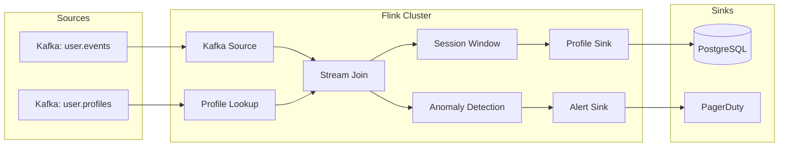
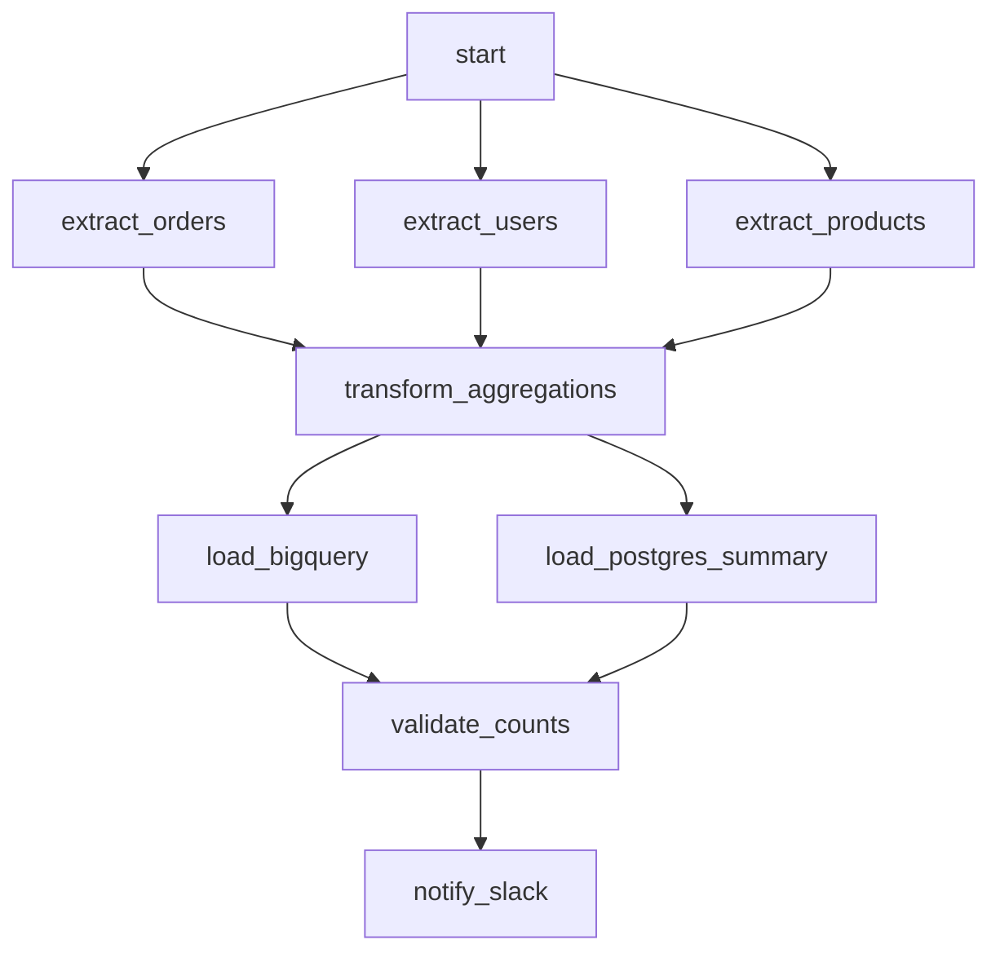
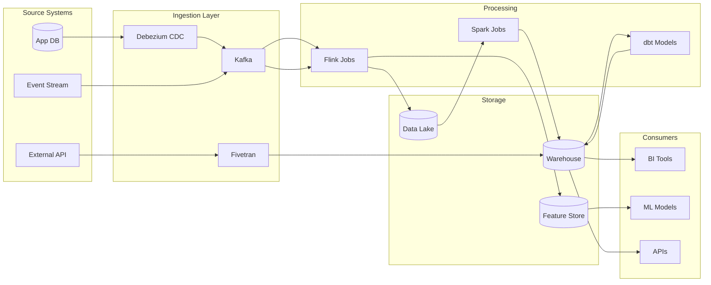

# Data Pipeline Documentation

> 💡 **Open Source Projects:** This standard is optional for most OSS projects.
> See [36-CONTEXT_GUIDANCE](./36-CONTEXT_GUIDANCE.md) for what you actually need.

> **Goal:** Document data pipelines (Kafka, Flink, Spark, Airflow) so engineers understand data flow, schemas, SLAs, and failure handling without reverse-engineering code.

---

## 1. Pipeline Catalog

### Required Pipeline Registry

Maintain `docs/data/PIPELINE_CATALOG.md`:

```markdown
# Data Pipeline Catalog

## Streaming Pipelines

| Pipeline | Source | Sink | Technology | SLA | Owner |
|----------|--------|------|------------|-----|-------|
| `user-events-processor` | Kafka: `user.events` | PostgreSQL | Flink | < 5s latency | @streaming-team |
| `order-enrichment` | Kafka: `orders.raw` | Kafka: `orders.enriched` | Kafka Streams | < 2s latency | @order-team |
| `clickstream-analytics` | Kinesis | S3 + RedShift | Spark Streaming | < 1 min | @analytics-team |

## Batch Pipelines

| Pipeline | Schedule | Source | Sink | Technology | SLA | Owner |
|----------|----------|--------|------|------------|-----|-------|
| `daily-aggregations` | 02:00 UTC | PostgreSQL | BigQuery | Airflow + dbt | Complete by 04:00 | @analytics-team |
| `ml-feature-pipeline` | Hourly | S3 | Feature Store | Spark | Within 30 min | @ml-team |
| `compliance-export` | Daily | All DBs | S3 (encrypted) | Airflow | Complete by 06:00 | @compliance-team |
```

---

## 2. Kafka Topic Documentation

### Topic Registry

Maintain `docs/data/kafka/TOPICS.md`:

```markdown
# Kafka Topics

## Topic: `orders.created`

| Property | Value |
|----------|-------|
| **Purpose** | New order events from checkout service |
| **Producers** | `checkout-service` |
| **Consumers** | `order-processor`, `notification-service`, `analytics-pipeline` |
| **Partitions** | 12 |
| **Partition Key** | `order_id` |
| **Retention** | 7 days |
| **Compaction** | Disabled |
| **Schema** | [orders.created.avsc](./schemas/orders.created.avsc) |
| **Dead Letter Topic** | `orders.created.dlq` |

### Message Schema

```json
{
  "type": "record",
  "name": "OrderCreated",
  "namespace": "com.example.orders",
  "fields": [
    {"name": "order_id", "type": "string", "doc": "UUID of the order"},
    {"name": "user_id", "type": "string", "doc": "UUID of the user"},
    {"name": "items", "type": {"type": "array", "items": "OrderItem"}},
    {"name": "total", "type": "decimal", "doc": "Order total in USD"},
    {"name": "created_at", "type": "timestamp-millis"}
  ]
}
```

### Partitioning Strategy

- Key: `order_id` (ensures all events for an order go to same partition)
- Why: Enables ordered processing per order

### Consumer Groups

| Group | Service | Offset Reset | Lag Alert |
|-------|---------|--------------|-----------|
| `order-processor-cg` | order-processor | earliest | > 1000 |
| `notification-cg` | notification-service | latest | > 500 |
| `analytics-cg` | analytics-pipeline | earliest | > 10000 |

```

---

## 3. Flink/Spark Job Documentation

### Job README Template

```markdown
# User Events Processor (Flink Job)

## Overview

Processes user activity events in real-time to:
1. Aggregate session data
2. Detect anomalies
3. Update user profiles

## Architecture



## Configuration

| Parameter | Default | Description |
|-----------|---------|-------------|
| `parallelism` | 4 | Job parallelism |
| `checkpoint.interval` | 60s | Checkpoint frequency |
| `session.gap` | 30min | Session window gap |
| `anomaly.threshold` | 3.0 | Standard deviations for anomaly |

## Schemas

### Input: `user.events`

```avro
{
  "type": "record",
  "name": "UserEvent",
  "fields": [
    {"name": "user_id", "type": "string"},
    {"name": "event_type", "type": "string"},
    {"name": "timestamp", "type": "long"},
    {"name": "properties", "type": {"type": "map", "values": "string"}}
  ]
}
```

### Output: `user.sessions`

```avro
{
  "type": "record",
  "name": "UserSession",
  "fields": [
    {"name": "user_id", "type": "string"},
    {"name": "session_start", "type": "timestamp-millis"},
    {"name": "session_end", "type": "timestamp-millis"},
    {"name": "event_count", "type": "int"},
    {"name": "page_views", "type": "int"}
  ]
}
```

## SLAs

| Metric | Target | Alert Threshold |
|--------|--------|-----------------|
| End-to-end latency | < 5 seconds | > 10 seconds |
| Processing throughput | 10k events/sec | < 5k events/sec |
| Checkpoint duration | < 30 seconds | > 60 seconds |
| Consumer lag | < 1000 | > 5000 |

## Failure Handling

| Failure | Behavior | Recovery |
|---------|----------|----------|
| Kafka unavailable | Retry with backoff | Automatic reconnect |
| Checkpoint failure | Job continues | Alert + investigate |
| Deserialization error | Send to DLQ | Manual review |
| Database timeout | Retry 3x | Alert after 3 failures |

## Deployment

```bash
# Deploy to production
flink run -d \
  -p 4 \
  -c com.example.UserEventsProcessor \
  user-events-processor.jar \
  --kafka.bootstrap kafka.prod:9092 \
  --checkpoint.dir s3://flink-checkpoints/user-events
```

## Monitoring

- [Flink Dashboard](https://flink.example.com/jobs/USER_EVENTS)
- [Grafana Dashboard](https://grafana.example.com/d/user-events-processor)
- [Consumer Lag](https://kafka.example.com/consumer-groups/user-events-cg)

```

---

## 4. Airflow DAG Documentation

### DAG README Template

```markdown
# Daily Aggregations DAG

## Overview

| Property | Value |
|----------|-------|
| **DAG ID** | `daily_aggregations` |
| **Schedule** | `0 2 * * *` (02:00 UTC daily) |
| **Owner** | @analytics-team |
| **SLA** | Complete by 04:00 UTC |
| **Retries** | 3 with 10-min backoff |

## Task Graph



## Tasks

| Task | Type | Duration | Description |
|------|------|----------|-------------|
| `extract_orders` | PostgresOperator | ~5 min | Extract yesterday's orders |
| `extract_users` | PostgresOperator | ~2 min | Extract active users |
| `transform_aggregations` | PythonOperator | ~10 min | dbt transformations |
| `load_bigquery` | BigQueryOperator | ~5 min | Load to analytics warehouse |
| `validate_counts` | PythonOperator | ~1 min | Verify row counts ±5% |

## Dependencies

### External Systems

- PostgreSQL (source)
- BigQuery (sink)
- dbt Cloud (transformations)
- Slack (notifications)

### Upstream DAGs

- `user_dimension_refresh` (must complete first)

### Downstream DAGs

- `executive_dashboard_refresh` (triggered on success)

## Variables & Connections

| Name | Type | Description |
|------|------|-------------|
| `pg_conn_id` | Connection | Source PostgreSQL |
| `bq_conn_id` | Connection | BigQuery sink |
| `dbt_token` | Variable | dbt Cloud API token |
| `slack_webhook` | Variable | Alerts webhook |

## Failure Handling

| Task | On Failure |
|------|------------|
| `extract_*` | Retry 3x, then alert |
| `transform_*` | Retry 2x, then alert + pause DAG |
| `load_*` | Retry 3x with exponential backoff |
| `validate_*` | Alert but don't block |

## Runbook

See [DAG Failure Runbook](../runbooks/AIRFLOW_DAILY_AGG.md)

```

---

## 5. Data Lineage Documentation

### Lineage Diagram



### Column-Level Lineage

For critical fields, document column lineage:

```markdown
## Field: `orders.lifetime_value`

| Stage | Transformation |
|-------|----------------|
| **Source** | `orders.total_amount` (PostgreSQL) |
| **Ingestion** | CDC via Debezium → Kafka `orders.cdc` |
| **Transform 1** | Flink: Sum by `user_id`, window 30 days |
| **Transform 2** | dbt: `models/marts/customers.sql` line 45 |
| **Output** | `warehouse.customers.lifetime_value` |
```

---

## 6. Schema Evolution Documentation

### Schema Registry

```markdown
# Schema Evolution Log

## Topic: `orders.created`

| Version | Date | Change | Compatibility |
|---------|------|--------|---------------|
| v3 | 2025-12-01 | Added `discount_code` field (optional) | BACKWARD |
| v2 | 2025-09-15 | Renamed `amount` → `total` | FORWARD |
| v1 | 2025-01-01 | Initial schema | - |

### Migration Notes (v2 → v3)

- New optional field `discount_code` (string, nullable)
- No consumer changes required
- Producers updated in PR #1234
```

---

## 7. Data Quality Documentation

### Data Quality Rules

```markdown
# Data Quality Rules

## Table: `orders_daily_agg`

| Rule | Check | Threshold | Action |
|------|-------|-----------|--------|
| Freshness | `max(updated_at)` | < 4 hours old | Alert |
| Completeness | `count(*)` vs yesterday | ±10% | Alert |
| Nullness | `order_id IS NOT NULL` | 0% nulls | Block |
| Uniqueness | `DISTINCT order_id` | 100% unique | Block |
| Range | `total > 0` | 100% valid | Alert |

## Great Expectations Suite

See `tests/data_quality/orders_suite.json`
```

---

## 8. Related Documents

| Document | Purpose |
|----------|---------|
| [Database Documentation](./19-DATABASE_DOCUMENTATION.md) | Source/sink schema docs |
| [API Documentation](./18-API_DOCUMENTATION.md) | AsyncAPI for Kafka |
| [Operations](./06-OPERATIONS.md) | Pipeline runbooks |
| [Service Catalog](./21-SERVICE_CATALOG.md) | Pipeline ownership |

---

**Previous:** [22 - CI/CD Pipelines](./22-CICD_PIPELINES.md)
**Next:** [24 - Security & Compliance](./24-SECURITY_COMPLIANCE.md)
