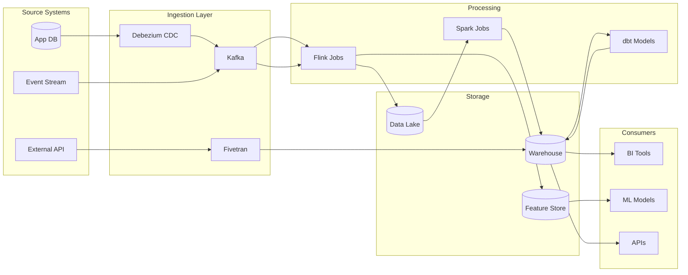

# Data Pipeline Documentation

> 💡 **Open Source Projects:** This standard is optional for most OSS projects.
> See [36-CONTEXT_GUIDANCE](./36-CONTEXT_GUIDANCE.md) for what you actually need.

> **Goal:** Document data pipelines (Kafka, Flink, Spark, Airflow) so engineers understand data flow, schemas, SLAs, and failure handling without reverse-engineering code.

---

## Documentation Location

**IMPORTANT:** All pipeline documentation must live in the DAG's folder, not in a centralized docs location.

### Folder Structure

```
dags/{domain}/               # e.g., dags/analytics/, dags/ml/, dags/reporting/
├── README.md                # Domain landing page
├── PIPELINE_CATALOG.md      # Catalog for this domain's pipelines
├── {dag_name}.py            # DAG Python file
├── {dag_name}.md            # DAG documentation
├── schemas/                 # Optional: Avro/JSON schemas if using Kafka
│   └── {topic}.avsc
└── topics/                  # Optional: Kafka topic docs if relevant
    └── TOPICS.md
```

### SQL and Shared Artifacts

- SQL files: Store in a shared location (e.g., `include/sql/`) outside DAG folders
- Reference SQL paths in DAG documentation using relative paths
- Service account keys, configs: Use environment variables or a config management system

### Why This Structure?

- **Co-location:** Code and docs live together for easy discovery
- **Team ownership:** Each domain owns its folder without cross-team coordination
- **Scalability:** Works for repos with hundreds of DAGs
- **Git workflow:** Changes to a DAG and its docs happen in same PR

---

## 1. Pipeline Catalog

### Required Pipeline Registry

Maintain `dags/{domain}/PIPELINE_CATALOG.md` (e.g., `dags/analytics/PIPELINE_CATALOG.md`, `dags/ml/PIPELINE_CATALOG.md`):

```markdown
# Data Pipeline Catalog

## Streaming Pipelines

| Pipeline | Source | Sink | Technology | SLA | Owner |
|----------|--------|------|------------|-----|-------|
| `user-events-processor` | Kafka: `user.events` | PostgreSQL | Flink | < 5s latency | @streaming-team |
| `order-enrichment` | Kafka: `orders.raw` | Kafka: `orders.enriched` | Kafka Streams | < 2s latency | @order-team |
| `clickstream-analytics` | Kinesis | S3 + RedShift | Spark Streaming | < 1 min | @analytics-team |

## Batch Pipelines

| Pipeline | Schedule | Source | Sink | Technology | SLA | Owner |
|----------|----------|--------|------|------------|-----|-------|
| `daily-aggregations` | 02:00 UTC | PostgreSQL | BigQuery | Airflow + dbt | Complete by 04:00 | @analytics-team |
| `ml-feature-pipeline` | Hourly | S3 | Feature Store | Spark | Within 30 min | @ml-team |
| `compliance-export` | Daily | All DBs | S3 (encrypted) | Airflow | Complete by 06:00 | @compliance-team |
```

> **Note:** Each domain/team folder maintains its own catalog. For a cross-domain view, consider aggregating catalogs in CI or using a lineage tool like OpenLineage.

---

## 1.1 Pipeline Metadata Standard

Document pipeline metadata in a consistent, lineage-friendly format. Align to OpenLineage concepts so your metadata can be mapped to standard tooling.

### Required Metadata Fields

| Field | Description | Example |
|-------|-------------|---------|
| **Pipeline Name** | Stable identifier (DAG ID or job name) | `daily_aggregations` |
| **Domain** | Business domain or team area | `growth-analytics` |
| **Owner** | Team or primary owner | `@analytics-team` |
| **Contacts** | On-call or support alias | `#data-oncall` |
| **Classification** | Data sensitivity | `internal`, `confidential`, `pii` |
| **Inputs** | Dataset list (source systems/tables) | `clickhouse.orders` |
| **Outputs** | Dataset list (targets/sinks) | `house.orders_daily` |
| **Schedule** | Cron or event trigger | `0 2 * * *` |
| **SLA/Freshness** | Expected completion/freshness | `Complete by 04:00 UTC` |
| **Consumers** | Downstream dashboards/services | `exec_dashboard`, `risk_model` |

### OpenLineage Mapping (Mandatory)

Document these identifiers to align with OpenLineage concepts:

| OpenLineage Entity | Required Fields | Example |
|-------------------|----------------|---------|
| **Job** | `namespace`, `name` | `airflow`, `daily_aggregations` |
| **Run** | `run_id`, `started_at` | `manual__2025-01-01` |
| **Dataset** | `namespace`, `name` | `clickhouse`, `clickhouse.orders` |

---

## 2. Kafka Topic Documentation

### Topic Registry

> **Note:** Only create this if your pipelines produce or consume Kafka topics. Most pipelines won't need this section.

Maintain `dags/{domain}/topics/TOPICS.md` (e.g., `dags/streaming/topics/TOPICS.md`):

```markdown
# Kafka Topics

## Topic: `orders.created`

| Property | Value |
|----------|-------|
| **Purpose** | New order events from checkout service |
| **Producers** | `checkout-service` |
| **Consumers** | `order-processor`, `notification-service`, `analytics-pipeline` |
| **Partitions** | 12 |
| **Partition Key** | `order_id` |
| **Retention** | 7 days |
| **Compaction** | Disabled |
| **Schema** | [orders.created.avsc](../schemas/orders.created.avsc) |
| **Dead Letter Topic** | `orders.created.dlq` |

### Message Schema

    ```json
    {
    "type": "record",
    "name": "OrderCreated",
    "namespace": "com.example.orders",
    "fields": [
        {"name": "order_id", "type": "string", "doc": "UUID of the order"},
        {"name": "user_id", "type": "string", "doc": "UUID of the user"},
        {"name": "items", "type": {"type": "array", "items": "OrderItem"}},
        {"name": "total", "type": "decimal", "doc": "Order total in USD"},
        {"name": "created_at", "type": "timestamp-millis"}
    ]
    }
    ```

### Partitioning Strategy

- Key: `order_id` (ensures all events for an order go to same partition)
- Why: Enables ordered processing per order

### Consumer Groups

| Group | Service | Offset Reset | Lag Alert |
|-------|---------|--------------|-----------|
| `order-processor-cg` | order-processor | earliest | > 1000 |
| `notification-cg` | notification-service | latest | > 500 |
| `analytics-cg` | analytics-pipeline | earliest | > 10000 |
```

---

## 3. Flink/Spark Job Documentation

### Job README Template

```markdown
# User Events Processor (Flink Job)

## Overview

Processes user activity events in real-time to:
1. Aggregate session data
2. Detect anomalies
3. Update user profiles

## Architecture

    ```mermaid
    flowchart LR
        subgraph Sources
            K1[Kafka: user.events]
            K2[Kafka: user.profiles]
        end

        subgraph Flink["Flink Cluster"]
            Source1[Kafka Source]
            Source2[Profile Lookup]
            Join[Stream Join]
            Agg[Session Window]
            Anomaly[Anomaly Detection]
            Sink1[Profile Sink]
            Sink2[Alert Sink]
        end

        subgraph Sinks
            PG[(PostgreSQL)]
            Alert[PagerDuty]
        end

        K1 --> Source1 --> Join
        K2 --> Source2 --> Join
        Join --> Agg --> Sink1 --> PG
        Join --> Anomaly --> Sink2 --> Alert
    ```

## Configuration

| Parameter | Default | Description |
|-----------|---------|-------------|
| `parallelism` | 4 | Job parallelism |
| `checkpoint.interval` | 60s | Checkpoint frequency |
| `session.gap` | 30min | Session window gap |
| `anomaly.threshold` | 3.0 | Standard deviations for anomaly |

## Schemas

### Input: `user.events`

    ```avro
    {
    "type": "record",
    "name": "UserEvent",
    "fields": [
        {"name": "user_id", "type": "string"},
        {"name": "event_type", "type": "string"},
        {"name": "timestamp", "type": "long"},
        {"name": "properties", "type": {"type": "map", "values": "string"}}
    ]
    }
    ```

    ### Output: `user.sessions`

    ```avro
    {
    "type": "record",
    "name": "UserSession",
    "fields": [
        {"name": "user_id", "type": "string"},
        {"name": "session_start", "type": "timestamp-millis"},
        {"name": "session_end", "type": "timestamp-millis"},
        {"name": "event_count", "type": "int"},
        {"name": "page_views", "type": "int"}
    ]
    }
    ```

## SLAs

| Metric | Target | Alert Threshold |
|--------|--------|-----------------|
| End-to-end latency | < 5 seconds | > 10 seconds |
| Processing throughput | 10k events/sec | < 5k events/sec |
| Checkpoint duration | < 30 seconds | > 60 seconds |
| Consumer lag | < 1000 | > 5000 |

## Failure Handling

| Failure | Behavior | Recovery |
|---------|----------|----------|
| Kafka unavailable | Retry with backoff | Automatic reconnect |
| Checkpoint failure | Job continues | Alert + investigate |
| Deserialization error | Send to DLQ | Manual review |
| Database timeout | Retry 3x | Alert after 3 failures |

## Deployment

    ```bash
    # Deploy to production
    flink run -d \
    -p 4 \
    -c com.example.UserEventsProcessor \
    user-events-processor.jar \
    --kafka.bootstrap kafka.prod:9092 \
    --checkpoint.dir s3://flink-checkpoints/user-events
    ```

## Monitoring

- [Flink Dashboard](https://flink.example.com/jobs/USER_EVENTS)
- [Grafana Dashboard](https://grafana.example.com/d/user-events-processor)
- [Consumer Lag](https://kafka.example.com/consumer-groups/user-events-cg)
```

---

## 4. Airflow DAG Documentation

### Documentation Location

Each DAG should have a corresponding markdown file in the same folder:

```
dags/{domain}/
├── daily_aggregations.py          # DAG code
└── daily_aggregations.md          # DAG documentation (this template)
```

**Naming convention:** `{dag_id}.md` should match the DAG ID for easy discovery.

### DAG README Template

```markdown
# Daily Aggregations DAG

## Overview

| Property | Value |
|----------|-------|
| **DAG ID** | `daily_aggregations` |
| **Schedule** | `0 2 * * *` (02:00 UTC daily) |
| **Owner** | @analytics-team |
| **SLA** | Complete by 04:00 UTC |
| **Retries** | 3 with 10-min backoff |

## Pipeline Metadata (OpenLineage-Style)

| Field | Value |
|-------|-------|
| **Job Name** | `daily_aggregations` |
| **Job Namespace** | `airflow` |
| **Run ID Format** | `{{ dag_run.run_id }}` |
| **Inputs** | `clickhouse.orders`, `clickhouse.users` |
| **Outputs** | `bigquery.analytics.orders_daily` |
| **Domain** | `growth-analytics` |
| **Classification** | `internal` |

## Data Contract

| Output | Contract | Compatibility |
|--------|----------|---------------|
| `analytics.orders_daily` | Column definitions + required fields | Backward compatible |

## Lineage

    ```mermaid
    flowchart LR
        SRC1[(orders)] --> TRANSFORM[transform_aggregations]
        SRC2[(users)] --> TRANSFORM
        TRANSFORM --> OUT1[(analytics.orders_daily)]
    ```

## Task Graph

    ```mermaid
    flowchart TD
        Start[start] --> Extract1[extract_orders]
        Start --> Extract2[extract_users]
        Start --> Extract3[extract_products]

        Extract1 --> Transform[transform_aggregations]
        Extract2 --> Transform
        Extract3 --> Transform

        Transform --> LoadBQ[load_bigquery]
        Transform --> LoadPG[load_postgres_summary]

        LoadBQ --> Validate[validate_counts]
        LoadPG --> Validate

        Validate --> Notify[notify_slack]
    ```

## Tasks

| Task | Type | Duration | Description |
|------|------|----------|-------------|
| `extract_orders` | PostgresOperator | ~5 min | Extract yesterday's orders |
| `extract_users` | PostgresOperator | ~2 min | Extract active users |
| `transform_aggregations` | PythonOperator | ~10 min | dbt transformations |
| `load_bigquery` | BigQueryOperator | ~5 min | Load to analytics warehouse |
| `validate_counts` | PythonOperator | ~1 min | Verify row counts ±5% |

## Dependencies

### External Systems

- PostgreSQL (source)
- BigQuery (sink)
- dbt Cloud (transformations)
- Slack (notifications)

### Upstream DAGs

- `user_dimension_refresh` (must complete first)

### Downstream DAGs

- `executive_dashboard_refresh` (triggered on success)

## Variables & Connections

| Name | Type | Description |
|------|------|-------------|
| `pg_conn_id` | Connection | Source PostgreSQL |
| `bq_conn_id` | Connection | BigQuery sink |
| `dbt_token` | Variable | dbt Cloud API token |
| `slack_webhook` | Variable | Alerts webhook |

## Failure Handling

| Task | On Failure |
|------|------------|
| `extract_*` | Retry 3x, then alert |
| `transform_*` | Retry 2x, then alert + pause DAG |
| `load_*` | Retry 3x with exponential backoff |
| `validate_*` | Alert but don't block |

## Runbook

See [DAG Failure Runbook](../runbooks/AIRFLOW_DAILY_AGG.md)

## Data Quality

| Check | Threshold | Action |
|-------|-----------|--------|
| Row count change vs yesterday | ±10% | Alert |
| Nulls in key columns | 0% | Fail task |

## Backfill & Partitioning

- **Partition Key:** `ds`
- **Backfill Strategy:** Replay by date partition, idempotent writes

## Idempotency & Deduplication

- Writes are partitioned by date and overwrite within partition

## Monitoring

- [Grafana Dashboard](https://grafana.example.com/d/daily-aggregations)
- Alerts in `#data-alerts`

## Runbook

See [DAG Failure Runbook](../runbooks/AIRFLOW_DAILY_AGG.md)

## Governance

- **Data Classification:** internal
- **PII:** none

## Consumers

- `executive_dashboard_refresh`
- `risk_scoring_model`
```

---

## 5. Data Lineage Documentation

> **Note:** For Airflow DAGs, lineage diagrams should be included in the DAG's markdown file (see Section 4). This section provides additional guidance for complex multi-system lineage.

### Lineage Diagram



### Column-Level Lineage

For critical fields, document column lineage:

```markdown
## Field: `orders.lifetime_value`

| Stage | Transformation |
|-------|----------------|
| **Source** | `orders.total_amount` (PostgreSQL) |
| **Ingestion** | CDC via Debezium → Kafka `orders.cdc` |
| **Transform 1** | Flink: Sum by `user_id`, window 30 days |
| **Transform 2** | dbt: `models/marts/customers.sql` line 45 |
| **Output** | `warehouse.customers.lifetime_value` |
```

---

## 6. Schema Evolution Documentation

### Schema Registry

Maintain schema evolution logs in `dags/{domain}/schemas/EVOLUTION.md`:

```markdown
# Schema Evolution Log

## Topic: `orders.created`

| Version | Date | Change | Compatibility |
|---------|------|--------|---------------|
| v3 | 2025-12-01 | Added `discount_code` field (optional) | BACKWARD |
| v2 | 2025-09-15 | Renamed `amount` → `total` | FORWARD |
| v1 | 2025-01-01 | Initial schema | - |

### Migration Notes (v2 → v3)

- New optional field `discount_code` (string, nullable)
- No consumer changes required
- Producers updated in PR #1234
```

---

## 7. Data Quality Documentation

### Data Quality Rules

Document quality rules in the DAG's markdown file under the "Data Quality" section. For Great Expectations suites, reference them from the DAG documentation:

```markdown
# Data Quality Rules

## Table: `orders_daily_agg`

| Rule | Check | Threshold | Action |
|------|-------|-----------|--------|
| Freshness | `max(updated_at)` | < 4 hours old | Alert |
| Completeness | `count(*)` vs yesterday | ±10% | Alert |
| Nullness | `order_id IS NOT NULL` | 0% nulls | Block |
| Uniqueness | `DISTINCT order_id` | 100% unique | Block |
| Range | `total > 0` | 100% valid | Alert |

## Great Expectations Suite

See `tests/data_quality/orders_suite.json`
```

> **Location:** Include this in your `dags/{domain}/{dag_name}.md` file. If using Great Expectations, store suite JSON files in `tests/data_quality/` and reference them.

---

## 8. Complete Example: dags/analytics/

This example shows how a team might organize their pipeline documentation:

```
dags/analytics/
├── README.md                          # Landing page for analytics pipelines
├── PIPELINE_CATALOG.md                # Catalog of all analytics pipelines
├── daily_user_metrics.py              # DAG: Daily user aggregations
├── daily_user_metrics.md              # Documentation
├── weekly_revenue_report.py           # DAG: Weekly revenue reporting
├── weekly_revenue_report.md           # Documentation
├── customer_churn_prediction.py       # DAG: ML feature pipeline
├── customer_churn_prediction.md       # Documentation
├── schemas/                           # Optional: If using Kafka/event schemas
│   └── user_events.avsc
└── topics/                            # Optional: If using Kafka
    └── TOPICS.md
```

### README.md Structure

```markdown
---
title: "Analytics Pipelines"
type: "landing"
status: "approved"
owner: "@analytics-team"
---

# Analytics Team Data Pipelines

This folder contains data pipelines owned by the Analytics team.

## Quick Links
- [Pipeline Catalog](./PIPELINE_CATALOG.md) - All pipelines at a glance
- [Daily User Metrics](./daily_user_metrics.md)
- [Weekly Revenue Report](./weekly_revenue_report.md)

## Conventions
- **Schedule:** Most pipelines run daily between 02:00-04:00 UTC
- **Data Sources:** PostgreSQL (primary), S3 (event logs)
- **Data Sinks:** BigQuery (warehouse), Redshift (reporting)
- **SQL Location:** `../../include/sql/` (shared across teams)
- **Owner:** analytics@example.com
```

### PIPELINE_CATALOG.md Structure

See Section 1 for the full template.

---

## 9. Related Documents

| Document | Purpose |
|----------|---------|
| [Database Documentation](./19-DATABASE_DOCUMENTATION.md) | Source/sink schema docs |
| [API Documentation](./18-API_DOCUMENTATION.md) | AsyncAPI for Kafka |
| [Operations](./06-OPERATIONS.md) | Pipeline runbooks |
| [Service Catalog](./21-SERVICE_CATALOG.md) | Pipeline ownership |
| [Enterprise Data Classification](./templates/tier-enterprise/DATA_CLASSIFICATION.md) | Data classification template |

---

**Previous:** [22 - CI/CD Pipelines](./22-CICD_PIPELINES.md)
**Next:** [24 - Security & Compliance](./24-SECURITY_COMPLIANCE.md)
