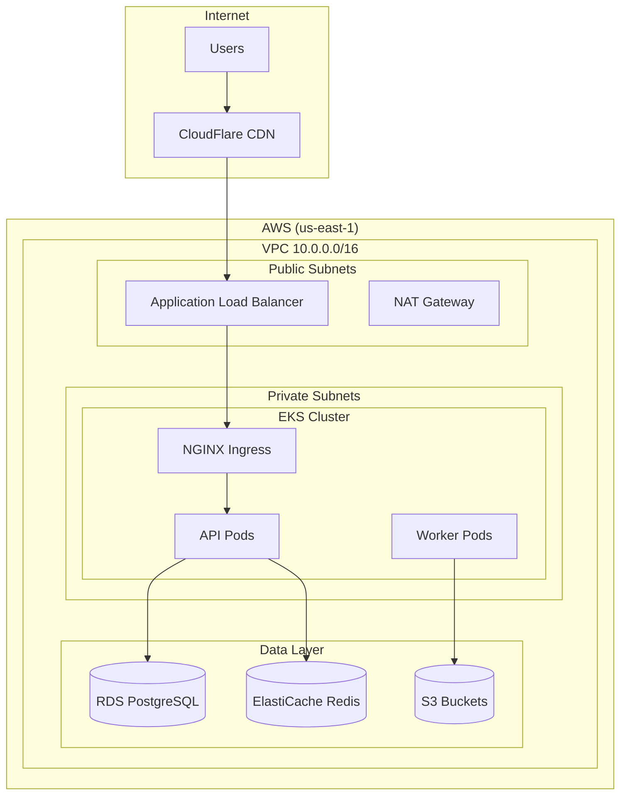

# Infrastructure as Code Documentation

> **Goal:** Document infrastructure code (Terraform, Kubernetes, Helm, Pulumi) so teams understand what's deployed, why, and how to modify it safely.

---

## 1. Terraform Documentation

### Module README Template

Every Terraform module MUST have a `README.md`:

```markdown
# AWS EKS Cluster Module

Creates a production-ready EKS cluster with managed node groups.

## Usage

```hcl
module "eks" {
  source = "./modules/eks"

  cluster_name    = "production"
  cluster_version = "1.28"
  vpc_id          = module.vpc.vpc_id
  subnet_ids      = module.vpc.private_subnet_ids

  node_groups = {
    general = {
      instance_types = ["m5.large"]
      min_size       = 2
      max_size       = 10
    }
  }
}
```

## Requirements

| Name | Version |
|------|---------|
| terraform | >= 1.5 |
| aws | >= 5.0 |

## Inputs

| Name | Description | Type | Default | Required |
|------|-------------|------|---------|----------|
| cluster_name | EKS cluster name | string | - | yes |
| cluster_version | Kubernetes version | string | "1.28" | no |
| vpc_id | VPC ID | string | - | yes |

## Outputs

| Name | Description |
|------|-------------|
| cluster_endpoint | EKS API endpoint |
| cluster_arn | EKS cluster ARN |

## Resources Created

- EKS Cluster
- Managed Node Groups
- IAM Roles and Policies
- Security Groups

```

### terraform-docs Automation

```yaml
# .github/workflows/terraform-docs.yml
name: Terraform Docs
on:
  pull_request:
    paths:
      - 'infra/**/*.tf'

jobs:
  docs:
    runs-on: ubuntu-latest
    steps:
      - uses: terraform-docs/gh-actions@v1
        with:
          working-dir: infra/modules
          output-file: README.md
          output-method: inject
```

### Inline Comments

```hcl
# main.tf

# Why: Separate node group for GPU workloads to optimize costs
# GPU instances are expensive, so we use spot instances with fallback
resource "aws_eks_node_group" "gpu" {
  cluster_name    = aws_eks_cluster.main.name
  node_group_name = "gpu-workers"

  # Why: Spot instances for 70% cost savings on ML training jobs
  capacity_type = "SPOT"

  instance_types = [
    "g4dn.xlarge",   # Primary: NVIDIA T4
    "g4dn.2xlarge",  # Fallback if xlarge unavailable
  ]
}
```

---

## 2. Kubernetes Documentation

### Manifest Documentation

```yaml
# deployments/api-gateway.yaml
# ==============================================================================
# API Gateway Deployment
#
# PURPOSE: Main ingress point for all API traffic
# REPLICAS: 3 (production), 1 (staging)
# RESOURCES: 500m CPU, 512Mi memory per pod
#
# DEPENDENCIES:
#   - ConfigMap: api-gateway-config
#   - Secret: api-gateway-secrets
#   - Service: redis-cache
#
# SCALING: HPA based on CPU (target: 70%)
# ALERTS: See alerts/api-gateway.yaml
#
# OWNER: @backend-team
# ==============================================================================
apiVersion: apps/v1
kind: Deployment
metadata:
  name: api-gateway
  labels:
    app: api-gateway
    # Why: Used by PodDisruptionBudget for safe rollouts
    app.kubernetes.io/component: gateway
spec:
  replicas: 3
  template:
    spec:
      containers:
        - name: api
          resources:
            requests:
              # Why: Based on load testing showing p99 at 400m
              cpu: "500m"
              memory: "512Mi"
            limits:
              # Why: Allow burst to 1 CPU for traffic spikes
              cpu: "1000m"
              memory: "1Gi"
```

### Kustomize Documentation

```yaml
# kustomization.yaml
# ==============================================================================
# Production Overlay
#
# Applies production-specific configurations on top of base:
# - Increased replicas (3 → 5)
# - Production resource limits
# - Production ConfigMaps
# - Ingress with TLS
# ==============================================================================
apiVersion: kustomize.config.k8s.io/v1beta1
kind: Kustomization

resources:
  - ../../base

# Production replica counts
replicas:
  - name: api-gateway
    count: 5  # Why: Handle 10k RPS with headroom

# Production-specific patches
patches:
  - path: patches/resources.yaml  # Increase CPU/memory
  - path: patches/ingress.yaml    # Add TLS
```

---

## 3. Helm Chart Documentation

### Chart README

```markdown
# API Gateway Helm Chart

## Description

Deploys the API Gateway with configurable replicas, resources, and ingress.

## Prerequisites

- Kubernetes 1.25+
- Helm 3.10+
- NGINX Ingress Controller
- cert-manager (for TLS)

## Installation

```bash
helm install api-gateway ./charts/api-gateway \
  --namespace production \
  --values values-production.yaml
```

## Configuration

| Parameter | Description | Default |
|-----------|-------------|---------|
| `replicaCount` | Number of replicas | 3 |
| `image.repository` | Image repository | gcr.io/project/api |
| `image.tag` | Image tag | latest |
| `resources.requests.cpu` | CPU request | 500m |
| `ingress.enabled` | Enable ingress | true |
| `ingress.hosts[0]` | Ingress hostname | api.example.com |

## Upgrading

### From 1.x to 2.x

Breaking changes:

- `config.redis` moved to `redis.host`
- Resource defaults increased

```bash
# Update values.yaml with new structure, then:
helm upgrade api-gateway ./charts/api-gateway
```

```

### values.yaml Documentation

```yaml
# values.yaml

# Number of pod replicas
# Recommended: 3 for production, 1 for development
replicaCount: 3

image:
  repository: gcr.io/project/api-gateway
  # Override in CI/CD with --set image.tag=$GIT_SHA
  tag: "latest"
  pullPolicy: IfNotPresent

# Resource requests and limits
# Values determined from load testing at 1000 RPS
resources:
  requests:
    cpu: "500m"      # P99 usage: 400m
    memory: "512Mi"  # P99 usage: 450Mi
  limits:
    cpu: "1000m"     # Allow 2x burst
    memory: "1Gi"    # OOM at 900Mi observed

# Horizontal Pod Autoscaler
autoscaling:
  enabled: true
  minReplicas: 3
  maxReplicas: 20
  # Why 70%: Leave headroom for traffic bursts
  targetCPUUtilization: 70
```

---

## 4. Architecture Documentation

### Infrastructure Diagram

Include in `docs/infrastructure/ARCHITECTURE.md`:



---

## 5. State Management Documentation

```markdown
# Terraform State Management

## Remote State Configuration

State is stored in S3 with DynamoDB locking:

| Environment | S3 Bucket | DynamoDB Table |
|-------------|-----------|----------------|
| Production | `company-tfstate-prod` | `terraform-locks-prod` |
| Staging | `company-tfstate-staging` | `terraform-locks-staging` |

## Accessing State

```hcl
terraform {
  backend "s3" {
    bucket         = "company-tfstate-prod"
    key            = "eks/terraform.tfstate"
    region         = "us-east-1"
    dynamodb_table = "terraform-locks-prod"
    encrypt        = true
  }
}
```

## State Recovery

See [Runbook: Terraform State Recovery](../runbooks/TF_STATE_RECOVERY.md)

```

---

## 7. Development Environment as Code

Treat your development environment configuration with the same rigor as production infrastructure.

### Dev Container Configuration

All repositories MUST contain a `.devcontainer` directory to define a reproducible development environment.

#### Standard Structure

```

.devcontainer/
├── devcontainer.json   # VS Code / DevPod configuration
├── Dockerfile          # Custom dev image (if needed)
└── post-create.sh      # Setup script (make init, git hooks)

```

#### Key Requirements

1.  **Version Pinning:** Explicitly version Python, Node, and tool versions in `devcontainer.json` or `Dockerfile`.
2.  **Parity:** Tools in the container MUST match CI/CD versions.
3.  **Automation:** Use `postCreateCommand` to automate setup (install deps, hooks).
4.  **Extensions:** Enforce team-standard VS Code extensions (ESLint, Ruff, etc.).

#### Example `devcontainer.json`

```json
{
  "name": "Python 3.11 + Node 18",
  "image": "mcr.microsoft.com/devcontainers/python:3.11-bullseye",
  "features": {
    "ghcr.io/devcontainers/features/node:1": { "version": "18" },
    "ghcr.io/devcontainers/features/docker-in-docker:2": {}
  },
  "customizations": {
    "vscode": {
      "extensions": ["charliermarsh.ruff", "dbaeumer.vscode-eslint"],
      "settings": { "editor.formatOnSave": true }
    }
  },
  "postCreateCommand": "bash .devcontainer/post-create.sh"
}
```

---

## 8. Microservice Code Structure

### Documentation Requirement

All infrastructure code (Terraform, Kubernetes, Helm) and microservice code MUST be documented according to organizational best practices.

### Python/FastAPI Microservice Structure

For Python/FastAPI microservices, follow the canonical structure defined in:

👉 **[Microservice Architecture Best Practices](../learning/MICROSERVICE_ARCHITECTURE_BEST_PRACTICES.md)**

**Quick Reference:**

- **Entry Point**: `main.py` (NOT `app.py`) - avoids namespace collisions
- **Utilities Package**: `core/` (NOT `app/`) - scalable cross-cutting concerns
- **Package Markers**: Every directory needs `__init__.py`
- **Dockerfile CMD**: `CMD ["uvicorn", "main:app", ...]`

**Validation Checklist:**

```bash
# Quick structure validation
find services/backend-* -name "app.py" -not -path "*/test*"  # Should be empty
find services/backend-* -type d -name "core" | wc -l          # Should equal service count
find services/backend-* -type d -name "app" | wc -l           # Should be 0
```

### Related Learning Resources

- **[Microservice Architecture Best Practices](../learning/MICROSERVICE_ARCHITECTURE_BEST_PRACTICES.md)** - Comprehensive guide with:
  - The problem (namespace collisions explained)
  - The solution (standard structure with `main.py` + `core/`)
  - Why it matters (scalability, developer experience, industry standards)
  - 15+ authoritative sources with links (FastAPI, Microsoft, Netflix, Python PEPs)
  - Step-by-step migration guide
  - Common anti-patterns to avoid

---

## 9. Related Documents

| Document | Purpose |
|----------|---------|
| [CI/CD Pipelines](./22-CICD_PIPELINES.md) | IaC deployment pipelines |
| [Service Catalog](./21-SERVICE_CATALOG.md) | Infrastructure services |
| [Operations](./06-OPERATIONS.md) | IaC runbooks |
| [Microservice Best Practices](../learning/MICROSERVICE_ARCHITECTURE_BEST_PRACTICES.md) | Comprehensive architecture guide |

---

**Previous:** [24 - Security & Compliance](./24-SECURITY_COMPLIANCE.md)
**Next:** [26 - Onboarding](./26-ONBOARDING.md)
