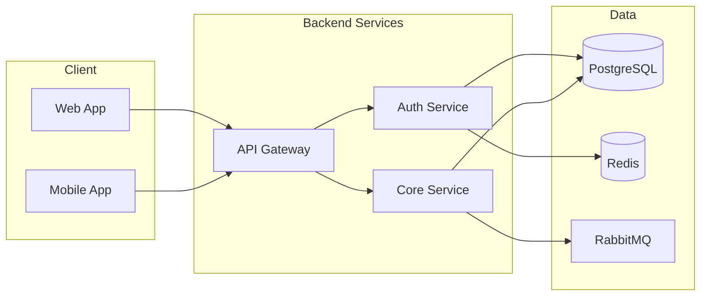

# Developer Onboarding Documentation

> **Goal:** New developers should be productive within their first week. Documentation should enable self-service onboarding with minimal hand-holding.

---

## 1. Getting Started Guide

### Required Structure

Every project MUST have a `docs/GETTING_STARTED.md`:

```markdown
# Getting Started

Welcome to [Project Name]! This guide will get you up and running.

## Time Estimate

| Step | Duration |
|------|----------|
| Prerequisites | 10 min |
| Clone & Setup | 15 min |
| Run Locally | 5 min |
| First Test | 5 min |
| **Total** | **~35 min** |

## Prerequisites

Before you begin, ensure you have:

- [ ] Docker Desktop running
- [ ] VS Code (Recommended) or preferred editor
- [ ] Git installed

## Quick Start

### Option A: Dev Container (Recommended)

**Best for:** Fastest start, guaranteed consistency.

1. Open folder in VS Code.
2. Click **Reopen in Container** when prompted.
3. Wait for setup to complete (~5 mins).
4. Run:
   ```bash
   make up
   ```

### Option B: Local Setup

**Best for:** Custom tooling, native performance.

- [ ] Node.js 20+ (`node --version`)
- [ ] Python 3.11+ (`python --version`)
- [ ] Access to 1Password vault (request from @manager)

```bash
# Clone the repository
git clone https://github.com/org/project.git
cd project

# Run automated setup (installs deps, creates .env, starts services)
make setup

# Start development server
make dev

# Open http://localhost:3000
```

## Verify Your Setup

Run the verification script:

```bash
make verify
# Expected output:
# ✅ Database connected
# ✅ Redis connected
# ✅ API responding
# ✅ Frontend loaded
```

## First Contribution

1. Pick an issue labeled `good-first-issue`
2. Read [CONTRIBUTING.md](./CONTRIBUTING.md)
3. Create a branch: `git checkout -b feature/your-name-issue-123`
4. Make your change
5. Run tests: `make test`
6. Open a PR

## Getting Help

| Question Type | Where to Ask |
|---------------|--------------|
| Code questions | `#eng-help` Slack |
| Access issues | `#it-support` Slack |
| Architecture | [Architecture Docs](./ARCHITECTURE.md) |
| API questions | [API Reference](./api/README.md) |

```

---

## 2. 30-60-90 Day Documentation Structure

### Day 1-30: Learn & Contribute

```markdown
# Week 1: Orientation

## Day 1
- [ ] Complete HR onboarding
- [ ] Set up laptop and development environment
- [ ] Read [Getting Started](./GETTING_STARTED.md)
- [ ] Join Slack channels: #eng-general, #eng-help, #team-*
- [ ] Meet with buddy for initial 1:1

## Day 2-3
- [ ] Complete [Architecture Overview](./ARCHITECTURE.md)
- [ ] Read Coding Standards document
- [ ] Shadow a code review
- [ ] Complete first `good-first-issue`

## Day 4-5
- [ ] Attend team standup
- [ ] Read on-call documentation
- [ ] Complete security training
- [ ] Submit first PR

# Week 2-4: Contribute

- [ ] Complete 3-5 small issues
- [ ] Participate in code reviews
- [ ] Document something you found confusing
- [ ] Give onboarding feedback
```

### Day 31-60: Own Features

```markdown
# Week 5-8: Feature Ownership

## Goals
- [ ] Own a small feature end-to-end
- [ ] Write tests for your features
- [ ] Participate in design discussions
- [ ] Mentor newer team members on basics

## Checkpoints
- [ ] Week 6: Complete feature implementation
- [ ] Week 8: Feature deployed and monitored
```

### Day 61-90: Full Contributor

```markdown
# Week 9-12: Full Integration

## Goals
- [ ] On-call rotation participation
- [ ] Lead a small project
- [ ] Contribute to architecture decisions
- [ ] Update onboarding docs based on experience

## Completion Criteria
- [ ] Can work independently on complex issues
- [ ] Understands full system architecture
- [ ] Comfortable with deployment process
```

---

## 3. Architecture Overview for New Hires

### Required Sections

```markdown
# Architecture Overview

## System Diagram



## Key Services

| Service | Purpose | Repo | Owner |
|---------|---------|------|-------|
| Frontend | React SPA | `/apps/web` | @frontend-team |
| API Gateway | Request routing, auth | `/services/gateway` | @backend-team |
| Core Service | Business logic | `/services/core` | @backend-team |

## Data Flow

1. User authenticates via OAuth
2. Token stored in HTTP-only cookie
3. Requests routed through API Gateway
4. Gateway validates token, adds user context
5. Core service handles business logic

## Tech Stack

| Layer | Technology | Why We Chose It |
|-------|------------|-----------------|
| Frontend | Next.js | SSR, great DX |
| API | FastAPI | Performance, type safety |
| Database | PostgreSQL | Reliability, JSONB support |
| Cache | Redis | Speed, pub/sub capability |
| Queue | RabbitMQ | Reliability, routing |

```

---

## 4. First Contribution Checklist

```markdown
# First Contribution Checklist

## Before You Start

- [ ] Finished [Getting Started](./GETTING_STARTED.md)
- [ ] Read [Contributing Guidelines](./CONTRIBUTING.md)
- [ ] Set up pre-commit hooks: `make install-hooks`

## Making Changes

- [ ] Created feature branch from `main`
- [ ] Made small, focused commits
- [ ] Wrote/updated tests for changes
- [ ] Updated documentation if needed
- [ ] Ran `make lint` with no errors
- [ ] Ran `make test` with all passing

## Pull Request

- [ ] PR title follows format: `type(scope): description`
- [ ] PR description explains "why" not just "what"
- [ ] Linked to issue number
- [ ] Added screenshots for UI changes
- [ ] Requested review from appropriate CODEOWNER

## After Merge

- [ ] Deleted feature branch
- [ ] Verified deployment succeeded
- [ ] Checked for any alerts
```

---

## 5. Team-Specific Glossary

```markdown
# Project Glossary

Terms you'll hear that might be confusing:

| Term | Definition |
|------|------------|
| **The Monolith** | Original Rails app we're migrating away from |
| **Core** | New Python microservice with business logic |
| **BFF** | Backend-for-Frontend pattern for web/mobile |
| **Canary** | 10% deployment used for gradual rollout |
| **Feature Flag** | LaunchDarkly toggle for gradual releases |
| **The Queue** | RabbitMQ used for async job processing |
| **Hot Path** | Real-time request handling (< 100ms) |
| **Cold Path** | Async processing via queue |

See also: [Company Glossary](./GLOSSARY.md)
```

---

## 6. Buddy Program Documentation

```markdown
# Onboarding Buddy Guide

## Your Role

As an onboarding buddy, you help the new hire:
- Navigate the codebase
- Understand team culture
- Provide psychological safety for questions
- Connect them with the right people

## Weekly Touchpoints

| Week | Focus | Duration |
|------|-------|----------|
| 1 | Daily check-ins | 15 min/day |
| 2-4 | 2x/week check-ins | 30 min each |
| 5-8 | Weekly check-ins | 30 min |
| 9-12 | As needed | - |

## Discussion Topics

### Week 1
- How's the environment setup going?
- Any blockers?
- What's confusing about the codebase?

### Week 2-4
- How's your first PR going?
- Are code reviews making sense?
- Understanding the architecture?

### Week 5+
- Feel ready to take on larger tasks?
- What would you improve about onboarding?
```

---

## 7. Related Documents

| Document | Purpose |
|----------|---------|
| [Philosophy](./01-PHILOSOPHY.md) | Why we document |
| [Anti-Patterns](./20-ANTI_PATTERNS.md) | Common mistakes |
| [Service Catalog](./21-SERVICE_CATALOG.md) | Service discovery |

---

**Previous:** [25 - Infrastructure Code](./25-INFRASTRUCTURE_CODE.md)
**Next:** [27 - Postmortems](./27-POSTMORTEMS.md)
