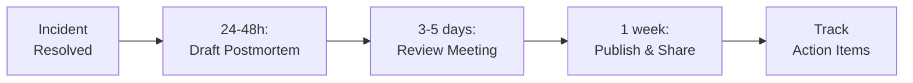

# Incident Postmortem Documentation

> **Goal:** Learn from incidents through blameless retrospectives. Focus on systems and processes, not individuals.

---

## 1. Blameless Culture

### Core Principles

| Principle | Practice |
|-----------|----------|
| **No Blame** | Focus on systems, not people |
| **Assume Good Intent** | Everyone acted with best available info |
| **Psychological Safety** | Safe to share mistakes |
| **System Thinking** | Fix the system, not the symptom |
| **Continuous Learning** | Every incident is a learning opportunity |

> **"Human error is a symptom of a deeper system problem, not a cause."**
> — Sidney Dekker

---

## 2. Postmortem Template

### Required Document

After any P0/P1 incident, create `docs/incidents/YYYY-MM-DD-incident-title.md`:

```markdown
# Incident: [Brief Title]

**Date:** 2025-12-09
**Duration:** 2 hours 15 minutes (14:30 - 16:45 UTC)
**Severity:** P1
**Author:** @incident-commander
**Status:** Complete

---

## Summary

One paragraph executive summary:

> On December 9, 2025, users experienced intermittent 503 errors for
> approximately 2 hours due to database connection pool exhaustion.
> The issue was caused by a query regression in the v2.3.1 release
> that increased connection hold time by 10x. Impact: ~15% of API
> requests failed during the incident window.

---

## Impact

| Metric | Value |
|--------|-------|
| Duration | 2h 15m |
| Users Affected | ~12,000 |
| Requests Failed | ~45,000 (15% error rate) |
| Revenue Impact | ~$8,000 estimated |
| SLA Status | Breached (target: 99.9%, actual: 99.2%) |

---

## Timeline

| Time (UTC) | Event |
|------------|-------|
| 14:30 | PagerDuty alert: Error rate > 5% |
| 14:32 | On-call engineer acknowledges |
| 14:35 | Initial investigation: DB connections at 100% |
| 14:45 | Rolled back to v2.3.0 |
| 14:50 | Error rate unchanged - rollback didn't help |
| 15:00 | Escalation to database team |
| 15:15 | Identified: Connection pool exhausted |
| 15:30 | Increased pool size from 20 → 50 |
| 15:35 | Error rate dropping |
| 16:00 | All metrics back to normal |
| 16:45 | Incident declared resolved |

---

## Root Cause Analysis

### What Happened

The v2.3.1 release included a new ORM query that held database
connections for the duration of request processing instead of
releasing them after the query completed.

### Contributing Factors

1. **Query Pattern Change** — New eager loading pattern kept
   connections open longer
2. **Insufficient Pool Size** — Pool sized for old query patterns
3. **Missing Monitoring** — No alert on connection wait time
4. **Load Spike** — Traffic 20% higher than normal during incident

### Five Whys

1. **Why** did users see 503 errors?
   - Database connections exhausted
2. **Why** were connections exhausted?
   - New queries held connections 10x longer
3. **Why** did the new queries hold connections longer?
   - ORM eager loading pattern change in v2.3.1
4. **Why** wasn't this caught in testing?
   - Load tests don't run against production-like data volume
5. **Why** don't load tests use production-like data?
   - No automated data sampling from production

---

## What Went Well

- Alert fired within 5 minutes of issue start
- Clear escalation path followed
- Team collaborated effectively
- Customer communication was timely

## What Could Be Improved

- Rollback didn't help — should have checked if it was recent code
- Took 45 minutes to identify root cause
- No runbook for connection pool issues
- Load tests don't catch connection holding issues

---

## Action Items

| Action | Owner | Due Date | Status |
|--------|-------|----------|--------|
| Add connection wait time alert | @sre-team | 2025-12-16 | 🔲 TODO |
| Create connection pool runbook | @sre-team | 2025-12-20 | 🔲 TODO |
| Add load test with prod-like data | @platform | 2025-12-30 | 🔲 TODO |
| Review all ORM eager loading | @backend | 2026-01-10 | 🔲 TODO |
| Increase default pool size | @platform | 2025-12-12 | ✅ DONE |

---

## Lessons Learned

1. Connection pool sizing needs to account for query patterns
2. Load tests must simulate realistic data volumes
3. Need better visibility into connection lifecycle

---

## Appendix

- [Grafana Dashboard](https://grafana.example.com/d/incident-2025-12-09)
- [Slack Thread](https://slack.com/archives/incidents/p1234567890)
- [Related PR](https://github.com/org/repo/pull/1234)
```

---

## 3. Severity Classification

| Severity | Criteria | Postmortem Required |
|----------|----------|---------------------|
| **P0** | Complete service outage | ✅ Mandatory within 48h |
| **P1** | Major feature unavailable or degraded | ✅ Mandatory within 1 week |
| **P2** | Minor feature affected, workaround exists | 📝 Recommended |
| **P3** | Minimal impact | ❌ Optional |

---

## 4. Postmortem Process

### Timeline



### Postmortem Meeting

**Duration:** 30-60 minutes

**Attendees:**

- Incident Commander
- On-call responders
- Service owners
- Optional: Leadership (for P0)

**Agenda:**

1. **5 min** — Review timeline
2. **15 min** — Discuss what happened (facts, not opinions)
3. **15 min** — Identify contributing factors
4. **10 min** — Agree on action items
5. **5 min** — Assign owners and due dates

---

## 5. Action Item Tracking

### Required Fields

| Field | Purpose |
|-------|---------|
| **Action** | Specific, measurable task |
| **Owner** | Single person accountable |
| **Due Date** | Realistic deadline |
| **Status** | TODO, IN PROGRESS, DONE, WONTFIX |
| **Ticket** | Link to tracking issue |

### Status Tracking

```markdown
## Action Item Status

| ID | Action | Owner | Due | Status | Ticket |
|----|--------|-------|-----|--------|--------|
| 1 | Add connection alert | @sre | Dec 16 | ✅ DONE | SRE-123 |
| 2 | Create runbook | @sre | Dec 20 | 🔄 IN PROGRESS | SRE-124 |
| 3 | Load test update | @platform | Dec 30 | 🔲 TODO | PLAT-456 |
```

---

## 6. Sharing & Learning

### Distribution

| Audience | Format |
|----------|--------|
| Engineering Team | Full postmortem document |
| Company | Summary in #incidents Slack |
| Leadership | Brief for P0/P1 |
| External (if applicable) | Status page update |

### Monthly Review

- Review all postmortems from past month
- Track action item completion rate
- Identify recurring themes
- Update runbooks based on learnings

---

## 7. Related Documents

| Document | Purpose |
|----------|---------|
| [Operations](./06-OPERATIONS.md) | Runbooks, on-call |
| [CI/CD Pipelines](./22-CICD_PIPELINES.md) | Deployment incidents |
| [Service Catalog](./21-SERVICE_CATALOG.md) | Service ownership |

---

**Previous:** [26 - Onboarding](./26-ONBOARDING.md)
**Next:** [28 - Mobile Apps](./28-MOBILE_APPS.md)
