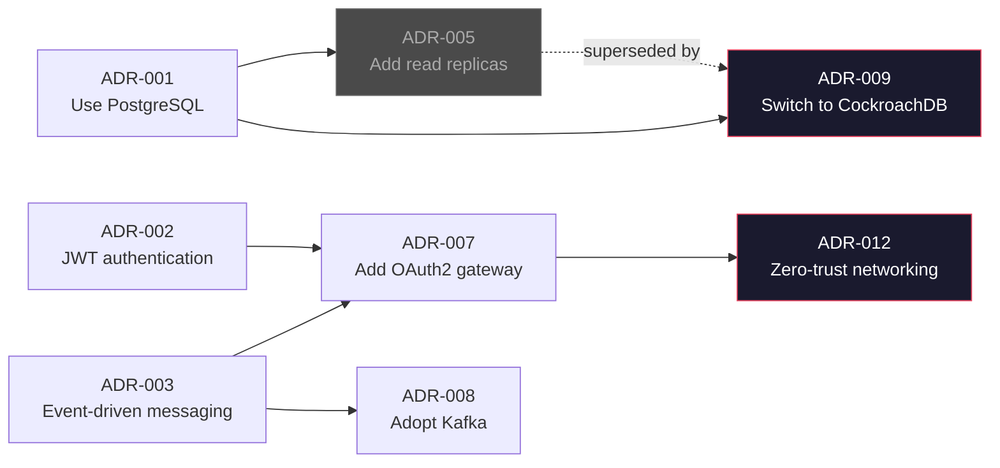
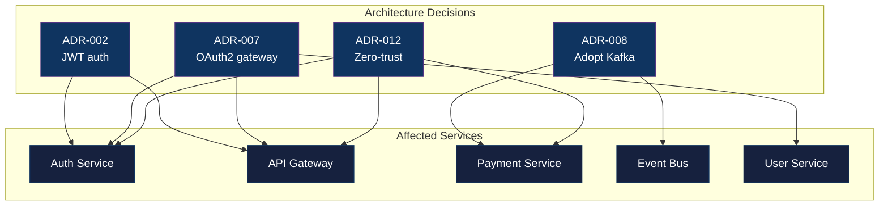
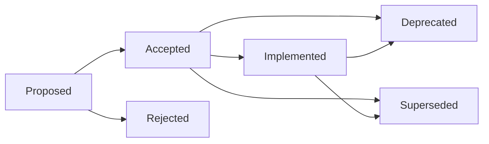

# Architecture Decision Records (ADR)

> **Goal:** Capture the "why" behind architectural decisions so that humans and AI agents can understand context, avoid re-litigating settled choices, and make better decisions going forward. Every recommendation here is backed by a published source, if you think one is wrong, check the [references](#18-sources-and-references) before opening an issue.

---

## 1. Why ADRs exist

Your codebase grows, your team changes, and six months later someone asks: "Why did we pick Kafka over RabbitMQ?" Nobody remembers. The Slack thread is buried. The person who made the call left. The code shows *what* was built, but nothing shows *why*.

Jansen and Bosch named this problem **knowledge vaporization** ([WICSA 2005](https://dl.acm.org/doi/10.1109/WICSA.2005.61)) — decision rationale disappears into the architecture, leaving only structure without reasoning. In 2011, [Michael Nygard](https://www.cognitect.com/blog/2011/11/15/documenting-architecture-decisions) proposed the fix: short text files in version control that capture a decision, its context, and its consequences. His argument still holds: "Agile methods are not opposed to documentation, only to valueless documentation. Large documents are never kept up to date. Small, modular documents have at least a chance at being updated."

This isn't a niche practice anymore. [ThoughtWorks](https://www.thoughtworks.com/radar/techniques/lightweight-architecture-decision-records) moved ADRs to **Adopt** (their strongest recommendation) in May 2018: "For most projects, we see no reason why you wouldn't want to use this technique." All three major cloud providers now publish formal ADR guidance —[AWS](https://docs.aws.amazon.com/prescriptive-guidance/latest/architectural-decision-records/adr-process.html), [Microsoft Azure](https://learn.microsoft.com/en-us/azure/well-architected/architect-role/architecture-decision-record), and [Google Cloud](https://cloud.google.com/architecture/architecture-decision-records). The [UK Government](https://www.gov.uk/government/publications/architectural-decision-record-framework/architectural-decision-record-framework) and [US 18F (General Services Administration)](https://blog.18f.org/2021/07/06/architecture_decision_records_helpful_now_invaluable_later/) use them for public sector architecture. If governments can adopt ADRs, your team can too.

The results back it up. [Spotify Engineering](https://engineering.atspotify.com/2020/04/when-should-i-write-an-architecture-decision-record) found that ADRs solved knowledge loss during team ownership changes and improved cross-office alignment. [GitHub Engineering](https://github.blog/engineering/architecture-optimization/why-write-adrs/) found that colleagues could reference an ADR instead of needing a 30-minute pairing call. The ECSA 2024 empirical study ([Ahmeti et al., 2024](https://link.springer.com/chapter/10.1007/978-3-031-70797-1_22)) confirmed that ADR introduction improved transparency, reduced repeated debates, and aided onboarding. An IBM Watson team produced ~80 ADRs over two years and found the process taught design thinking to junior developers with a median 2 years of experience ([Agile Alliance Experience Report](https://agilealliance.org/resources/experience-reports/distribute-design-authority-with-architecture-decision-records/)).

### 1.1 The cost of not writing ADRs

Every engineering team has that conversation. Someone new joins, asks "Why did we choose X over Y?", and suddenly you're in a meeting where people who were involved try to reconstruct reasoning from memory. I've been in those meetings. They're a waste of everyone's time. The concrete costs:

* **Duplicated effort** — engineers independently solve the same problems
* **Re-litigation** — the same decision gets debated every time someone new joins
* **Risky reversals** — without context, teams either blindly accept legacy decisions or blindly reverse them ([Nygard, 2011](https://www.cognitect.com/blog/2011/11/15/documenting-architecture-decisions))
* **Architecture debt** — undocumented decisions compound into structural liabilities that are harder to identify and costlier to remediate than code-level technical debt ([Verdecchia, Kruchten & Lago, 2021](https://www.sciencedirect.com/science/article/pii/S0950584921001282); [MacCormack et al., Harvard Business School, 2016](https://www.hbs.edu/ris/Publication%20Files/2016-JSS%20Technical%20Debt_d793c712-5160-4aa9-8761-781b444cc75f.pdf))

### 1.2 ADRs for AI coding agents

This is the part that changed how I work with agents. AI agents can read code (the "what") but can't infer intent (the "why"). Without documented decisions, agents hallucinate alternatives to settled choices, suggest architectures that conflict with existing constraints, and generate code that doesn't fit the project. I got tired of fixing their work.

ADRs fix this. They have enough structure for parsing but are written in natural language, which is perfect for LLMs ([Chris Swan, 2025](https://blog.thestateofme.com/2025/07/10/using-architecture-decision-records-adrs-with-ai-coding-assistants/)). When you tell an agent "refer to ADR-007, we already decided this," it reads the context and writes code that actually fits.

One caveat worth knowing: Gloaguen et al. found that bulk-dumping context files *degrades* AI agent performance while increasing inference costs by 20%+ ([Gloaguen, Mündler, Müller, Raychev & Vechev, 2026](https://arxiv.org/abs/2602.11988)). Their recommendation: "human-written context files should describe only minimal requirements." Don't shove all your ADRs into the prompt. Use YAML frontmatter so agents can filter by status, technology, and category, and use retrieval-based approaches (Model Context Protocol servers, Retrieval-Augmented Generation) over static inclusion.

> For the relationship between ADRs and AGENTS.md: ADRs capture the historical "why" (what was decided and the reasoning); AGENTS.md provides operational "how" (what the agent must do right now). Both are complementary. See [04-AI_AGENTS.md](./04-AI_AGENTS.md).

---

## 2. When to write an ADR

Write an ADR when a decision is **architecturally significant**. Not every decision needs one — naming your variables doesn't warrant a document. [Zimmermann's Architectural Significance Test](https://ozimmer.ch/practices/2020/09/24/ASRTestECSADecisions.html) gives you seven criteria. If a decision meets two or more, write an ADR:

| # | Criterion | Example |
|---|-----------|---------|
| 1 | **High business value or risk** | Payment processor selection |
| 2 | **Key stakeholder concern** | Compliance auditor requires encryption rationale |
| 3 | **Quality-of-service deviation** (order of magnitude change) | Moving from 99.9% to 99.99% uptime |
| 4 | **External dependency** (unpredictable or uncontrollable) | Third-party API with no SLA |
| 5 | **Cross-cutting impact** | Authentication pattern affecting all services |
| 6 | **First-of-a-kind** (novel to the team) | First use of event sourcing |
| 7 | **Historical trouble** | Technology that caused incidents before |

[Spotify](https://engineering.atspotify.com/2020/04/when-should-i-write-an-architecture-decision-record) simplifies it: "When should I write an Architecture Decision Record? Almost always!" Their decision tree:

1. **Problem exists, blessed solution exists but undocumented** -> Write an ADR (backfill)
2. **Problem exists, no solution, big change** -> Write an [RFC](./34-RFC.md) first, then an ADR
3. **Problem exists, no solution, small change** -> Write an ADR directly

**What doesn't need an ADR:** Decisions that are minimal-risk, easily reversible, already covered by existing standards, or temporary (experiments, proofs of concept). Good rule of thumb: if it would take longer to write the ADR than to reverse the decision, skip it.

**Timeline:**

* **Draft** during the design phase —[18F](https://blog.18f.org/2021/07/06/architecture_decision_records_helpful_now_invaluable_later/) recommends writing ADRs *during* the decision-making process (like Test-Driven Development), not after
* **Sources** collected during research — minimum 2-3 external sources required
* **Accepted** before merging the code that implements the decision
* **Retroactive ADRs** are legitimate —[Azure](https://learn.microsoft.com/en-us/azure/well-architected/architect-role/architecture-decision-record) explicitly recommends them for brownfield workloads, and [Spotify](https://engineering.atspotify.com/2020/04/when-should-i-write-an-architecture-decision-record) describes backfilling undocumented decisions as a valid use case

---

## 3. ADRs vs RFCs vs design documents

People get confused about when to use what. These aren't competing formats — they serve different purposes and work together.

| Aspect | ADR | RFC | Design Document |
|--------|-----|-----|-----------------|
| **Purpose** | Record a decision | Explore and discuss a decision | Describe a system design |
| **When written** | Decision is being made or was just made | Decision is open, input needed | Before implementation |
| **Scope** | Single decision | Broad proposal, may yield multiple ADRs | Entire system or feature |
| **Length** | 1-2 pages | 2-10 pages | 10-20 pages |
| **Audience** | Team, future maintainers, AI agents | Cross-team stakeholders | Reviewers, implementers |
| **Lifecycle** | Immutable once accepted | Evolves during discussion, then closed | Updated during implementation |

The natural sequence: a [design document](./35-DESIGN_DOCUMENTS.md) explores the design space, an [RFC](./34-RFC.md) gathers cross-team feedback on a controversial proposal, and ADRs capture the specific decisions that emerge.

> [Uber](https://blog.pragmaticengineer.com/scaling-engineering-teams-via-writing-things-down-rfcs/) uses RFCs. [Google](https://www.industrialempathy.com/posts/design-docs-at-google/) uses design documents. [Oxide Computer](https://oxide.computer/blog/rfd-1-requests-for-discussion) uses RFDs (Requests for Discussion) for everything. They all capture decisions as distinct records too. The format matters less than the habit of writing things down.

### 3.1 Where ADRs fit in documentation frameworks

In the [Diataxis framework](https://diataxis.fr/), ADRs map to the **Explanation** quadrant (understanding-oriented documentation). They answer "why" — reasoning, context, and trade-offs. If you're in a regulated industry, [ISO/IEC/IEEE 42010:2022](https://www.iso.org/standard/74393.html) (the international standard for architecture description) defines Architecture Rationale as "the explanation, justification or reasoning about Architecture Decisions that have been made, including architectural alternatives not chosen." ADRs are the lightweight, practical way to satisfy what that standard prescribes formally.

[Simon Brown's C4 model](https://c4model.com/) complements ADRs: C4 diagrams show the "what" (architecture structure at four levels), ADRs document the "why" (reasoning behind that structure). [Structurizr](https://docs.structurizr.com/ui/decisions/) displays both alongside each other and can [visualize ADR relationships as force-directed graphs](https://dev.to/simonbrown/visualising-adrs-3klm).

### 3.2 Visualizing ADR relationships

ADRs don't exist in isolation. They supersede, depend on, and relate to each other — and they affect specific services and components. Visualizing these relationships is what turns a folder of markdown files into an architecture knowledge graph.

**Decision relationship graph** — this belongs in the `README.md` of your ADR folder (`docs/architecture/decisions/README.md`) and **MUST** be updated every time you create, supersede, or deprecate an ADR. If you're adding a new ADR and don't update this graph, your PR is incomplete. [Structurizr](https://docs.structurizr.com/ui/decisions/) can generate this automatically; here's the same concept in Mermaid:



**ADR impact on services** — this lives in the ADR itself, not the README. Each ADR should include a diagram showing which services and components the decision affects. This is the view that matters during incident response and onboarding. When someone asks "why does the auth service work this way?", the diagram inside the ADR shows them exactly what's affected:



We use Mermaid for these graphs because they render natively in GitHub, GitLab, and most markdown viewers — no external tooling required, no images to keep in sync, and AI agents can read the graph definition directly from the markdown. If you prefer other tools, [Structurizr](https://structurizr.com/) generates them from your workspace DSL, [Archgate](https://archgate.dev/) builds a decision graph from your ADR directory and exposes it to AI agents via Model Context Protocol (MCP), and `adr generate graph` from [adr-tools](https://github.com/npryce/adr-tools) produces a Graphviz dot file showing supersession chains. But Mermaid keeps everything in one place — the same markdown file, version-controlled with the decision.

The point isn't the tooling — it's that decisions have a topology, and if you can't see it, you can't reason about it.

---

## 4. Format heritage

We extend [MADR 4.0](https://adr.github.io/madr/) (Markdown Architectural Decision Records), the most widely adopted template. Knowing where each piece comes from helps you decide which sections matter for your project:

| Source | Year | Contribution to our format | Reference |
|--------|------|---------------------------|-----------|
| **Tyree & Akerman** | 2005 | Assumptions, Constraints, Related requirements fields | [IEEE Software 22(2)](https://ieeexplore.ieee.org/document/1407822/) |
| **Michael Nygard** | 2011 | Lightweight format: Title, Context, Decision, Status, Consequences | [Cognitect Blog](https://www.cognitect.com/blog/2011/11/15/documenting-architecture-decisions) |
| **Olaf Zimmermann** | 2012 | Y-Statements (compact one-sentence format), anti-patterns | [Medium](https://medium.com/olzzio/y-statements-10eb07b5a177) |
| **MADR 4.0** (Kopp, Zimmermann) | 2024 | Decision Drivers, Considered Options, Confirmation section | [GitHub](https://github.com/adr/madr) |
| **GOV.UK** | 2025 | Stakeholders consulted, escalation levels | [GOV.UK Framework](https://www.gov.uk/government/publications/architectural-decision-record-framework/architectural-decision-record-framework) |
| **C4 / Structurizr** (Simon Brown) | 2021 | Force-directed ADR relationship graphs, decision-to-service impact diagrams | [Visualising ADRs](https://dev.to/simonbrown/visualising-adrs-3klm) |
| **This standard** | 2025 | Compliance mapping, AI-consumable frontmatter, reference requirements, Mermaid graph requirements | Novel |

> **Academic foundation:** Kruchten's [2004 ontology](https://philippe.kruchten.com/wp-content/uploads/2009/07/kruchten-2004-design-decisions.pdf) established architectural decisions as first-class entities. Jansen & Bosch's [WICSA 2005 paper](https://dl.acm.org/doi/10.1109/WICSA.2005.61) reframed software architecture from a structural view to a decision-centric view, introducing the concept of knowledge vaporization. Kopp, Armbruster & Zimmermann formalized MADR in the [ZEUS 2018 paper](https://ceur-ws.org/Vol-2072/).

---

## 5. Standard format

### 5.1 Required frontmatter fields

YAML frontmatter isn't optional. It's what lets AI agents filter your ADRs by status, technology, and category instead of dumping everything into a prompt. It's also what makes automated validation possible. [Structured MADR](https://github.com/zircote/structured-madr) and [MADR 4.0](https://adr.github.io/madr/decisions/0013-use-yaml-front-matter-for-meta-data.html) both adopted frontmatter for this reason.

```yaml
---
title: "ADR-NNN: [Title]"
type: "adr"
status: "[proposed | accepted | deprecated | superseded | implemented | rejected]"
owner: "@team-name"
classification: "internal"
created: "YYYY-MM-DD"
last_updated: "YYYY-MM-DD"
version: "X.Y.Z"
decision_date: "YYYY-MM-DD"
decision_makers:
  - "@username1"
  - "@username2"
review_date: "YYYY-MM-DD"           # When to re-evaluate (6-12 months from decision)
supersedes: "NNNN"                   # ADR number this replaces (if any)
superseded_by: "NNNN"               # ADR number that replaced this (if any)
related_to:                          # ADRs this depends on or relates to
  - "NNNN"
  - "NNNN"
---
```

**Field definitions:**

| Field | Required | Description |
|-------|----------|-------------|
| `title` | Yes | `ADR-NNN: Short Descriptive Title` |
| `type` | Yes | Always `adr` |
| `status` | Yes | One of: `proposed`, `accepted`, `deprecated`, `superseded`, `implemented` |
| `owner` | Yes | Team or individual responsible (the Directly Responsible Individual) |
| `classification` | Yes | `internal` or `public` |
| `created` | Yes | Date first written |
| `last_updated` | Yes | Date of most recent change |
| `version` | Yes | Semantic version of this document |
| `decision_date` | Yes | Date the decision was formally made |
| `decision_makers` | Yes | List of people who made the decision |
| `review_date` | Recommended | When to re-evaluate (typically 6-12 months from decision) |
| `supersedes` | If applicable | ADR number this replaces |
| `superseded_by` | If applicable | ADR number that replaced this (added when superseded) |
| `related_to` | Recommended | List of related ADR numbers |

### 5.2 Required sections

Every ADR **MUST** include these sections in order:

| # | Section | Description | Origin |
|---|---------|-------------|--------|
| 1 | **Context** | Problem statement, business requirements, forces at play. Value-neutral language. | [Nygard (2011)](https://www.cognitect.com/blog/2011/11/15/documenting-architecture-decisions) |
| 2 | **Decision Drivers** | Bulleted list of forces/concerns influencing the choice | [MADR 4.0](https://adr.github.io/madr/) |
| 3 | **Considered Options** | 3+ alternatives with pros/cons/effort estimates | [MADR 4.0](https://adr.github.io/madr/), [Tyree-Akerman (2005)](https://ieeexplore.ieee.org/document/1407822/) |
| 4 | **Decision** | Chosen option with rationale. Active voice: "We will..." | [Nygard (2011)](https://www.cognitect.com/blog/2011/11/15/documenting-architecture-decisions) |
| 5 | **Consequences** | Positive, Negative, Risks (with mitigations) | [Nygard (2011)](https://www.cognitect.com/blog/2011/11/15/documenting-architecture-decisions) |
| 6 | **Y-Statement** | One-sentence decision summary: "In the context of [X], facing [Y], we decided [Z] to achieve [Q], accepting [D]" | [Zimmermann (2012)](https://medium.com/olzzio/y-statements-10eb07b5a177) |
| 7 | **Assumptions** | "What could cause problems if untrue now or later?" | [Tyree-Akerman (2005)](https://ieeexplore.ieee.org/document/1407822/) |
| 8 | **Confirmation** | How compliance with this decision will be verified | [MADR 4.0](https://adr.github.io/madr/) |
| 9 | **Service Impact Diagram** | Mermaid graph showing which services/components the decision affects (see [3.2](#32-visualizing-adr-relationships)) | [C4 / Structurizr](https://dev.to/simonbrown/visualising-adrs-3klm) |
| 10 | **Compliance Mapping** | Map the decision to any compliance framework relevant to your project (ISO 27001, SOC 2, GDPR, PCI-DSS, HIPAA, FedRAMP, or whatever your auditors care about). If no compliance framework applies, state "N/A — no compliance implications" | This standard (novel) |
| 11 | **References** | External sources that informed the decision (min 2-3) | This standard |
| 12 | **Related Documents** | Links to other ADRs, PRDs, runbooks, implementation PRs | [Tyree-Akerman (2005)](https://ieeexplore.ieee.org/document/1407822/) |

### 5.3 Template

Full template at: [templates/tier-1-system/ADR.md](./templates/tier-1-system/ADR.md)

---

## 6. Writing good ADRs

### 6.1 Length and tone

One to two pages. Half a page to a page is ideal. If it takes longer than 30 minutes to write, you're probably cramming too many decisions into one ADR — split it up. Use analytical, discursive tone — the [Diataxis framework](https://diataxis.fr/explanation/) says explanation should "admit opinion and perspective." Active voice: "We will use Kafka" not "Kafka was selected."

Nygard's original spec: "full sentences, in paragraphs." Bullets for visual style are fine, but don't use fragment lists as a substitute for actual reasoning. If you can't explain the decision in complete sentences, you don't understand it well enough to write an ADR.

### 6.2 The Considered Options section

This is where most ADRs fall apart. [Zimmermann](https://ozimmer.ch/practices/2023/04/03/ADRCreation.html) documents two specific anti-patterns that I've seen kill otherwise solid ADRs:

* **Dummy Alternative** — presenting absurd options to make the preferred choice look good. If an option wouldn't survive 30 seconds of scrutiny, it doesn't belong. Consider genuinely viable alternatives.
* **Sprint/Rush** — considering only one option or only short-term effects. Every ADR should consider at least three options and their 1-2 year implications.

For each option, document:

* **Pros** — genuine advantages
* **Cons** — genuine disadvantages (don't hide them)
* **Estimated effort** — Low / Medium / High
* **Evidence** — benchmarks, vendor docs, or team experience that supports the assessment

### 6.3 The Consequences section

Always include negative consequences and risks. An ADR without negative consequences is a sales pitch, not a decision record — that's [Zimmermann's "Fairy Tale" anti-pattern](https://ozimmer.ch/practices/2023/04/03/ADRCreation.html). Every architectural choice has trade-offs. If you can't name one, you haven't thought hard enough about the decision.

Structure it as three subsections:

* **Positive** — benefits the decision provides
* **Negative** — costs, limitations, and trade-offs accepted
* **Risks** — what could go wrong, with mitigation strategies

---

## 7. References section (REQUIRED)

Every ADR **MUST** include a References section with a minimum of 2-3 external sources. This is non-negotiable — decisions without evidence are opinions.

### 7.1 Format

```markdown
## References

| # | Source | Type | URL |
|---|--------|------|-----|
| 1 | RFC 9700: OAuth 2.0 Security BCP | Standard | https://datatracker.ietf.org/doc/rfc9700/ |
| 2 | OWASP JWT Cheat Sheet | Best Practice | https://cheatsheetseries.owasp.org/... |
| 3 | Stripe vs Adyen Benchmark (2025) | Benchmark | https://example.com/benchmark |
| 4 | ADR-0007: Keycloak Architecture | Internal | ../0007-keycloak-authentication-architecture.md |
```

### 7.2 Source types

| Type | Description | Examples |
|------|-------------|---------|
| **Standard** | RFC, ISO, NIST, W3C specifications | RFC 9700, ISO 27001 A.5.24 |
| **Best Practice** | OWASP, CNCF, Google SRE, vendor best practices | OWASP Cheat Sheets, CNCF guidelines |
| **Benchmark** | Performance comparisons, load test results | Benchmarks, case studies |
| **Vendor Docs** | Official documentation from the chosen technology | Keycloak docs, Redis docs |
| **Research** | Academic papers, engineering blog posts | IEEE papers, Spotify engineering blogs |
| **Internal** | Other ADRs, PRDs, runbooks in this repository | ADR-0007, GKE.md |

### 7.3 Quality requirements

* **Minimum 2-3 sources** per ADR (enforced during review)
* At least **one authoritative source** (RFC, ISO, OWASP, vendor official docs)
* Sources must be **relevant to the decision** — not padding
* **Internal references** (other ADRs, runbooks) count and are encouraged for traceability
* All URLs must be **full URLs** (no shortened links)

---

## 8. Decision linking

### 8.1 Frontmatter fields

Decision relationships **MUST** be declared in YAML frontmatter, not buried in prose where nobody (human or AI) can parse them:

```yaml
supersedes: "0005"        # This ADR replaces ADR-0005
related_to:
  - "0006"                # Depends on namespace architecture
  - "0013"                # Related logging decisions
```

When an ADR is superseded, the **old ADR** must also be updated:

```yaml
status: "superseded"
superseded_by: "0009"     # Added when ADR-0009 supersedes this
```

### 8.2 Relationship types

| Relationship | Direction | Frontmatter Field |
|-------------|-----------|-------------------|
| **Supersedes** | New -> Old | `supersedes: "NNNN"` on the new ADR |
| **Superseded by** | Old -> New | `superseded_by: "NNNN"` on the old ADR |
| **Related to** | Bidirectional | `related_to: ["NNNN"]` on both ADRs |

### 8.3 Superseding rules

1. Create a **NEW** ADR explaining the new decision.
2. Mark the OLD ADR as `status: superseded` and add `superseded_by: "NNNN"`.
3. Add a note at the top of the old ADR body: `> **Superseded by [ADR-NNNN](link)** — [reason]`
4. Don't delete the old ADR. It's history.

> [AWS](https://docs.aws.amazon.com/prescriptive-guidance/latest/architectural-decision-records/adr-process.html) makes the same point: accepted ADRs are **immutable**. When circumstances change, create a new ADR and mark the original as superseded. The status field is the only part that should evolve.

---

## 9. Assumptions section

This is one of the most valuable additions to Nygard's original format, introduced by [Tyree & Akerman (2005)](https://ieeexplore.ieee.org/document/1407822/). The Assumptions section documents conditions that must remain true for the decision to hold. If any assumption breaks, the decision needs re-evaluation.

```markdown
## Assumptions

| # | Assumption | Impact if Wrong | Monitoring |
|---|-----------|-----------------|------------|
| 1 | Keycloak supports FAPI 2.0 by Q3 2026 | Must evaluate alternative IdP | Track Keycloak releases |
| 2 | Redis latency stays < 5ms p99 | Session lookup degrades UX | Prometheus alert |
| 3 | Team has Go expertise for MinIO builds | Source builds not maintainable | Skills matrix review |
```

---

## 10. Confirmation section (MADR 4.0)

The Confirmation section answers: **"How will we verify this decision is working?"** It was renamed from "Validation" in MADR 3.0 and moved as a sub-element of Decision Outcome in [MADR 4.0](https://github.com/adr/madr/releases/tag/4.0.0) (released September 17, 2024).

```markdown
## Confirmation

Compliance with this ADR is confirmed by:

- [ ] Design review approved the architecture
- [ ] Implementation matches the decided pattern
- [ ] Automated test: `test_upload_resumes_after_interruption`
- [ ] Metric threshold: upload completion rate > 95% (Grafana dashboard)
- [ ] Load test validates performance assumptions
```

This section converts decisions from "we decided" to "we can prove it works."

---

## 11. Compliance mapping section

For ADRs that implement security or compliance controls, map the decision to specific framework controls:

```markdown
## Compliance Mapping

| Framework | Control | How This ADR Addresses It |
|-----------|---------|--------------------------|
| ISO 27001 | A.8.24 — Use of cryptography | TLS 1.3 for all inter-service communication |
| SOC 2 | CC6.1 — Logical access controls | JWT validation at gateway with OWASP fingerprint binding |
| GDPR | Art. 32 — Security of processing | Encryption at rest via KMS-managed keys |
```

No existing ADR standard (MADR, Tyree-Akerman, GOV.UK) includes compliance mapping. We added it because we needed it for audit readiness. The immutable, timestamped, version-controlled nature of ADRs makes them natural audit-trail artifacts — both SOC 2 and ISO 27001 require documented evidence of decision-making processes, and ADRs satisfy this without extra work.

---

## 12. Anti-patterns

### 12.1 Creation anti-patterns

[Zimmermann (2023)](https://ozimmer.ch/practices/2023/04/03/ADRCreation.html) documents eleven creation anti-patterns. You'll recognize these — they show up in every codebase that tries ADRs:

| Anti-Pattern | Description | Fix |
|-------------|-------------|-----|
| **Fairy Tale** | Only lists pros, hides cons | Always document negative consequences |
| **Dummy Alternative** | Presents absurd options to make the chosen one look good | Consider genuinely viable alternatives |
| **Sales Pitch** | Marketing language instead of evidence | Use evidence-based language with references |
| **Sprint/Rush** | Only considers one option, only short-term effects | Consider 3+ options with 1-2 year implications |
| **Mega-ADR** | 10+ pages with code samples and diagrams | Keep ADR focused; link to design docs for detail |
| **Blueprint in Disguise** | Reads like a mandate, not a decision record | Document the journey, not just the destination |
| **Free Lunch** | Ignores long-term consequences | Document maintenance, operational, and cost implications |
| **Tunnel Vision** | Ignores broader context (operations, maintenance, system-wide effects) | Consider the full system, not just the immediate scope |
| **Magic Tricks** | False urgency, pseudo-problems, meaningless weighted scoring | State real context; avoid pseudo-accuracy |

### 12.2 Review anti-patterns

[Zimmermann (2023)](https://ozimmer.ch/practices/2023/04/05/ADRReview.html) also documents review anti-patterns:

| Anti-Pattern | Description |
|-------------|-------------|
| **Pass Through** | Few/no comments; document only skimmed |
| **Copy Edit** | Only grammar and wording focus; architectural substance ignored |
| **Siding/Dead End** | Review comments switch topics without resolution |
| **Power Game** | Using hierarchy instead of technical arguments |
| **Groundhog Day** | Repeating identical messages without progress |

### 12.3 Organizational anti-patterns

| Anti-Pattern | Description | Source |
|-------------|-------------|-------|
| **Write-only ADRs** | Written but never referenced — the fundamental failure mode | Common observation |
| **ADR fatigue** | Over-documenting minor decisions | Fix: apply the [Architectural Significance Test](#2-when-to-write-an-adr) |
| **Orphan ADRs** | Decisions nobody owns | Fix: assign a Directly Responsible Individual (DRI); include review in architecture forums |
| **Any Decision Record** | ADRs capture *every* decision, drowning signal in noise | [Pureur & Bittner (2023, InfoQ)](https://www.infoq.com/articles/architectural-decision-record-purpose/) |
| **Shadow architecture** | Architects make decisions behind the scenes while claiming to use ADRs | [Harmel-Law (Fowler's bliki)](https://martinfowler.com/articles/scaling-architecture-conversationally.html) |

### 12.4 Decision-making fallacies

[Zimmermann (2025)](https://ozimmer.ch/practices/2025/09/01/ADMFallacies.html) identifies seven architectural decision-making fallacies:

| Fallacy | Description |
|---------|-------------|
| **Following the Crowd** | Assuming what worked elsewhere will work for you |
| **Anecdotal Evidence** | Basing design on isolated past examples or blog posts |
| **Golden Hammer** | Applying one solution universally |
| **Blind Flight** | Skipping context modeling and requirements analysis |
| **Time Dimension Irrelevance** | Reusing outdated evidence without updating evaluations |
| **AI Uber-Confidence** | Using AI-generated design advice without validation |

---

## 13. Storage, naming, and lifecycle

### 13.1 Location

* **Global architecture:** `docs/architecture/decisions/`
* **Service-specific:** `services/<name>/docs/adr/`
* **Cross-cutting decisions in monorepos:** one authoritative location, cross-references from other services

[ThoughtWorks](https://www.thoughtworks.com/radar/techniques/lightweight-architecture-decision-records) says it best: store ADRs in source control, not wikis. Wikis are where decisions go to die. I've watched it happen — six months later nobody can find anything, the links are broken, and the search doesn't work.

### 13.2 File naming

`NNNN-short-title-with-dashes.md`

* `NNNN`: Monotonically increasing number (0001, 0002...)
* Numbers are never reused
* Example: `0005-use-uuid-primary-keys.md`

> [Dapr (CNCF)](https://github.com/dapr/dapr/tree/master/docs/decision_records) uses category-based subdirectories (`api/`, `architecture/`, `cli/`, `engineering/`, `sdk/`) — an effective pattern for projects with many decisions across different concern areas.

### 13.3 Status lifecycle



| Status | Meaning |
|--------|---------|
| `proposed` | Under discussion, not yet decided |
| `accepted` | Decision made, implementation may or may not have started |
| `rejected` | Decision considered but not adopted (document the reason to prevent re-litigation) |
| `implemented` | Decision fully implemented and verified |
| `deprecated` | Decision no longer recommended but not replaced |
| `superseded` | Replaced by a newer ADR (must link via `superseded_by`) |

> Adding `rejected` is important —[AWS](https://docs.aws.amazon.com/prescriptive-guidance/latest/architectural-decision-records/adr-process.html) includes it to prevent future teams from re-proposing the same approach without knowing it was already evaluated.

### 13.4 Immutability

Accepted ADRs are **immutable**. The status field is the only part that changes (to `superseded` or `deprecated`). When circumstances change, create a new ADR. Don't edit the old one. This creates an auditable chain of reasoning that's invaluable for compliance and onboarding — and it means your git history tells the truth.

---

## 14. Review and governance

### 14.1 The Advice Process

[Andrew Harmel-Law](https://martinfowler.com/articles/scaling-architecture-conversationally.html) (featured on Martin Fowler's bliki) proposes that **anyone can make an architectural decision** provided they consult two groups: those affected by the decision, and subject matter experts. This isn't consensus — the decision maker listens to advice but isn't bound by it. The ADR documents both the decision and the advice received.

This replaces traditional Architecture Review Boards (ARBs) with distributed authority. If your organization has an ARB that gates every decision, you've created a bottleneck. ThoughtWorks and Fowler explicitly advise against heavy-handed ARB approval gates for most organizations.

### 14.2 Review workflow

1. **Pull Request:** Create a PR with the ADR draft.
2. **Silent reading:** Include 10-15 minutes of dedicated reading time in review meetings ([AWS](https://docs.aws.amazon.com/prescriptive-guidance/latest/architectural-decision-records/adr-process.html) recommends the Amazon-style "silent read" approach).
3. **Discussion:** Focus on Decision Drivers and Consequences. [Zimmermann](https://ozimmer.ch/practices/2023/04/05/ADRReview.html) recommends three reviewer types: friendly peer (early feedback), official stakeholder (adequacy), and formal design authority (approval).
4. **Approval:** Requires approval from the relevant tech lead or architect.
5. **Merge:** Once merged, the decision is "Accepted."
6. **Re-evaluate:** On `review_date` or when assumptions change.

### 14.3 Scaling governance

The [UK Government ADR Framework (2025)](https://www.gov.uk/government/publications/architectural-decision-record-framework/architectural-decision-record-framework) defines four escalation levels that scale naturally:

| Level | Scope | Governance |
|-------|-------|-----------|
| **Team** | Local decisions, no cross-team impact | PR-based review, team autonomy |
| **Programme** | Affects multiple teams or shared services | Cross-team consultation required |
| **Department** | Impacts multiple programmes or sets precedents | Architecture Advisory Forum review |
| **Organization-wide** | Requires central alignment | Formal review authority |

The framework's guiding principle: "The point is to make decisions visible, not to add bureaucracy."

### 14.4 Freshness management

Research found that [20-25% of architectural decisions showed stale evidence within two months](https://arxiv.org/html/2601.21116). That's fast. The immutability principle helps — old ADRs don't become "stale" because they record the state at decision time. But you still need to know when a decision is worth re-evaluating:

* Set `review_date` to 6-12 months from `decision_date`
* Include ADR status checks in quarterly architecture reviews
* Use the [adr-validation.yml](./templates/ci-cd/adr-validation.yml) workflow to flag ADRs past their `review_date` automatically

---

## 15. ADR index maintenance

The ADR index at `docs/architecture/decisions/INDEX.md` **MUST** include all ADRs:

| Column | Required |
|--------|----------|
| ADR number + link | Yes |
| Title | Yes |
| Status | Yes |
| Date | Yes |
| Summary | Yes |

When creating a new ADR, update INDEX.md in the same PR. Don't leave it for later — you won't do it. Tools like [adr-log](https://github.com/adr/adr-log) can auto-generate this index from ADR files if you'd rather automate it.

---

## 16. Automated enforcement

Rules that aren't enforced aren't rules — they're suggestions. Copy the [adr-validation.yml](./templates/ci-cd/adr-validation.yml) workflow into your `.github/workflows/` directory:

```bash
cp docs/standards/templates/ci-cd/adr-validation.yml .github/workflows/
```

The workflow runs four checks:

| Check | Triggers | What It Does |
|-------|----------|-------------|
| **Frontmatter validation** | PR to ADR dirs | Verifies all required fields are present and status values are valid |
| **Structure validation** | PR to ADR dirs | Verifies all 12 required sections are present and minimum 2 references exist |
| **Review date check** | Weekly + manual | Flags accepted/implemented ADRs past their `review_date`, fails if critically overdue |
| **Decision linking** | PR to ADR dirs | Checks `supersedes`/`superseded_by` consistency between ADRs |

Configure the workflow by setting two environment variables:

| Variable | Default | Description |
|----------|---------|-------------|
| `ADR_DIRS` | `docs/architecture/decisions services/*/docs/adr` | Directories to scan for ADRs |
| `REVIEW_OVERDUE_DAYS` | `30` | Days past `review_date` before the check fails |

This workflow complements the existing [documentation-check.yml](./templates/ci-cd/documentation-check.yml) (which enforces that code changes include doc updates) and [freshness-check.yml](./templates/ci-cd/freshness-check.yml) (which flags stale docs generally). The ADR workflow is specific to architectural decision records and validates the structure and metadata this standard requires.

---

## 17. Tooling

| Tool | Language | What It Does | Link |
|------|----------|-------------|------|
| **adr-tools** | Shell | Original CLI: `adr init`, `adr new`, `adr list`, `adr generate graph` | [GitHub](https://github.com/npryce/adr-tools) (5.3k stars) |
| **MADR** | Markdown | The template standard (4 variants: full, minimal, bare, bare-minimal) | [GitHub](https://github.com/adr/madr) (2.1k stars) |
| **log4brains** | TypeScript | Generates a searchable static knowledge base from ADRs | [GitHub](https://github.com/thomvaill/log4brains) (1.4k stars) |
| **Structured MADR** | YAML/JSON | Machine-readable ADRs with JSON Schema validation | [GitHub](https://github.com/zircote/structured-madr) |
| **Decision Guardian** | TypeScript | CI/CD enforcement — surfaces relevant ADRs on PRs that touch protected code | [GitHub](https://github.com/DecispherHQ/decision-guardian) |
| **ADR Manager** | TypeScript | VS Code extension with visual editing UI | [VS Code Marketplace](https://marketplace.visualstudio.com/items?itemName=StevenChen.vscode-adr-manager) |
| **Backstage ADR Plugin** | TypeScript | Explore and search ADRs within Spotify's Backstage developer portal | [GitHub](https://github.com/backstage/community-plugins/tree/main/workspaces/adr/plugins/adr) |
| **Structurizr** | Java | Visualizes ADR relationships as force-directed graphs alongside C4 diagrams | [structurizr.com](https://structurizr.com/) |
| **Archgate** | TypeScript | Executable ADRs with companion rule files; MCP server for AI agents | [archgate.dev](https://archgate.dev/) |
| **adr-log** | JavaScript | Auto-generates an ADR index from existing files | [GitHub](https://github.com/adr/adr-log) |

### 16.1 AI-specific tooling

| Tool | What It Does | Link |
|------|-------------|------|
| **Archgate MCP** | Exposes ADRs to Claude Code and Cursor via MCP server | [archgate.dev](https://archgate.dev/) |
| **mcp-adr-analysis-server** | AI-powered ADR analysis, generates ADRs from code analysis | [GitHub](https://github.com/tosin2013/mcp-adr-analysis-server) |
| **ContextPilot** | Syncs context files (`.cursorrules`, `CLAUDE.md`, `copilot-instructions.md`) from a single source | [GitHub](https://github.com/contextpilot-dev/contextpilot) |
| **Agent Decision Records** | ADR variant for documenting decisions made *by* AI agents | [GitHub](https://github.com/me2resh/agent-decision-record) |

---

## 18. Sources and references

### Foundational works

| # | Source | URL |
|---|--------|-----|
| 1 | Nygard, M. "Documenting Architecture Decisions" (2011) | <https://www.cognitect.com/blog/2011/11/15/documenting-architecture-decisions> |
| 2 | Tyree, J. & Akerman, A. "Architecture Decisions: Demystifying Architecture." *IEEE Software* 22(2), 2005 | <https://ieeexplore.ieee.org/document/1407822/> |
| 3 | Jansen, A. & Bosch, J. "Software Architecture as a Set of Architectural Design Decisions." *WICSA 2005* | <https://dl.acm.org/doi/10.1109/WICSA.2005.61> |
| 4 | Kruchten, P. "An Ontology of Architectural Design Decisions" (2004) | <https://philippe.kruchten.com/wp-content/uploads/2009/07/kruchten-2004-design-decisions.pdf> |
| 5 | Kopp, O., Armbruster, A., Zimmermann, O. "Markdown Architectural Decision Records." *ZEUS 2018* | <https://ceur-ws.org/Vol-2072/> |
| 6 | Kruchten, P., Lago, P., van Vliet, H. "Building Up and Reasoning About Architectural Knowledge." *QoSA 2006* | <https://doi.org/10.1007/11921998_8> |

### Standards and frameworks

| # | Source | URL |
|---|--------|-----|
| 7 | ISO/IEC/IEEE 42010:2022 —Architecture Description | <https://www.iso.org/standard/74393.html> |
| 8 | MADR 4.0 (Markdown Architectural Decision Records) | <https://adr.github.io/madr/> |
| 9 | MADR GitHub Repository | <https://github.com/adr/madr> |
| 10 | ADR GitHub Organization | <https://adr.github.io/> |
| 11 | ADR Templates Directory | <https://adr.github.io/adr-templates/> |
| 12 | Joel Parker Henderson —ADR Collection (12 formats cataloged) | <https://github.com/joelparkerhenderson/architecture-decision-record> |
| 13 | arc42 —Section 9: Architecture Decisions | <https://docs.arc42.org/section-9/> |

### Industry adoption

| # | Source | URL |
|---|--------|-----|
| 14 | ThoughtWorks Technology Radar —Lightweight ADRs (Adopt) | <https://www.thoughtworks.com/radar/techniques/lightweight-architecture-decision-records> |
| 15 | AWS Prescriptive Guidance —ADR Process | <https://docs.aws.amazon.com/prescriptive-guidance/latest/architectural-decision-records/adr-process.html> |
| 16 | AWS Architecture Blog —Master ADRs | <https://aws.amazon.com/blogs/architecture/master-architecture-decision-records-adrs-best-practices-for-effective-decision-making/> |
| 17 | Microsoft Azure —Maintain an ADR | <https://learn.microsoft.com/en-us/azure/well-architected/architect-role/architecture-decision-record> |
| 18 | Google Cloud —Architecture Decision Records | <https://cloud.google.com/architecture/architecture-decision-records> |
| 19 | UK Government ADR Framework (2025) | <https://www.gov.uk/government/publications/architectural-decision-record-framework/architectural-decision-record-framework> |
| 20 | UK Government ADR Blog Post (Nabil Nazar, GDS) | <https://technology.blog.gov.uk/2025/12/08/the-architecture-decision-record-adr-framework-making-better-technology-decisions-across-the-public-sector/> |
| 21 | GDS Way —Architecture Decisions | <https://gds-way.digital.cabinet-office.gov.uk/standards/architecture-decisions.html> |
| 22 | 18F —ADRs: Helpful now, invaluable later (2021) | <https://18f.gsa.gov/2021/07/06/architecture_decision_records_helpful_now_invaluable_later/> |

### Practitioner experience

| # | Source | URL |
|---|--------|-----|
| 23 | Spotify Engineering —When Should I Write an ADR (Blake, 2020) | <https://engineering.atspotify.com/2020/04/when-should-i-write-an-architecture-decision-record> |
| 24 | GitHub Engineering —Why Write ADRs | <https://github.blog/engineering/architecture-optimization/why-write-adrs/> |
| 25 | Harmel-Law, A. "Scaling Architecture Conversationally" (Martin Fowler's bliki) | <https://martinfowler.com/articles/scaling-architecture-conversationally.html> |
| 26 | Orosz, G. "Engineering Planning with RFCs, Design Documents and ADRs" (*The Pragmatic Engineer*, 2022) | <https://newsletter.pragmaticengineer.com/p/rfcs-and-design-docs> |
| 27 | Frazelle, J. "RFD 1: Requests for Discussion" (Oxide Computer, 2020) | <https://oxide.computer/blog/rfd-1-requests-for-discussion> |
| 28 | Ubl, M. "Design Docs at Google" (2020) | <https://www.industrialempathy.com/posts/design-docs-at-google/> |
| 29 | Calcado, P. "A Structured RFC Process" (2018) | <https://philcalcado.com/2018/11/19/a_structured_rfc_process.html> |
| 30 | Red Hat —Why You Should Be Using ADRs | <https://www.redhat.com/en/blog/architecture-decision-records> |
| 31 | Equal Experts —Accelerating ADRs with Generative AI (2025) | <https://www.equalexperts.com/blog/our-thinking/accelerating-architectural-decision-records-adrs-with-generative-ai/> |

### Research by Olaf Zimmermann

| # | Source | URL |
|---|--------|-----|
| 32 | Zimmermann, O. Y-Statements (2012) | <https://medium.com/olzzio/y-statements-10eb07b5a177> |
| 33 | Zimmermann, O. "Architectural Decisions — The Making Of" (2020) | <https://ozimmer.ch/practices/2020/04/27/ArchitectureDecisionMaking.html> |
| 34 | Zimmermann, O. "How to Create ADRs — and How Not To" (2023) | <https://ozimmer.ch/practices/2023/04/03/ADRCreation.html> |
| 35 | Zimmermann, O. "How to Review ADRs — and How Not To" (2023) | <https://ozimmer.ch/practices/2023/04/05/ADRReview.html> |
| 36 | Zimmermann, O. "An Adoption Model for Architectural Decision Making" (2023) | <https://ozimmer.ch/practices/2023/04/21/ADAdoptionModel.html> |
| 37 | Zimmermann, O. "Seven Architectural Decision Making Fallacies" (2025) | <https://ozimmer.ch/practices/2025/09/01/ADMFallacies.html> |
| 38 | Zimmermann, O. Architectural Significance Test | <https://ozimmer.ch/practices/2020/09/24/ASRTestECSADecisions.html> |
| 39 | Design Practice Repository —ADR Y-Form Template | <https://socadk.github.io/design-practice-repository/artifact-templates/DPR-ArchitecturalDecisionRecordYForm.html> |

### Academic research

| # | Source | URL |
|---|--------|-----|
| 40 | Ahmeti et al. "ADRs in Practice: An Action Research Study." *ECSA 2024* | <https://link.springer.com/chapter/10.1007/978-3-031-70797-1_22> |
| 41 | Verdecchia, R., Kruchten, P., Lago, P. "Architectural Design Decisions that Incur Technical Debt." *JSS* 180, 2021 | <https://www.sciencedirect.com/science/article/pii/S0950584921001282> |
| 42 | MacCormack, A. et al. "Technical Debt and System Architecture." Harvard Business School, 2016 | <https://www.hbs.edu/ris/Publication%20Files/2016-JSS%20Technical%20Debt_d793c712-5160-4aa9-8761-781b444cc75f.pdf> |
| 43 | Falessi, D. et al. "Decision-Making Techniques for Software Architecture Design." *ACM Computing Surveys* 43(4), 2011 | <https://dl.acm.org/doi/10.1145/1978802.1978812> |
| 44 | Kruchten, P., Nord, R.L., Ozkaya, I. "Technical Debt: From Metaphor to Theory." *IEEE Software* 29(6), 2012 | <https://dl.acm.org/doi/10.1109/MS.2012.167> |
| 45 | Babar, M.A. et al. (eds.) *Software Architecture Knowledge Management.* Springer, 2009 | <https://link.springer.com/book/10.1007/978-3-642-02374-3> |
| 46 | Fairbanks, G. *Just Enough Software Architecture: A Risk-Driven Approach.* 2010 | <https://www.georgefairbanks.com/book/> |
| 47 | Epistemic Status and Temporal Validity of Architectural Decisions (2025) | <https://arxiv.org/html/2601.21116> |
| 48 | Gloaguen, T., Mündler, N., Müller, M., Raychev, V. & Vechev, M. "Evaluating AGENTS.md: Are Repository-Level Context Files Helpful for Coding Agents?" *arXiv:2602.11988*, ETH Zurich, 2026 | <https://arxiv.org/abs/2602.11988> |

### ADRs and AI agents

| # | Source | URL |
|---|--------|-----|
| 49 | Swan, C. "Using ADRs with AI Coding Assistants" (2025) | <https://blog.thestateofme.com/2025/07/10/using-architecture-decision-records-adrs-with-ai-coding-assistants/> |
| 50 | Boeckeler, B. "Context Engineering for Coding Agents" (Martin Fowler) | <https://martinfowler.com/articles/exploring-gen-ai/context-engineering-coding-agents.html> |
| 51 | Lyu, S. "ADR in Code: Architecture Compliance with AI Code Reviews" (2026) | <https://shinglyu.com/blog/2026/03/01/ai-adr-code-review.html> |
| 52 | Pureur, P. & Bittner, K. "Has Your ADR Lost Its Purpose?" *InfoQ*, 2023 | <https://www.infoq.com/articles/architectural-decision-record-purpose/> |
| 53 | Structured MADR — Machine-readable ADRs | <https://github.com/zircote/structured-madr> |
| 54 | Agent Decision Records (AgDR) | <https://github.com/me2resh/agent-decision-record> |
| 55 | Archgate — Executable ADRs | <https://archgate.dev/> |

### Tooling

| # | Source | URL |
|---|--------|-----|
| 56 | adr-tools (Nat Pryce) | <https://github.com/npryce/adr-tools> |
| 57 | log4brains | <https://github.com/thomvaill/log4brains> |
| 58 | ADR Manager (VS Code) | <https://marketplace.visualstudio.com/items?itemName=StevenChen.vscode-adr-manager> |
| 59 | Decision Guardian | <https://github.com/DecispherHQ/decision-guardian> |
| 60 | Backstage ADR Plugin | <https://github.com/backstage/community-plugins/tree/main/workspaces/adr/plugins/adr> |
| 61 | ADR Tooling List | <https://adr.github.io/adr-tooling/> |
| 62 | Structurizr —ADR Visualization | <https://docs.structurizr.com/ui/decisions/> |
| 63 | Brown, S. "Visualising ADRs" (2021) | <https://dev.to/simonbrown/visualising-adrs-3klm> |

### Documentation frameworks

| # | Source | URL |
|---|--------|-----|
| 64 | Diataxis Framework | <https://diataxis.fr/> |
| 65 | C4 Model | <https://c4model.com/> |
| 66 | Agile Alliance —Distribute Design Authority with ADRs (IBM Watson) | <https://agilealliance.org/resources/experience-reports/distribute-design-authority-with-architecture-decision-records/> |

---

## 19. Related documents

| Document | Purpose |
|----------|---------|
| [Philosophy](./01-PHILOSOPHY.md) | "Context, not Control" principle |
| [Document Types](./03-DOCUMENT_TYPES.md) | Where ADRs fit in |
| [AI Agents](./04-AI_AGENTS.md) | How AI agents consume project context |
| [RFCs](./34-RFC.md) | When to use an RFC instead of (or before) an ADR |
| [Design Documents](./35-DESIGN_DOCUMENTS.md) | When to use a design doc instead of an ADR |
| [ADR Template](./templates/tier-1-system/ADR.md) | Copy this to start a new ADR |
| [ADR Example](./examples/example-adr.md) | Reference implementation |

---

**Previous:** [32 - Progressive Disclosure](./32-PROGRESSIVE_DISCLOSURE.md)
**Next:** [34 - Requests for Comments](./34-RFC.md)
