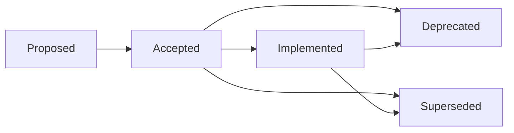

# Architecture Decision Records (ADR)

> **Goal:** Capture the "Why" behind architectural decisions. An ADR is a short text file that describes a decision, its context, and its consequences.

---

## 1. When to Write an ADR

Write an ADR when a decision involves a significant trade-off, including:

* Adding/Removing a core dependency (e.g., "Switching from REST to gRPC").
* Changing a database or storage strategy.
* Defining a structural pattern (e.g., "Standardizing on Hexagonal Architecture").
* Accepting strategic technical debt.
* Selecting a security control or compliance approach.
* Choosing an infrastructure or deployment strategy.

**Timeline:**

* **Draft:** During the design phase.
* **Sources:** Collect references during research phase. Minimum 2-3 external sources required.
* **Approved:** Before merging the code implementing the decision.

---

## 2. Standard Format

We follow an extended [MADR (Markdown Any Decision Records)](https://adr.github.io/madr/) format, enhanced with fields from Tyree-Akerman (traceability), GOV.UK (stakeholders), ADR-E (explainability), and compliance mapping (novel — no industry standard includes this yet).

### 2.1 Required Frontmatter Fields

```yaml
---
title: "ADR-NNN: [Title]"
type: "adr"
status: "[proposed | accepted | deprecated | superseded | implemented]"
owner: "@team-name"
classification: "internal"
created: "YYYY-MM-DD"
last_updated: "YYYY-MM-DD"
version: "X.Y.Z"
decision_date: "YYYY-MM-DD"
decision_makers:
  - "@username1"
  - "@username2"
review_date: "YYYY-MM-DD"           # When this decision should be re-evaluated
supersedes: "NNNN"                   # ADR number this replaces (if any)
superseded_by: "NNNN"               # ADR number that replaced this (if any)
related_to:                          # ADRs this depends on or relates to
  - "NNNN"
  - "NNNN"
---
```

**Field definitions:**

| Field | Required | Description |
|-------|----------|-------------|
| `title` | Yes | `ADR-NNN: Short Descriptive Title` |
| `type` | Yes | Always `adr` |
| `status` | Yes | One of: `proposed`, `accepted`, `deprecated`, `superseded`, `implemented` |
| `owner` | Yes | Team or individual responsible |
| `classification` | Yes | `internal` or `public` |
| `created` | Yes | Date first written |
| `last_updated` | Yes | Date of most recent change |
| `version` | Yes | Semantic version of this document |
| `decision_date` | Yes | Date the decision was formally made |
| `decision_makers` | Yes | List of people who made the decision |
| `review_date` | Recommended | When to re-evaluate (typically 6-12 months from decision) |
| `supersedes` | If applicable | ADR number this replaces |
| `superseded_by` | If applicable | ADR number that replaced this (added when superseded) |
| `related_to` | Recommended | List of related ADR numbers |

### 2.2 Required Sections

Every ADR **MUST** include these sections in order:

| # | Section | Description |
|---|---------|-------------|
| 1 | **Context** | Problem statement, business requirements, forces at play |
| 2 | **Decision Drivers** | Bulleted list of forces/concerns influencing the choice |
| 3 | **Considered Options** | 3+ alternatives with pros/cons/effort estimates |
| 4 | **Decision** | Chosen option with rationale |
| 5 | **Consequences** | Positive, Negative, Risks (with mitigations) |
| 6 | **References** | External sources that informed the decision (min 2-3) |
| 7 | **Related Documents** | Links to other ADRs, PRDs, runbooks, implementation PRs |

### 2.3 Recommended Sections

These sections are **RECOMMENDED** for all ADRs and **REQUIRED** for P0/P1 decisions:

| # | Section | Description | Source |
|---|---------|-------------|--------|
| 8 | **Assumptions** | "What could cause problems if untrue now or later?" | Tyree-Akerman |
| 9 | **Confirmation** | How compliance with this decision will be verified | MADR 4.0 |
| 10 | **Compliance Mapping** | Which ISO 27001 / SOC 2 / GDPR controls this implements | Novel |

### 2.4 Template

Full template at: `docs/standards/templates/tier-1-system/ADR.md`

---

## 3. References Section (REQUIRED)

Every ADR **MUST** include a References section with a minimum of 2-3 external sources. This is non-negotiable — decisions without evidence are opinions.

### 3.1 Format

```markdown
## References

| # | Source | Type | URL |
|---|--------|------|-----|
| 1 | RFC 9700: OAuth 2.0 Security BCP | Standard | https://datatracker.ietf.org/doc/rfc9700/ |
| 2 | OWASP JWT Cheat Sheet | Best Practice | https://cheatsheetseries.owasp.org/... |
| 3 | Stripe vs Adyen Benchmark (2025) | Benchmark | https://example.com/benchmark |
| 4 | ADR-0007: Keycloak Architecture | Internal ADR | ../0007-keycloak-authentication-architecture.md |
```

### 3.2 Source Types

| Type | Description | Examples |
|------|-------------|---------|
| **Standard** | RFC, ISO, NIST, W3C specifications | RFC 9700, ISO 27001 A.5.24 |
| **Best Practice** | OWASP, CNCF, Google SRE, vendor best practices | OWASP Cheat Sheets, CNCF guidelines |
| **Benchmark** | Performance comparisons, load test results | Benchmarks, case studies |
| **Vendor Docs** | Official documentation from the chosen technology | Keycloak docs, Redis docs |
| **Research** | Academic papers, engineering blog posts | IEEE papers, Spotify/Netflix engineering blogs |
| **Internal** | Other ADRs, PRDs, runbooks in this repository | ADR-0007, GKE.md |

### 3.3 Quality Requirements

* **Minimum 2-3 sources** per ADR (enforced during review)
* At least **one authoritative source** (RFC, ISO, OWASP, vendor official docs)
* Sources must be **relevant to the decision** — not padding
* **Internal references** (other ADRs, runbooks) count and are encouraged for traceability
* All URLs must be **full URLs** (no shortened links)

---

## 4. Decision Linking

### 4.1 Frontmatter Fields

Decision relationships **MUST** be declared in YAML frontmatter, not just in prose:

```yaml
supersedes: "0005"        # This ADR replaces ADR-0005
related_to:
  - "0006"                # Depends on namespace architecture
  - "0013"                # Related logging decisions
```

When an ADR is superseded, the **old ADR** must also be updated:

```yaml
status: "superseded"
superseded_by: "0009"     # Added when ADR-0009 supersedes this
```

### 4.2 Relationship Types

| Relationship | Direction | Frontmatter Field |
|-------------|-----------|-------------------|
| **Supersedes** | New → Old | `supersedes: "NNNN"` on the new ADR |
| **Superseded by** | Old → New | `superseded_by: "NNNN"` on the old ADR |
| **Related to** | Bidirectional | `related_to: ["NNNN"]` on both ADRs |

### 4.3 Superseding Rules

1. Create a **NEW** ADR explaining the new decision.
2. Mark the OLD ADR as `status: superseded` and add `superseded_by: "NNNN"`.
3. Add a note at the top of the old ADR body: `> **Superseded by [ADR-NNNN](link)** — [reason]`
4. Do **not** delete the old ADR. It is history.

---

## 5. Assumptions Section

When present, the Assumptions section documents conditions that must remain true for the decision to be valid. If any assumption becomes false, the decision should be re-evaluated.

```markdown
## Assumptions

| # | Assumption | Impact if Wrong | Monitoring |
|---|-----------|-----------------|------------|
| 1 | Keycloak supports FAPI 2.0 by Q3 2026 | Must evaluate alternative IdP | Track Keycloak releases |
| 2 | Redis latency stays < 5ms p99 | Session lookup degrades UX | Prometheus alert |
| 3 | Team has Go expertise for MinIO builds | Source builds not maintainable | Skills matrix review |
```

---

## 6. Confirmation Section (MADR 4.0)

The Confirmation section answers: **"How will we verify this decision is working?"**

```markdown
## Confirmation

Compliance with this ADR is confirmed by:

- [ ] Design review approved the architecture
- [ ] Implementation matches the decided pattern
- [ ] Automated test: `test_upload_resumes_after_interruption`
- [ ] Metric threshold: upload completion rate > 95% (Grafana dashboard)
- [ ] Load test validates performance assumptions
```

This section converts decisions from "we decided" to "we can prove it works."

---

## 7. Compliance Mapping Section

For ADRs that implement security or compliance controls, map the decision to specific framework controls:

```markdown
## Compliance Mapping

| Framework | Control | How This ADR Addresses It |
|-----------|---------|--------------------------|
| ISO 27001 | A.8.24 — Use of cryptography | TLS 1.3 for all inter-service communication |
| SOC 2 | CC6.1 — Logical access controls | JWT validation at gateway with OWASP fingerprint binding |
| GDPR | Art. 32 — Security of processing | Encryption at rest via KMS-managed keys |
```

> **Note:** No existing ADR standard (MADR, Tyree-Akerman, GOV.UK, ADR-E) includes compliance mapping. This is our extension for audit readiness.

---

## 8. Anti-Patterns to Avoid

Based on [Olaf Zimmermann's research](https://ozimmer.ch/practices/2023/04/03/ADRCreation.html), avoid these common ADR anti-patterns:

| Anti-Pattern | Description | Fix |
|-------------|-------------|-----|
| **Fairy Tale** | Only lists pros, hides cons | Always document negative consequences |
| **Dummy Alternative** | Presents absurd options to make the chosen one look good | Consider genuinely viable alternatives |
| **Sales Pitch** | Marketing language instead of facts | Use evidence-based language with references |
| **Sprint/Rush** | Only considers short-term (2-3 sprints) | Consider 1-2 year implications |
| **Mega-ADR** | 10+ pages with code samples and diagrams | Keep ADR focused; link to design docs |
| **Blueprint in Disguise** | Reads like a mandate, not a decision record | Document the journey, not just the destination |
| **Free Lunch** | Ignores long-term consequences | Document maintenance, operational, and cost implications |

---

## 9. Storage & Lifecycle

### Location

* **Global Architecture:** `docs/architecture/decisions/`
* **Service Specific:** `services/<name>/docs/adr/`

### File Naming

`NNNN-short-title-with-dashes.md`

* `NNNN`: Monotonically increasing number (0001, 0002...)
* Example: `0005-use-uuid-primary-keys.md`

### Status Lifecycle



| Status | Meaning |
|--------|---------|
| `proposed` | Under discussion, not yet decided |
| `accepted` | Decision made, implementation may or may not have started |
| `implemented` | Decision fully implemented and verified |
| `deprecated` | Decision no longer recommended but not replaced |
| `superseded` | Replaced by a newer ADR (must link via `superseded_by`) |

---

## 10. Review Process

1. **Pull Request:** Create a PR with the ADR draft.
2. **Discussion:** Discuss in PR comments. Focus on the *Decision Drivers* and *Consequences*.
3. **Approval:** Requires approval from the relevant Tech Lead or Architect.
4. **Merge:** Once merged, the decision is "Accepted".
5. **Review:** Re-evaluate on `review_date` or when assumptions change.

---

## 11. INDEX.md Maintenance

The ADR index at `docs/architecture/decisions/INDEX.md` **MUST** include all ADRs with:

| Column | Required |
|--------|----------|
| ADR number + link | Yes |
| Title | Yes |
| Status | Yes |
| Date | Yes |
| Summary | Yes |

When creating a new ADR, always update INDEX.md in the same PR.

---

## 12. Related Documents

| Document | Purpose |
|----------|---------|
| [Philosophy](./01-PHILOSOPHY.md) | "Context, not Control" principle |
| [Document Types](./03-DOCUMENT_TYPES.md) | Where ADRs fit in |
| [ADR Template](./templates/tier-1-system/ADR.md) | Copy this to start a new ADR |
| [ADR Example](./examples/example-adr.md) | Reference implementation |
| [ADR Index](../architecture/decisions/INDEX.md) | All decisions in this repository |
| [MADR 4.0](https://adr.github.io/madr/) | Upstream format we extend |
| [Tyree-Akerman Template](https://personal.utdallas.edu/~chung/SA/zz-Impreso-architecture_decisions-tyree-05.pdf) | Enterprise ADR reference (IEEE Software) |
| [ADR Anti-Patterns](https://ozimmer.ch/practices/2023/04/03/ADRCreation.html) | Zimmermann's guidance on common mistakes |

---

**Previous:** [32 - Progressive Disclosure](./32-PROGRESSIVE_DISCLOSURE.md)
**Next:** [34 - Search Optimization](./34-SEARCH_OPTIMIZATION.md)
