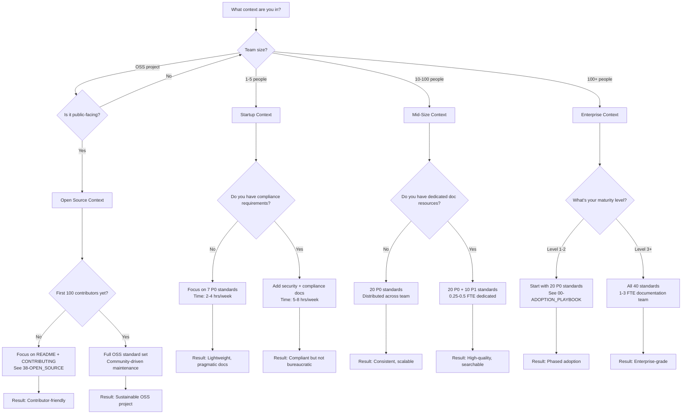

# Context-Specific Documentation Guidance

> **Goal:** Choose the right documentation standards and practices based on your project context—open source, startup, mid-size company, or large enterprise.

---

## Table of Contents

1. [Context Overview](#context-overview)
2. [Open Source Projects](#open-source-projects)
3. [Startups (1-10 Engineers)](#startups-1-10-engineers)
4. [Mid-Size Companies (10-100 Engineers)](#mid-size-companies-10-100-engineers)
5. [Large Enterprises (100+ Engineers)](#large-enterprises-100-engineers)
6. [Standards Matrix by Context](#standards-matrix-by-context)
7. [Decision Tree](#decision-tree)

---

## Context Overview

Different contexts require different documentation approaches. This guide helps you select the right standards and practices for your situation.

| Context | Team Size | Key Characteristics | Documentation Focus |
|---------|-----------|---------------------|---------------------|
| **Open Source** | 1-1000+ contributors | Public-facing, community-driven, volunteer contributors | Public clarity, contributor onboarding, maintainability |
| **Startup** | 1-10 engineers | Rapid iteration, limited resources, high velocity | Minimal viable docs, quick setup, essential only |
| **Mid-Size** | 10-100 engineers | Growing teams, need consistency, some process | Standardization, team alignment, basic governance |
| **Enterprise** | 100+ engineers | Compliance requirements, audit trails, dedicated teams | Full compliance, comprehensive coverage, formal processes |

---

## Open Source Projects

### Open Source Characteristics

- **Public-facing:** All documentation is visible to the world
- **Community-driven:** Contributors may be volunteers with varying skill levels
- **Long-term maintenance:** Projects may outlive original maintainers
- **Diverse audience:** Users, contributors, maintainers all need different docs

### Open Source Documentation Priorities

1. **README.md** — First impression, must be excellent
2. **CONTRIBUTING.md** — Clear contributor guidelines
3. **Getting Started** — New users can run in < 10 minutes
4. **API Documentation** — Public APIs must be fully documented
5. **Changelog** — Transparent release notes

### Open Source Recommended Standards

| Standard | Priority | Why |
|----------|----------|-----|
| `01-PHILOSOPHY.md` | P0 | Understand documentation value |
| `03-DOCUMENT_TYPES.md` | P0 | Know what to document |
| `05-QUALITY.md` | P0 | Ensure quality bar |
| `16-RELEASE_NOTES.md` | P0 | Changelog standards |
| `18-API_DOCUMENTATION.md` | P1 | If you have public APIs |
| `38-OPEN_SOURCE.md` | P1 | OSS-specific guidance |
| `26-ONBOARDING.md` | P1 | Contributor onboarding |
| `11-STYLE_GUIDE.md` | P2 | Consistency across contributors |

### OSS-Specific Considerations

**Public-Facing Documentation:**

- All docs are permanently visible
- Mistakes reflect on maintainers professionally
- SEO optimization matters for discoverability

**Community-Driven:**

- Welcome documentation PRs from strangers
- Clear contribution guidelines essential
- Recognize contributors publicly

**Long-Term Maintenance:**

- Projects may outlive original creators
- Maintainer handoff planning critical
- See [38-OPEN_SOURCE.md](./38-OPEN_SOURCE.md) for complete guidance

---

## Startups (1-10 Engineers)

### Startup Characteristics

- **Rapid iteration:** Code changes faster than documentation can keep up
- **Limited resources:** No dedicated technical writers
- **High velocity:** Speed to market is critical
- **Scrappy culture:** Pragmatism over perfection

### Startup Documentation Priorities

**Focus on these 5 priorities:**

1. **README.md in every service** - New hires can't ask questions if the team is in flow state
2. **Getting Started guide** - Onboard developers in < 1 day
3. **Environment setup** - One command to run locally
4. **Deployment runbook** - Critical path to production
5. **Architecture diagram** - Visual overview of system

**Explicitly skip:**

- Formal API documentation (code comments sufficient)
- Comprehensive governance docs
- Detailed style guides (use linters instead)

### Startup Recommended Standards

| Standard | Priority | Why | Time Investment |
|----------|----------|-----|-----------------|
| `01-PHILOSOPHY.md` | P0 | Understand value, skip bureaucracy | 15 min read |
| `03-DOCUMENT_TYPES.md` | P0 | Know what to write (README, runbooks) | 10 min read |
| `QUICK_START.md` | P0 | Get started in 5 minutes | 5 min read |
| `05-QUALITY.md` | P1 | Quality criteria (aim for 80%+) | 20 min read |
| `11-STYLE_GUIDE.md` | P2 | Basic consistency | 10 min read |
| `26-ONBOARDING.md` | P1 | Onboard new hires quickly | 15 min read |
| `27-RUNBOOKS.md` | P0 | Keep the site running | 20 min read |

**Total time investment:** 2-4 hours/week (10% of team)

### Startup-Specific Tradeoffs

**Do:**

- ✅ Document deployment and critical paths
- ✅ Use templates for speed
- ✅ Keep docs in Git (not Confluence)
- ✅ Automate what you can (linters, not reviews)

**Don't:**

- ❌ Write comprehensive API docs yet (unless API-first product)
- ❌ Create governance structures (too early)
- ❌ Perfect documentation (ship features instead)
- ❌ Over-invest in tooling (MkDocs Material is enough)

**Golden Rule:** If it takes >15 minutes to document, simplify the code instead.

---

## Mid-Size Companies (10-100 Engineers)

### Mid-Size Characteristics

- **Growing teams:** New hires every month
- **Need consistency:** Multiple teams, different styles
- **Scaling challenges:** Tribal knowledge becoming a problem
- **Process maturation:** Moving from chaos to structure

### Mid-Size Documentation Priorities

**Focus on standardization and discoverability:**

1. **Consistent README structure** - All services follow same template
2. **Centralized documentation site** - Single source of truth
3. **API documentation** - Services integrate with each other
4. **Onboarding docs** - Multiple new hires per quarter
5. **Architecture decision records** - Document why choices were made
6. **Incident postmortems** - Learn from failures

### Mid-Size Recommended Standards

| Standard | Priority | Why | Owner |
|----------|----------|-----|-------|
| **Foundation (P0)** | | | |
| `01-PHILOSOPHY.md` | P0 | Align team on documentation value | Doc lead |
| `03-DOCUMENT_TYPES.md` | P0 | Standardize what gets documented | Doc lead |
| `05-QUALITY.md` | P0 | Define quality bar | Doc lead |
| `07-GOVERNANCE.md` | P0 | CODEOWNERS for documentation | Engineering manager |
| **Core Documentation (P0)** | | | |
| `08-README_STANDARD.md` | P0 | Consistent README structure | All teams |
| `18-API_DOCUMENTATION.md` | P0 | Document service APIs | Backend teams |
| `26-ONBOARDING.md` | P0 | Reduce onboarding time | HR + Engineering |
| `27-RUNBOOKS.md` | P0 | Operational reliability | SRE/DevOps |
| **Process & Governance (P1)** | | | |
| `06-OPERATIONS.md` | P1 | Freshness, ownership | Doc lead |
| `11-STYLE_GUIDE.md` | P1 | Consistency across teams | Doc lead |
| `22-DECISION_RECORDS.md` | P1 | Architecture decisions | Tech leads |
| `28-INCIDENT_POSTMORTEMS.md` | P1 | Learn from incidents | SRE |
| **Tooling & Automation (P1)** | | | |
| `04-AI_AGENTS.md` | P1 | AI-assisted documentation | Engineering |
| `39-INTEGRATIONS.md` | P1 | MkDocs, Backstage, GitHub | DevOps |
| `scripts/*.sh` | P1 | Validation automation | CI/CD |
| **Advanced (P2)** | | | |
| `13-FEEDBACK.md` | P2 | Measure helpfulness | Product |
| `17-MATURITY_MODEL.md` | P2 | Track improvement | Doc lead |
| `40-METRICS.md` | P2 | ROI calculation | Engineering manager |

**Total time investment:** 25-50% of 1 FTE (dedicated documentation engineer or distributed across team)

### Organizational Structure

**Recommended:**

- **Documentation Champion:** 1 person, 25-50% time
- **CODEOWNERS:** Each team owns their service docs
- **Monthly Review:** Documentation health metrics
- **Quarterly Audit:** Freshness and quality checks

**Warning Signs You Need More Investment:**

- Onboarding takes >2 weeks
- Same questions asked repeatedly in Slack
- Incidents caused by undocumented procedures
- New team members can't deploy independently

---

## Large Enterprises (100+ Engineers)

### Enterprise Characteristics

- **Compliance requirements:** GDPR, SOC2, ISO27001
- **Audit trails:** Everything must be documented and version-controlled
- **Dedicated teams:** Technical writers, SRE, DevRel
- **Formal processes:** Change management, approval workflows
- **Multiple products:** Documentation across product portfolio

### Enterprise Documentation Priorities

**Full compliance and comprehensive coverage:**

1. **All 40 standards implemented** - No gaps allowed
2. **Automated enforcement** - CI/CD blocks non-compliant docs
3. **Dedicated portal** - Backstage, Docusaurus, or enterprise CMS
4. **Search and discovery** - AI-powered search across all docs
5. **Translation/localization** - Multi-language support
6. **Compliance documentation** - Audit trails, SLAs, policies
7. **API governance** - OpenAPI specs for all services
8. **Metrics dashboards** - Real-time documentation health

### Enterprise Recommended Standards

**All 40 standards, differentiated by must-have vs should-have:**

#### Must-Have (30 standards)

**Foundation & Quality:**

- 01-PHILOSOPHY, 02-REPOSITORY_STRUCTURE, 03-DOCUMENT_TYPES, 04-AI_AGENTS, 05-QUALITY, 06-OPERATIONS, 07-GOVERNANCE

**Core Documentation:**

- 08-README_STANDARD, 09-CODE_COMMENTS, 10-COMMIT_MESSAGES, 11-STYLE_GUIDE, 12-IMAGES_DIAGRAMS, 13-FEEDBACK, 14-SEARCH

**API & Technical:**

- 15-VERSIONING, 16-RELEASE_NOTES, 17-MATURITY_MODEL, 18-API_DOCUMENTATION, 19-ERROR_HANDLING

**Operational:**

- 21-SECURITY_DOCS, 22-DECISION_RECORDS, 23-TROUBLESHOOTING, 24-FAQ, 25-GLOSSARY, 26-ONBOARDING, 27-RUNBOOKS, 28-INCIDENT_POSTMORTEMS, 29-MONITORING_ALERTS

**Enterprise-Specific:**

- 30-CHANGE_LOGS, 31-DEPENDENCIES, 32-TESTING_DOCS, 33-CI_CD_DOCS, 34-DISASTER_RECOVERY, 35-DOCUMENTATION_PORTAL

**Meta:**

- 36-CONTEXT_GUIDANCE (this document), 37-MIGRATION_GUIDE, 40-METRICS

#### Should-Have (10 standards)

**For OSS or external-facing products:**

- 38-OPEN_SOURCE

**For multi-team organizations:**

- 39-INTEGRATIONS (Backstage, JIRA, etc.)

**For continuous improvement:**

- 20-ANTI_PATTERNS (train new hires on common mistakes)

### Time Investment

**Dedicated Resources:**

- **1-3 full-time Documentation Engineers** ($150K-250K/year each)
- **Part-time Technical Writers** (for user-facing docs)
- **Engineering contribution:** 5% of each engineer's time (~2 hours/week)

**Tooling Budget:**

- Documentation portal: $10-50K/year (Backstage self-hosted, or Docusaurus)
- Compliance tools: $5-20K/year (SBOM, security scanning)
- Monitoring/analytics: $5-10K/year (Plausible, Grafana)
- **Total:** $170-330K/year investment

**Expected ROI:** 300-500% (see [40-METRICS.md](./40-METRICS.md) for calculation)

### Governance and Review Processes

**Approval Workflows:**

1. **Technical Review:** Engineer on the team verifies accuracy
2. **Audience Review:** Someone NOT on the team tests usability
3. **Compliance Review:** Security/legal reviews sensitive docs
4. **Documentation Team Review:** Final style and structure check

**Cadence:**

- **Daily:** Automated CI/CD checks
- **Weekly:** Documentation health dashboard review
- **Monthly:** Metrics review meeting
- **Quarterly:** Maturity assessment and planning
- **Annually:** Full compliance audit

---

## Standards Matrix by Context

Comprehensive table showing which standards apply to each context:

| Standard | Solo/Small (1-5) | Mid-Size (10-100) | Enterprise (100+) | OSS Projects |
|----------|------------------|-------------------|-------------------|--------------|
| **Foundation** | | | | |
| 01-PHILOSOPHY | ✅ P0 | ✅ P0 | ✅ P0 | ✅ P0 |
| 02-REPOSITORY_STRUCTURE | ✅ P1 | ✅ P0 | ✅ P0 | ✅ P1 |
| 03-DOCUMENT_TYPES | ✅ P0 | ✅ P0 | ✅ P0 | ✅ P0 |
| 04-AI_AGENTS | ⚪ P2 | ✅ P1 | ✅ P0 | ⚪ P2 |
| 05-QUALITY | ✅ P1 | ✅ P0 | ✅ P0 | ✅ P0 |
| 06-OPERATIONS | ⚪ P2 | ✅ P1 | ✅ P0 | ✅ P1 |
| 07-GOVERNANCE | ⚪ Skip | ✅ P0 | ✅ P0 | ✅ P1 |
| **Core Documentation** | | | | |
| 08-README_STANDARD | ✅ P0 | ✅ P0 | ✅ P0 | ✅ P0 |
| 09-CODE_COMMENTS | ✅ P1 | ✅ P1 | ✅ P0 | ✅ P1 |
| 10-COMMIT_MESSAGES | ✅ P1 | ✅ P0 | ✅ P0 | ✅ P0 |
| 11-STYLE_GUIDE | ⚪ P2 | ✅ P1 | ✅ P0 | ✅ P1 |
| 12-IMAGES_DIAGRAMS | ✅ P1 | ✅ P1 | ✅ P0 | ✅ P1 |
| 13-FEEDBACK | ⚪ Skip | ⚪ P2 | ✅ P0 | ✅ P1 |
| 14-SEARCH | ⚪ Skip | ✅ P1 | ✅ P0 | ✅ P1 |
| **Versioning & Release** | | | | |
| 15-VERSIONING | ✅ P1 | ✅ P0 | ✅ P0 | ✅ P0 |
| 16-RELEASE_NOTES | ✅ P1 | ✅ P0 | ✅ P0 | ✅ P0 |
| 17-MATURITY_MODEL | ⚪ Skip | ⚪ P2 | ✅ P1 | ⚪ P2 |
| **Technical Documentation** | | | | |
| 18-API_DOCUMENTATION | ⚪ P2 | ✅ P0 | ✅ P0 | ✅ P0 |
| 19-ERROR_HANDLING | ⚪ P2 | ✅ P1 | ✅ P0 | ✅ P1 |
| 20-ANTI_PATTERNS | ⚪ Skip | ⚪ P2 | ✅ P1 | ⚪ P2 |
| 21-SECURITY_DOCS | ✅ P1 | ✅ P0 | ✅ P0 | ✅ P0 |
| 22-DECISION_RECORDS | ⚪ P2 | ✅ P1 | ✅ P0 | ⚪ P2 |
| 23-TROUBLESHOOTING | ✅ P1 | ✅ P0 | ✅ P0 | ✅ P0 |
| 24-FAQ | ⚪ Skip | ✅ P1 | ✅ P0 | ✅ P1 |
| 25-GLOSSARY | ⚪ Skip | ✅ P1 | ✅ P0 | ✅ P1 |
| **People & Process** | | | | |
| 26-ONBOARDING | ✅ P1 | ✅ P0 | ✅ P0 | ✅ P1 |
| 27-RUNBOOKS | ✅ P0 | ✅ P0 | ✅ P0 | ⚪ P2 |
| 28-INCIDENT_POSTMORTEMS | ⚪ P2 | ✅ P1 | ✅ P0 | ⚪ Skip |
| 29-MONITORING_ALERTS | ✅ P1 | ✅ P0 | ✅ P0 | ⚪ P2 |
| **Enterprise Operations** | | | | |
| 30-CHANGE_LOGS | ⚪ P2 | ✅ P1 | ✅ P0 | ⚪ Skip |
| 31-DEPENDENCIES | ✅ P1 | ✅ P1 | ✅ P0 | ✅ P1 |
| 32-TESTING_DOCS | ⚪ P2 | ✅ P1 | ✅ P0 | ✅ P1 |
| 33-CI_CD_DOCS | ✅ P1 | ✅ P0 | ✅ P0 | ✅ P1 |
| 34-DISASTER_RECOVERY | ⚪ P2 | ✅ P1 | ✅ P0 | ⚪ Skip |
| 35-DOCUMENTATION_PORTAL | ⚪ Skip | ✅ P1 | ✅ P0 | ⚪ Skip |
| **Context & Migration** | | | | |
| 36-CONTEXT_GUIDANCE | ✅ P0 | ✅ P0 | ✅ P0 | ✅ P0 |
| 37-MIGRATION_GUIDE | ✅ P1 | ✅ P1 | ✅ P0 | ✅ P1 |
| 38-OPEN_SOURCE | ⚪ Skip | ⚪ Skip | ✅ P1 | ✅ P0 |
| 39-INTEGRATIONS | ⚪ Skip | ✅ P1 | ✅ P0 | ⚪ P2 |
| 40-METRICS | ⚪ Skip | ⚪ P2 | ✅ P0 | ⚪ P2 |

**Legend:**

- ✅ **P0** = Critical, must adopt
- ✅ **P1** = Important, should adopt
- ⚪ **P2** = Nice to have
- ⚪ **Skip** = Not applicable or too early

---

## Decision Tree

Use this flowchart to determine which standards to prioritize:

**Quick Decision Guide:**

| If you are... | Start with | Then add | Skip for now |
|---------------|-----------|----------|--------------|
| **Solo developer** | README, Getting Started | Runbooks, Security | Governance, Metrics |
| **Small startup** | 7 P0 standards | API docs, Testing | Compliance, Formal processes |
| **Growing company** | 20 P0 standards | 10 P1 standards | Advanced metrics |
| **Enterprise** | All 40 standards | Compliance docs | Nothing (full coverage) |
| **OSS maintainer** | README, CONTRIBUTING, LICENSE | Security, Release process | Internal operations |

---

## Related Documents

| Document | Purpose |
|----------|---------|
| [00-ADOPTION_PLAYBOOK.md](./00-ADOPTION_PLAYBOOK.md) | 12-week implementation plan |
| [37-MIGRATION_GUIDE.md](./37-MIGRATION_GUIDE.md) | Migrating from other standards |
| [38-OPEN_SOURCE.md](./38-OPEN_SOURCE.md) | OSS-specific guidance |
| [40-METRICS.md](./40-METRICS.md) | Measuring documentation success |
| [QUICK_START.md](./QUICK_START.md) | 5-minute quickstart guide |

---

**Previous:** [35 - Documentation Portal](./35-DOCUMENTATION_PORTAL.md)
**Next:** [37 - Migration Guide](./37-MIGRATION_GUIDE.md)
