# Documentation Metrics and Measurement

> **Goal:** Define metrics to measure documentation health, ROI, adoption, and quality for continuous improvement.

---

## Table of Contents

1. [Documentation Health Metrics](#documentation-health-metrics)
2. [ROI Calculation](#roi-calculation)
3. [Adoption Tracking](#adoption-tracking)
4. [Quality Metrics](#quality-metrics)
5. [Community Engagement Metrics](#community-engagement-metrics)
6. [Dashboard and Reporting](#dashboard-and-reporting)

---

## Documentation Health Metrics

### Coverage

**Definition:** Percentage of services/components with complete documentation

**Calculation:**

```text
Documentation Coverage = (Services with complete README / Total services) × 100
```

**Measurement:**

```bash
# Count services with README
find services/ -name "README.md" | wc -l

# Count total services
find services/ -maxdepth 1 -type d | tail -n +2 | wc -l

# Calculate percentage
echo "scale=2; ($(find services/ -name 'README.md' | wc -l) / $(find services/ -maxdepth 1 -type d | tail -n +2 | wc -l)) * 100" | bc
```

**Target:** 100% (all services documented)

**Quality Gate:** < 80% triggers documentation review

### Freshness

**Definition:** Percentage of documentation updated within acceptable timeframe

**Calculation:**

```text
Freshness Score = (Docs updated < 90 days ago / Total docs) × 100
```

**Measurement:**

```bash
# Using the validation script
bash docs/standards/scripts/check-freshness.sh docs/

# Output example:
# ✓ 34/41 files fresh (82.9%)
# ✗ 7 files stale (> 90 days)
```

**Target:**

- **P0 (Critical):** < 30 days
- **P1 (High):** < 60 days
- **P2 (Medium):** < 90 days

**Quality Gate:** < 70% triggers freshness initiative

### Completeness

**Definition:** Percentage of required sections present in documentation

**Calculation:**

```text
Completeness Score = (Present required sections / Total required sections) × 100
```

**Measurement:**

```bash
# Using structure validation script
bash docs/standards/scripts/validate-structure.sh docs/standards/

# Output:
# ✓ 00-ADOPTION_PLAYBOOK.md: 10/10 sections (100%)
# ✗ 20-ANTI_PATTERNS.md: 0/8 sections (0%)
```

**Target:** 100% for all documents

**Quality Gate:** < 90% blocks PR merge

### Accuracy

**Definition:** Percentage of facts that match actual codebase state

**Calculation:**

```text
Accuracy Score = (Correct facts / Total verifiable facts) × 100
```

**Measurement:**

Manual review with checklist:

- [ ] All file paths exist
- [ ] All function/class names match code
- [ ] All version numbers match package manifests
- [ ] All commands execute successfully
- [ ] All URLs resolve (HTTP 200)

**Target:** 100% (no exceptions)

**Quality Gate:** Single inaccuracy triggers correction

### Time-to-First-Contribution

**Definition:** Time for new contributor to submit their first PR

**Calculation:**

```text
TTFC = Time from repository clone to first PR submission
```

**Measurement:**

Survey new contributors:

```markdown
## New Contributor Survey

How long did it take you to:
1. Clone and setup dev environment? _____ minutes
2. Understand codebase structure? _____ minutes
3. Make your first change? _____ minutes
4. Submit your first PR? _____ minutes

**Total:** _____ minutes
```

**Target:**

- **Environment setup:** < 10 minutes
- **First PR submitted:** < 60 minutes

**Benchmark:** Top OSS projects achieve < 30 minutes

---

## ROI Calculation

### Documentation Investment Cost

**Formula:**

```text
Documentation Investment = (Hours spent × Hourly rate) + Tool costs
```

**Typical Breakdown:**

| Activity | Hours/Week | % of Total |
|----------|------------|------------|
| Writing new docs | 4-6 | 40% |
| Updating existing docs | 2-3 | 20% |
| Reviewing doc PRs | 2-3 | 20% |
| Maintaining tooling | 1-2 | 10% |
| Training team | 1-2 | 10% |
| **Total** | **10-16** | **100%** |

**Annual Investment:**

```text
# For mid-size team (25% of 1 FTE dedicated to docs)
Hours per year = 40 hours/week × 52 weeks × 0.25 = 520 hours
Cost at $100/hour = 520 × $100 = $52,000

# Plus tooling
MkDocs Material + Hosting = $500/year
Total Investment = $52,500/year
```

### Documentation Value Generation

**Formula:**

```text
Documentation Value = Time Saved × Hourly Rate
```

**Time Saved Breakdown:**

| Benefit | Time Saved | Calculation |
|---------|------------|-------------|
| **Onboarding acceleration** | 40 hours/new hire | (Previous: 2 weeks) - (Current: 1 week) = 40h |
| **Reduced support tickets** | 2 hours/week/engineer | 15 engineers × 2h/week × 52 weeks = 1,560h |
| **Faster incident resolution** | 30 min/incident | 50 incidents/year × 0.5h = 25h |
| **Fewer deployment mistakes** | 4 hours/mistake avoided | 10 mistakes avoided/year × 4h = 40h |
| **Reduced context switching** | 1 hour/week/engineer | 15 engineers × 1h/week × 52 weeks = 780h |
| **Total Annual Time Saved** | | **2,445 hours** |

**Annual Value at $100/hour:**

```text
Value Generated = 2,445 hours × $100/hour = $244,500
```

### ROI Formula

```text
ROI = ((Value - Investment) / Investment) × 100
ROI = (($244,500 - $52,500) / $52,500) × 100
ROI = 365%
```

**Interpretation:** Every $1 invested in documentation returns $3.65 in value.

### Conservative vs. Optimistic Scenarios

| Scenario | Investment | Value | ROI |
|----------|------------|-------|-----|
| **Conservative** (10% time saved) | $52,500 | $98,000 | 87% |
| **Realistic** (as calculated above) | $52,500 | $244,500 | 365% |
| **Optimistic** (30% time saved) | $52,500 | $490,000 | 833% |

**Recommendation:** Use conservative estimates for budgeting, measure actual results.

### Worked Example

**Scenario:** 20-person engineering team, 5 new hires/year

**Before Documentation Investment:**

- Onboarding: 2 weeks (80 hours) per hire
- Support tickets: 5 hours/week (team-wide)
- Incident resolution: 2 hours average
- 100 incidents/year

**After Documentation Investment:**

- Onboarding: 1 week (40 hours) per hire → **200 hours saved/year**
- Support tickets: 2 hours/week → **156 hours saved/year**
- Incident resolution: 1 hour average → **100 hours saved/year**

**Total Time Saved:** 456 hours/year

**Value at $120/hour:** $54,720

**Investment:** $40,000 (documentation engineer part-time)

**ROI:** 37%

**Payback Period:** 8.8 months

---

## Adoption Tracking

### Standards Compliance Rate

**Definition:** Percentage of services following documentation standards

**Calculation:**

```text
Compliance Rate = (Services passing validation / Total services) × 100
```

**Measurement:**

```bash
# Run validation across all services
for service in services/*/; do
    echo "Checking $service"
    bash docs/standards/scripts/validate-frontmatter.sh "$service/README.md"
    bash docs/standards/scripts/validate-structure.sh "$service/README.md"
done | grep -c "✓"
```

**Target:** 95%+ compliance

**Trend:** Track weekly to measure adoption velocity

### CI/CD Integration Completeness

**Definition:** Percentage of repositories with documentation checks enabled

**Calculation:**

```text
CI Integration = (Repos with doc checks / Total repos) × 100
```

**Measurement:**

Check for presence of `.github/workflows/documentation-check.yml`:

```bash
# Count repos with documentation CI
find . -name "documentation-check.yml" | wc -l

# Count total repos
ls -d */ | wc -l
```

**Target:** 100% for all active repositories

### Team Adoption Percentage

**Definition:** Percentage of team members actively using standards

**Calculation:**

```text
Team Adoption = (Team members with doc commits / Total team) × 100
```

**Measurement:**

```bash
# Find unique documentation contributors in last 90 days
git log --since="90 days ago" --pretty=format:"%an" -- docs/ | sort -u | wc -l

# Compare to total team size
git log --since="90 days ago" --pretty=format:"%an" | sort -u | wc -l
```

**Target:** 80%+ of engineers contributing to docs

### Documentation Usage Metrics

**Definition:** How often documentation is accessed

**Measurement (if using MkDocs or similar):**

Google Analytics or Plausible metrics:

| Metric | Target | Notes |
|--------|--------|-------|
| **Pageviews/month** | 1,000+ | Growing trend |
| **Unique visitors/month** | 200+ | External + internal |
| **Avg. time on page** | 2+ minutes | Indicates reading |
| **Bounce rate** | < 50% | Found what they needed |
| **Search queries** | Track top 20 | Identify gaps |

**Internal Access (Git-based):**

```bash
# Track doc file reads (if logged)
git log --all --format='%H' -- docs/ | wc -l

# Recent activity
git log --since="30 days ago" --oneline -- docs/ | wc -l
```

---

## Quality Metrics

### Six Quality Criteria Scores

Reference [05-QUALITY.md](./05-QUALITY.md) for detailed definitions.

**Scorecard Template:**

```text
┌─────────────────────────────────────────────┐
│  Service: backend-gateway                   │
├─────────────────────────────────────────────┤
│  Accuracy:      100/100  ████████████████   │
│  Completeness:   95/100  ███████████████░   │
│  Consistency:   100/100  ████████████████   │
│  Usability:      90/100  ██████████████░░   │
│  Compliance:    100/100  ████████████████   │
│  AI-Readability: 85/100  █████████████░░░   │
├─────────────────────────────────────────────┤
│  OVERALL:        95/100  STATUS: PASS ✓     │
└─────────────────────────────────────────────┘
```

**Aggregation:**

```text
Overall Quality Score = (Sum of 6 criteria) / 6
```

**Target:** 85%+ per service, 90%+ repository-wide

### Link Health Percentage

**Definition:** Percentage of internal and external links that resolve

**Calculation:**

```text
Link Health = (Valid links / Total links) × 100
```

**Measurement:**

```bash
# Using markdown-link-check
npx markdown-link-check docs/**/*.md --quiet --summary

# Output:
# ✓ 234/240 links valid (97.5%)
# ✗ 6 broken links
```

**Target:** 100% internal links, 95%+ external links

**Automation:** Run daily, report broken links in Slack

### Readability Score (Flesch-Kincaid)

**Definition:** Grade level required to understand documentation

**Calculation:** Flesch-Kincaid Grade Level formula

**Measurement:**

Using `textstat` Python library:

```python
import textstat

with open('docs/README.md', 'r') as f:
    text = f.read()

grade_level = textstat.flesch_kincaid_grade(text)
print(f"Reading level: Grade {grade_level}")
```

**Target:** Grade 8-10 (accessible to most audiences)

**Interpretation:**

- **< Grade 8:** May be overly simplistic
- **Grade 8-10:** Ideal for technical docs
- **Grade 10-12:** Acceptable for advanced topics
- **> Grade 12:** Consider simplifying

### Accessibility Score (WCAG Compliance)

**Definition:** Compliance with Web Content Accessibility Guidelines 2.2 Level AA

**Measurement (for documentation sites):**

Using `pa11y` tool:

```bash
# Test documentation site
npx pa11y https://docs.example.com

# Batch test all pages
npx pa11y-ci --sitemap https://docs.example.com/sitemap.xml
```

**Checklist:**

- [ ] All images have alt text
- [ ] Color contrast ≥ 4.5:1
- [ ] Tables have headers
- [ ] Links have descriptive text
- [ ] No information by color alone

**Target:** 0 WCAG AA violations

### Documentation Completeness per Service

**Definition:** Per-service completion percentage

**Measurement:**

```bash
# Generate completeness report
for service in services/*/; do
    score=$(bash docs/standards/scripts/validate-structure.sh "$service/README.md" | grep -oP '\d+(?=%)')
    echo "$service: $score%"
done | sort -t: -k2 -n
```

**Output:**

```
services/backend-chat/: 100%
services/backend-gateway/: 100%
services/backend-ai/: 95%
services/backend-document/: 85%
services/backend-metadata/: 80%
```

**Target:** 100% for all production services

---

## Community Engagement Metrics

### Documentation PRs from Community

**Definition:** Number of documentation-only PRs from external contributors

**Calculation:**

```bash
# Count doc PRs from non-team members in last 90 days
gh pr list \
  --state all \
  --label "documentation" \
  --search "is:pr created:>$(date -d '90 days ago' +%Y-%m-%d)" \
  --json author,number \
  --jq 'length'
```

**Target:** 5+ community doc PRs per quarter (for active OSS projects)

**Trend:** Increasing indicates good documentation culture

### Issue Resolution Time

**Definition:** Average time from documentation issue creation to closure

**Calculation:**

```bash
# Using GitHub CLI
gh issue list \
  --state closed \
  --label "documentation" \
  --json createdAt,closedAt \
  --jq '.[] | (.closedAt | fromdateiso8601) - (.createdAt | fromdateiso8601) | . / 86400' \
  | awk '{sum+=$1; count++} END {print sum/count " days"}'
```

**Target:** < 7 days average

**Benchmark:** Fast-moving projects: < 3 days

### Documentation Feedback Score

**Definition:** Percentage of positive feedback on documentation

**Measurement:**

Add feedback widget to docs:

```html
<!-- At bottom of each page -->
<div class="feedback">
  <p>Was this page helpful?</p>
  <button onclick="sendFeedback('yes')">👍 Yes</button>
  <button onclick="sendFeedback('no')">👎 No</button>
</div>
```

**Calculation:**

```text
Helpfulness Ratio = (Positive feedback / Total feedback) × 100
```

**Target:** 80%+ positive feedback

**Action:** < 60% triggers content review for that page

### Contributor Retention Rate

**Definition:** Percentage of first-time doc contributors who contribute again

**Calculation:**

```text
Retention Rate = (Repeat contributors / First-time contributors) × 100
```

**Measurement:**

```bash
# Find first-time contributors
git log --format="%an" -- docs/ | sort | uniq -c | awk '$1 == 1 {print $2}'

# Find repeat contributors
git log --format="%an" -- docs/ | sort | uniq -c | awk '$1 > 1 {print $2}'
```

**Target:** 40%+ retention (OSS benchmark)

**Interpretation:** High retention indicates welcoming contribution process

### Search Success Rate

**Definition:** Percentage of searches that result in a page visit

**Measurement (for documentation sites with analytics):**

```text
Search Success Rate = (Searches with result click / Total searches) × 100
```

**Target:** 80%+ success rate

**Action:** Analyze failed searches to identify documentation gaps

---

## Dashboard and Reporting

### Weekly Health Report Template

```markdown
# Documentation Health Report - Week of [Date]

## Summary

| Metric | This Week | Last Week | Δ | Target | Status |
|--------|-----------|-----------|---|--------|--------|
| Coverage | 95% | 93% | +2% | 100% | 🟡 |
| Freshness | 82% | 80% | +2% | 70% | 🟢 |
| Completeness | 100% | 100% | 0% | 100% | 🟢 |
| Link Health | 97% | 95% | +2% | 100% | 🟡 |
| CI Integration | 100% | 100% | 0% | 100% | 🟢 |

## Highlights

- ✅ Completed documentation for `backend-metadata` service
- ✅ Fixed 6 broken links
- ⚠️ 3 services still missing OpenAPI specs

## Actions Needed

1. Add OpenAPI specs for backend-document, backend-metadata, database-document
2. Update stale docs (7 files > 90 days old)
3. Review feedback for `docs/deployment/GKE.md` (60% helpful score)

## Top Documentation Searches (This Week)

1. "kubernetes deployment" (45 searches)
2. "error codes" (32 searches) ← **GAP: No error code documentation**
3. "environment variables" (28 searches)

**Action:** Create error code reference document
```

### Monthly Metrics Review Agenda

```markdown
# Monthly Documentation Metrics Review - [Month Year]

## Attendees
- Documentation owner
- Engineering leads
- Product manager

## Agenda

### 1. Quality Score Review (15 min)
- Current overall score: ___%
- Services below 85%: [list]
- Plan to remediate

### 2. ROI Analysis (10 min)
- Documentation investment this month: $___
- Estimated value generated: $___
- ROI: ___%

### 3. Adoption Progress (10 min)
- Team adoption: ___%
- CI integration: ___%
- Trend analysis

### 4. Community Engagement (10 min)
- Community PRs: ___
- Issue resolution time: ___ days
- Feedback score: ___%

### 5. Action Items from Last Month (10 min)
- Review and close completed items
- Escalate blockers

### 6. New Initiatives (5 min)
- Proposals for next month

## Decisions

[Record decisions made]

## Action Items

- [ ] Action 1 (@owner, due date)
- [ ] Action 2 (@owner, due date)
```

### Quarterly OKR Alignment

```markdown
# Q[X] [YEAR] Documentation OKRs

## Objective: Achieve Level 4 Documentation Maturity

### Key Results:

1. **KR1:** Increase documentation coverage from 85% to 100%
   - **Measurement:** `validate-structure.sh` across all services
   - **Current:** 85% (35/41 services)
   - **Target:** 100% (41/41 services)
   - **Status:** 🟡 On Track

2. **KR2:** Improve freshness score from 70% to 85%
   - **Measurement:** `check-freshness.sh` for < 90 day threshold
   - **Current:** 75% (30/40 files)
   - **Target:** 85% (34/40 files)
   - **Status:** 🟢 Ahead

3. **KR3:** Reduce onboarding time from 2 weeks to 1 week
   - **Measurement:** New hire survey
   - **Current:** 1.5 weeks average
   - **Target:** 1 week
   - **Status:** 🟡 On Track

4. **KR4:** Achieve 90%+ documentation helpfulness score
   - **Measurement:** Feedback widget on docs site
   - **Current:** 82% (214/261 positive votes)
   - **Target:** 90%
   - **Status:** 🔴 At Risk
```

### Example Dashboard Layout (Mermaid)

```mermaid
graph TB
    subgraph "Documentation Health Dashboard"
        A[Coverage: 95%]
        B[Freshness: 82%]
        C[Quality: 92%]
        D[CI Integration: 100%]
    end

    subgraph "Community Metrics"
        E[Doc PRs: 12/quarter]
        F[Feedback: 85% positive]
        G[Search Success: 78%]
    end

    subgraph "ROI"
        H[Investment: $52K/year]
        I[Value: $245K/year]
        J[ROI: 365%]
    end

    A --> K[Overall Status: 🟢 Healthy]
    B --> K
    C --> K
    D --> K
    E --> K
    F --> K
    G --> K
    H --> L[Business Case: Strong]
    I --> L
    J --> L
```



### Tooling Recommendations

| Tool | Purpose | Cost | Integration |
|------|---------|------|-------------|
| **Google Analytics / Plausible** | Usage tracking | Free / $9/mo | MkDocs site |
| **GitHub Insights** | Contribution metrics | Free | Built-in |
| **Vale** | Style linting | Free | CI/CD |
| **markdown-link-check** | Link validation | Free | CI/CD |
| **pa11y** | Accessibility | Free | CI/CD |
| **Custom scripts** | Compliance, freshness | Free | Bash scripts in repo |
| **Grafana** | Dashboard visualization | Free (self-hosted) | API integration |

### Automation Recommendations

**Daily:**

- Link health check (automated via GitHub Actions)
- Broken link alerts to Slack

**Weekly:**

- Freshness report (automated script → email)
- Top search queries report (analytics)

**Monthly:**

- Full quality audit (manual review with checklist)
- Metrics review meeting (calendar invite)

**Quarterly:**

- OKR progress review
- Maturity level assessment (using [17-MATURITY_MODEL.md](./17-MATURITY_MODEL.md))

---

## Related Documents

| Document | Purpose |
|----------|---------|
| [05-QUALITY.md](./05-QUALITY.md) | Quality criteria definitions |
| [17-MATURITY_MODEL.md](./17-MATURITY_MODEL.md) | Maturity level assessment |
| [13-FEEDBACK.md](./13-FEEDBACK.md) | Feedback collection mechanisms |
| [00-ADOPTION_PLAYBOOK.md](./00-ADOPTION_PLAYBOOK.md) | Success metrics in context |

---

**Previous:** [39 - Integrations](./39-INTEGRATIONS.md)
**Next:** [Index](./INDEX.md)
