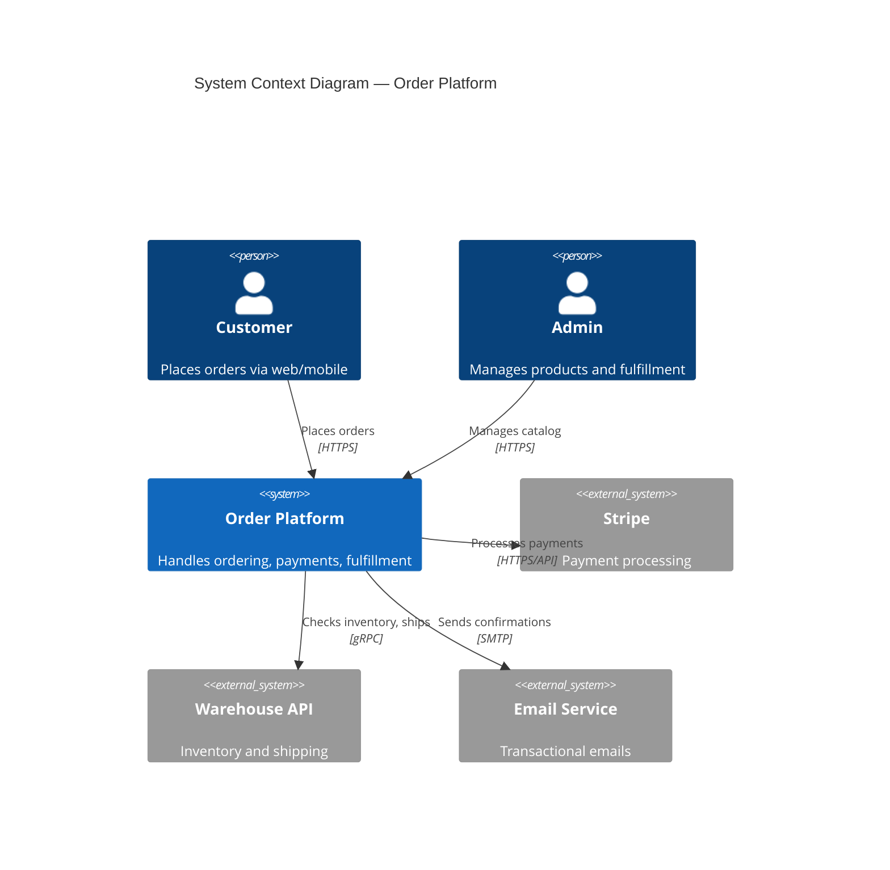
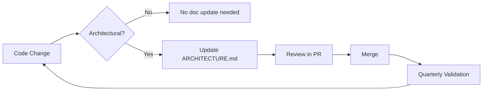

# Architecture Documentation

> **Goal:** Provide a prescriptive standard for documenting system architecture so engineers can understand, evaluate, and evolve a system without reading all the source code. Architecture docs answer three questions: *What does this system do? How is it built? Why was it built this way?*

> "Architecture represents the significant design decisions that shape a system, where significant is measured by cost of change." — Grady Booch

---

## 1. When to Write Architecture Documentation

Architecture documentation MUST be created **before implementation begins**, not after. At Google, design docs are the first artifact engineers look for when encountering an unfamiliar system — they are the most accessible entry point despite inevitably drifting from reality over time.

### 1.1 Triggers

Write or update architecture documentation when:

- **New system or service** is being designed
- **Major refactor** changes system boundaries, data flow, or deployment topology
- **New team members** will need to understand the system (onboarding)
- **Compliance audit** requires system descriptions (SOC 2, ISO 27001)
- **System boundary change** adds or removes external integrations
- **Incident** reveals undocumented behavior or components

### 1.2 The 50% Rule

Empirical research shows organizations can maintain documentation at ~50% of full coverage by including only frequently-required information items, significantly reducing maintenance burden without meaningful loss of understanding. Document what engineers actually need — not everything that exists.

> **Industry reality:** 56% of organizations report architecture documentation issues. Only 36% of practitioners believe their architecture docs match reality — despite 52% of leadership claiming alignment.

### 1.3 Documentation Depth by Scale

| Scale | What to Document | Time Investment |
|-------|-----------------|-----------------|
| **Solo / OSS** | README with architecture section + 1 context diagram | 30 min |
| **Team / Startup** | Dedicated `ARCHITECTURE.md` + C4 Levels 1-2 + key ADRs | 2-4 hours |
| **Enterprise** | Full standard (all sections below) + compliance mapping + fitness functions | 1-2 days |

---

## 2. Recommended Frameworks

This standard draws primarily from **C4 Model** for diagrams and **arc42** for section structure, while aligning with ISO/IEC/IEEE 42010:2022 concepts. Teams SHOULD adopt one framework consistently rather than mixing approaches arbitrarily.

### 2.1 Framework Comparison

| Framework | Author / Source | Core Concept | Best For |
|-----------|----------------|--------------|----------|
| **C4 Model** | Simon Brown | 4 zoom levels: Context → Container → Component → Code | Diagram clarity, all team sizes |
| **arc42** | Gernot Starke, Peter Hruschka | 12-section template covering all architecture aspects | Comprehensive documentation |
| **ISO/IEC/IEEE 42010:2022** | ISO/IEEE | Stakeholders → Concerns → Viewpoints → Views | Regulated industries, formal requirements |
| **4+1 View Model** | Philippe Kruchten (1995) | 5 views: Logical, Development, Process, Physical, Scenarios | Multi-stakeholder enterprises |
| **TOGAF** | The Open Group | Enterprise architecture framework (ADM cycle) | Strategic enterprise architecture |

### 2.2 C4 Model — Primary Recommendation

The C4 Model provides a hierarchical zoom-in approach to architecture visualization. Each level serves a different audience:

| Level | Name | Shows | Audience | Required? |
|-------|------|-------|----------|-----------|
| 1 | **Context** | System boundary, external actors, integrations | Everyone | MUST |
| 2 | **Container** | Deployable units, technology choices, protocols | Engineers, architects | MUST |
| 3 | **Component** | Logical building blocks within a container | Engineers on the team | RECOMMENDED for complex containers |
| 4 | **Code** | Classes, interfaces, code-level structure | Rarely needed | OPTIONAL — code is its own documentation |

**Supplementary diagram types** (not part of the 4 levels):

| Diagram | Purpose | When to Use |
|---------|---------|-------------|
| **Deployment** | Maps containers to infrastructure (K8s, cloud, on-prem) | Production systems |
| **Dynamic** | Shows runtime behavior for specific use cases or flows | Complex interactions, error paths |
| **System Landscape** | Shows multiple systems and their relationships | Multi-system environments |

### 2.3 Choosing Your Depth

| Scale | C4 Levels | Supplementary Diagrams |
|-------|-----------|----------------------|
| Solo / OSS | Level 1 only | None |
| Team / Startup | Levels 1-2 | Deployment |
| Enterprise | Levels 1-3 | Deployment + Dynamic |

---

## 3. Standard Format — Required Sections

Every `ARCHITECTURE.md` MUST include these sections. This structure is inspired by arc42's 12 sections, simplified to 8 essential sections that empirical studies show engineers actually read.

### 3.1 Required Sections

| # | Section | Description | Framework Mapping |
|---|---------|-------------|-------------------|
| 1 | **Overview** | 1-2 paragraph system purpose, scope, and key quality attributes | arc42 §1: Introduction and Goals |
| 2 | **System Context** | C4 Level 1 diagram: system boundary, external actors, integrations | C4 Context, arc42 §3 |
| 3 | **Container Diagram** | C4 Level 2 diagram: deployable units, technologies, communication | C4 Container, arc42 §5 |
| 4 | **Key Components** | Table of major components with technology, purpose, owner, repo | C4 Component (simplified) |
| 5 | **Data Architecture** | Data stores, schema overview, data flow paths, data classification | arc42 §8 (crosscutting) |
| 6 | **Infrastructure & Deployment** | Where and how the system runs, environments, network topology | arc42 §7, C4 Deployment |
| 7 | **Cross-Cutting Concerns** | Security model, authentication, observability, error handling patterns | arc42 §8 |
| 8 | **Technology Decisions** | Table linking to ADRs; inline rationale if no formal ADR process | arc42 §9 |

### 3.2 Required Frontmatter

```yaml
---
title: "[System/Component] Architecture"
type: "architecture"
status: "approved"
owner: "@team-name"
classification: "internal"
created: "YYYY-MM-DD"
last_updated: "YYYY-MM-DD"
version: "X.Y.Z"
---
```

### 3.3 Section Templates

#### Overview

```markdown
## Overview

[System Name] is a [type of system] that [primary purpose].
It serves [primary users/consumers] and integrates with [key external systems].

### Quality Attributes

| Attribute | Target | Rationale |
|-----------|--------|-----------|
| Availability | 99.9% | Customer-facing SLA |
| Latency (p99) | < 200ms | User experience requirement |
| Data Residency | EU-only | GDPR compliance |
```

#### Key Components

```markdown
## Key Components

| Component | Technology | Purpose | Owner | Repository |
|-----------|------------|---------|-------|------------|
| API Gateway | Kong / Envoy | Routing, rate limiting, auth | @platform | `org/api-gateway` |
| User Service | Go | User management, profiles | @identity | `org/user-service` |
| Event Bus | Kafka | Async event streaming | @platform | `org/event-infra` |
| Primary DB | PostgreSQL 16 | Transactional data | @data | Managed (RDS) |
```

#### Technology Decisions

```markdown
## Technology Decisions

| Decision | Choice | Rationale | ADR |
|----------|--------|-----------|-----|
| API Protocol | gRPC (internal), REST (external) | Performance for inter-service, compatibility for clients | [ADR-0003](docs/adr/0003-api-protocol.md) |
| Database | PostgreSQL | ACID compliance, JSON support, team expertise | [ADR-0005](docs/adr/0005-database-selection.md) |
| Auth | OIDC via Keycloak | Self-hosted, FAPI 2.0 support, SSO | [ADR-0007](docs/adr/0007-authentication.md) |
```

> **Full template at:** `templates/tier-1-system/ARCHITECTURE.md`

---

## 4. Diagrams — Standards and Tooling

### 4.1 Diagram Principles

- Every diagram MUST have a **title**, **legend**, and **last-updated date**
- Diagrams MUST stay at **exactly one abstraction level** — NEVER mix C4 Context-level and Code-level details in a single diagram
- Diagrams MUST be stored as **text** (Mermaid, PlantUML, or Structurizr DSL) in version control — NEVER as binary image files only
- Auto-generated diagrams MUST NOT **replace** intentional architecture documentation — they show implementation detail, not architectural intent
- Span names, element labels, and relationship descriptions MUST be **low-cardinality** — no IDs, timestamps, or user data in diagrams

> **The model-code gap:** Automatically generated diagrams are 1:1 accurate but too granular for architectural discussions. Architecture documentation requires intentional abstraction — deciding what to show and what to omit is the architect's job.

### 4.2 Recommended Tools

| Tool | Approach | Best For | Sync Strategy |
|------|----------|----------|---------------|
| **Mermaid** | Diagram-specific | Quick diagrams, GitHub/GitLab native rendering | Manual — update each diagram independently |
| **Structurizr DSL** | Model-based | C4 diagrams, complex systems | Automatic — single model generates all views |
| **PlantUML** | Diagram-specific | Detailed sequence/class diagrams, C4-PlantUML library | Manual — update each diagram independently |

**Key distinction:** Mermaid and PlantUML are *diagram-specific* — each diagram is defined independently. Structurizr DSL is *model-based* — you define the architecture once, then generate multiple views automatically. For systems with 5+ diagrams, RECOMMENDED to use Structurizr DSL to prevent drift between views.

### 4.3 Required Diagrams by Scale

| Scale | Minimum Required Diagrams |
|-------|--------------------------|
| Solo / OSS | 1 Context diagram (C4 Level 1) in README |
| Team / Startup | Context + Container + Deployment |
| Enterprise | Context + Container + Deployment + Dynamic (key flows) |

### 4.4 Mermaid C4 Example



### 4.5 Structurizr DSL Example

```dsl
workspace "Order Platform" {
    model {
        customer = person "Customer" "Places orders via web/mobile"
        admin = person "Admin" "Manages products and fulfillment"

        orderPlatform = softwareSystem "Order Platform" {
            webapp = container "Web App" "React SPA" "TypeScript"
            api = container "API Service" "REST + gRPC" "Go"
            db = container "Database" "Transactional data" "PostgreSQL"
            queue = container "Event Bus" "Async events" "Kafka"
        }

        stripe = softwareSystem "Stripe" "Payment processing" "External"

        customer -> webapp "Uses" "HTTPS"
        webapp -> api "Calls" "HTTPS/JSON"
        api -> db "Reads/writes" "TCP/TLS"
        api -> stripe "Processes payments" "HTTPS"
        api -> queue "Publishes events" "TCP"
    }

    views {
        systemContext orderPlatform "Context" { include * }
        container orderPlatform "Containers" { include * }
    }
}
```

---

## 5. Compliance and Security Mapping

Teams subject to compliance requirements MUST include the mapped architecture artifacts. This section makes architecture documentation audit-ready.

### 5.1 Compliance Requirements Matrix

| Framework | Control | Required Architecture Artifact |
|-----------|---------|-------------------------------|
| **SOC 2** | CC6.1, CC6.6, CC6.7 | Network diagrams, data flow diagrams, system boundary description |
| **SOC 2** | CC7.1, CC7.2 | System monitoring architecture, change detection documentation |
| **ISO 27001** | A.8.27 | Secure systems architecture documentation, security-by-design evidence |
| **GDPR** | Article 25 | Privacy-by-design architecture, data minimization evidence |
| **GDPR** | Article 30 | Records of processing activities, PII data flow diagrams |
| **EU AI Act** | Article 11, Annex IV | AI system architecture, component interaction, processing flow |
| **NIST SP 800-207** | ZTA principles | Zero trust architecture, trust boundaries, identity verification points |
| **AWS WAF** | All 5 pillars | Well-Architected review documentation |
| **Azure WAF** | All 5 pillars | Workload architecture assessment |
| **GCP AF** | All 6 pillars | Architecture framework alignment documentation |

### 5.2 Threat Modeling Integration

Architecture documentation SHOULD include or link to a threat model. The architecture diagrams directly feed threat modeling:

| Architecture Artifact | Feeds Threat Model Input |
|----------------------|--------------------------|
| System Context diagram | Trust boundaries, external attack surfaces |
| Container diagram | Internal attack surfaces, communication channels |
| Data flow paths | Data-in-transit threats, injection points |
| Infrastructure diagram | Network segmentation, deployment vulnerabilities |

**STRIDE** (Spoofing, Tampering, Repudiation, Information Disclosure, Denial of Service, Elevation of Privilege) — model-centric, best for application security.

**PASTA** (Process for Attack Simulation and Threat Analysis) — risk-centric 7-step methodology, best for comprehensive enterprise analysis.

### 5.3 Security Boundaries

Architecture docs for systems with compliance requirements MUST include a security boundaries table:

```markdown
## Security Boundaries

| Zone | Access Level | Components | Controls |
|------|-------------|------------|----------|
| Public | Internet | CDN, Load Balancer | WAF, DDoS protection |
| DMZ | VPN only | API Gateway | mTLS, rate limiting |
| Private | Service mesh | Core services | mTLS, network policies |
| Restricted | Bastion only | Databases, secrets | IAM, encryption at rest |
```

---

## 6. Keeping Architecture Docs Current

The single biggest problem with architecture documentation is **staleness**. Architecture drift — the gap between documented and actual architecture — accumulates invisibly with each release until a service disruption reveals undocumented dependencies.

### 6.1 Review Cadence

| Trigger | Action | Owner |
|---------|--------|-------|
| New service or major feature | Update diagrams and component table | Feature lead |
| Quarterly review | Validate all diagrams match production | Architecture owner |
| Dependency upgrade (major version) | Update technology decisions table | Tech lead |
| Incident revealing undocumented behavior | Add missing component or data flow | Postmortem owner |
| ADR accepted | Link from Technology Decisions section | ADR author |
| Team member onboarding | Validate docs are understandable, fix gaps | New team member |

### 6.2 Architectural Fitness Functions

Fitness functions are automated, repeatable checks that validate architectural properties. They transform architecture documentation from a static artifact into a living, testable specification.

```yaml
# .github/workflows/architecture-check.yml
name: Architecture Fitness Check
on: [pull_request]
jobs:
  check:
    runs-on: ubuntu-latest
    steps:
      - name: Check architecture doc freshness
        run: |
          LAST_UPDATED=$(grep 'last_updated' ARCHITECTURE.md | head -1 | grep -oP '\d{4}-\d{2}-\d{2}')
          DAYS_AGO=$(( ($(date +%s) - $(date -d "$LAST_UPDATED" +%s)) / 86400 ))
          if [ "$DAYS_AGO" -gt 90 ]; then
            echo "::warning::ARCHITECTURE.md has not been updated in $DAYS_AGO days"
          fi

      - name: Verify no orphaned services
        run: |
          # Compare services in ARCHITECTURE.md against actual deployment
          # This is a simplified example — adapt to your infrastructure
          grep -oP '`[a-z]+-service`' ARCHITECTURE.md | sort > documented.txt
          kubectl get services -o name | sort > actual.txt
          diff documented.txt actual.txt || echo "::warning::Architecture docs may be out of sync"
```

> **Source:** "Building Evolutionary Architectures" (Ford, Parsons, Kua — O'Reilly) defines fitness functions as "an objective integrity assessment of some architectural characteristic."

### 6.3 Freshness Signals

- Architecture docs MUST include `last_updated` in frontmatter
- RECOMMENDED: CI job flags architecture docs older than 90 days without update
- Reference `scripts/check-freshness.sh` for existing freshness validation tooling



---

## 7. Anti-Patterns

Common architecture documentation mistakes and how to fix them:

| Anti-Pattern | Description | Fix |
|-------------|-------------|-----|
| **Diagram-Only Docs** | Diagrams with no context, rationale, or narrative | Every diagram MUST have surrounding prose explaining what it shows and why |
| **Stale Diagrams** | Diagrams that no longer match production | Tie diagram updates to PR reviews; implement fitness functions (Section 6.2) |
| **Over-Documentation** | Trying to document every class and method | Follow the 50% rule: document only frequently-required items (Section 1.2) |
| **"Just Read the Code"** | No architecture docs at all | Source code shows HOW, not WHY; architecture docs capture intent, trade-offs, and constraints that code cannot express |
| **Mixing Abstraction Levels** | C4 Context-level and Code-level details in one diagram | Each diagram MUST stay at exactly one C4 level; use separate diagrams for different zoom levels |
| **Auto-Gen as Architecture** | Using auto-generated diagrams as the sole architecture doc | Auto-generated diagrams show implementation detail, not architectural intent; use them as supplements, not replacements |
| **Single-Audience Docs** | Writing only for business OR only for engineering | Use C4 levels to address multiple audiences: Level 1 for stakeholders, Level 2-3 for engineers |
| **Ivory Tower Architecture** | Docs written by architects who do not write code | Architecture docs MUST be maintained by the team that builds the system; "architecture astronauts" produce docs that diverge from reality |

---

## 8. Real-World Examples

### 8.1 Notable Open Source Architecture Docs

| Project | What Makes It Good | Reference |
|---------|-------------------|-----------|
| **Rust Compiler** | Entry points, source organization, key data structures, compiler pipeline (lexing → HIR → type checking) | [rustc-dev-guide](https://rustc-dev-guide.rust-lang.org/) |
| **VS Code** | Multi-process architecture (renderer, extension host, language server), clear component boundaries | [VS Code docs](https://code.visualstudio.com/api/advanced-topics/extension-host) |
| **Kubernetes** | Component diagram, API server flow, plugin architecture, control loop patterns | [k8s architecture](https://kubernetes.io/docs/concepts/architecture/) |
| **Flutter Engine** | High-level stack diagram, main processes, embedder API documentation | [Flutter wiki](https://github.com/flutter/flutter/wiki/) |

> **More examples:** [awesome-architecture-md](https://github.com/noahbald/awesome-architecture-md) — curated collection of well-structured ARCHITECTURE.md files.

### 8.2 This Repository's Resources

| Resource | Purpose |
|----------|---------|
| [Architecture Template](./templates/tier-1-system/ARCHITECTURE.md) | Copy this to start a new architecture doc |
| [Example: Enterprise](./examples/example-architecture.md) | Filled-in enterprise architecture example |
| [Example: Startup](./examples/example-startup-architecture.md) | Filled-in startup architecture example |

---

## 9. Scaling Guide

### 9.1 Solo / OSS

- [ ] README with architecture section (1-2 paragraphs + 1 diagram)
- [ ] C4 Level 1 Context diagram (Mermaid inline in README)
- [ ] Key technology decisions documented inline (no formal ADR needed)

### 9.2 Team / Startup

- [ ] Dedicated `ARCHITECTURE.md` file
- [ ] C4 Levels 1-2 (Context + Container diagrams)
- [ ] Component table with technology, purpose, and owner
- [ ] Key ADRs linked in Technology Decisions section
- [ ] Deployment diagram showing infrastructure
- [ ] Quarterly review cadence established

### 9.3 Enterprise

- [ ] All 8 required sections from Section 3 fully documented
- [ ] Compliance mapping (Section 5) for applicable frameworks
- [ ] Fitness functions in CI pipeline (Section 6.2)
- [ ] Threat model linked or included (STRIDE or PASTA)
- [ ] ATAM or lightweight architecture review process
- [ ] Structurizr DSL or equivalent model-based diagramming approach
- [ ] Cross-system context diagrams for system-of-systems view
- [ ] Architecture review board sign-off on major changes

> **ATAM** (Architecture Tradeoff Analysis Method) is a structured 9-step process developed by the Software Engineering Institute (SEI/CMU) for evaluating architectural decisions against quality attributes. It identifies risks, sensitivity points, and tradeoffs. RECOMMENDED for enterprise-scale systems.

---

## 10. Related Documents

### Internal References

| Document | Purpose |
|----------|---------|
| [Philosophy](./01-PHILOSOPHY.md) | "Context, not Control" — why documentation matters |
| [Document Types](./03-DOCUMENT_TYPES.md) | Where architecture docs fit in the taxonomy |
| [Visuals](./14-VISUALS.md) | Diagram standards and Mermaid guidance |
| [ADRs](./33-ADR.md) | Decision records that architecture docs reference |
| [Security & Compliance](./24-SECURITY_COMPLIANCE.md) | Compliance documentation requirements |
| [Service Catalog](./21-SERVICE_CATALOG.md) | Individual service documentation |
| [Infrastructure Code](./25-INFRASTRUCTURE_CODE.md) | IaC documentation for deployment views |
| [Observability](./43-OBSERVABILITY.md) | Logging, tracing, metrics standards |

### External References

| # | Source | Type | URL |
|---|--------|------|-----|
| 1 | C4 Model (Simon Brown) | Best Practice | <https://c4model.com> |
| 2 | arc42 Template (Starke, Hruschka) | Best Practice | <https://arc42.org> |
| 3 | ISO/IEC/IEEE 42010:2022 | Standard | <https://www.iso.org/standard/74393.html> |
| 4 | 4+1 View Model (Kruchten 1995) | Research | IEEE Software 12(6), November 1995 |
| 5 | Building Evolutionary Architectures | Research | O'Reilly (Ford, Parsons, Kua) |
| 6 | NIST SP 800-207: Zero Trust Architecture | Standard | <https://csrc.nist.gov/publications/detail/sp/800-207/final> |
| 7 | OWASP Threat Modeling | Best Practice | <https://owasp.org/www-community/Threat_Modeling> |
| 8 | Structurizr DSL | Vendor Docs | <https://docs.structurizr.com/dsl> |
| 9 | ATAM (SEI/CMU) | Best Practice | <https://www.sei.cmu.edu/architecture-tradeoff-analysis-method/> |
| 10 | Google Design Docs | Best Practice | <https://www.industrialempathy.com/posts/design-docs-at-google/> |

---

**Previous:** [43 - Observability](./43-OBSERVABILITY.md)
**Next:** [45 - Configuration & Feature Flags](./45-CONFIGURATION_FLAGS.md)
