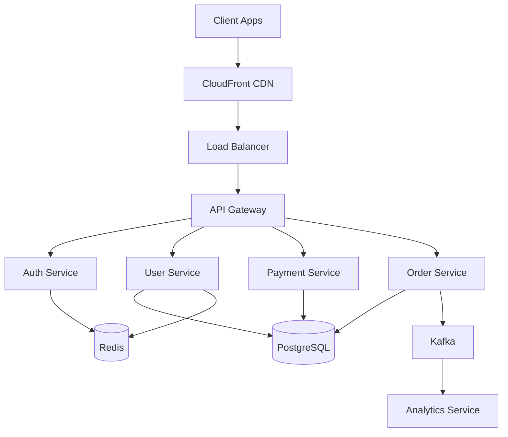
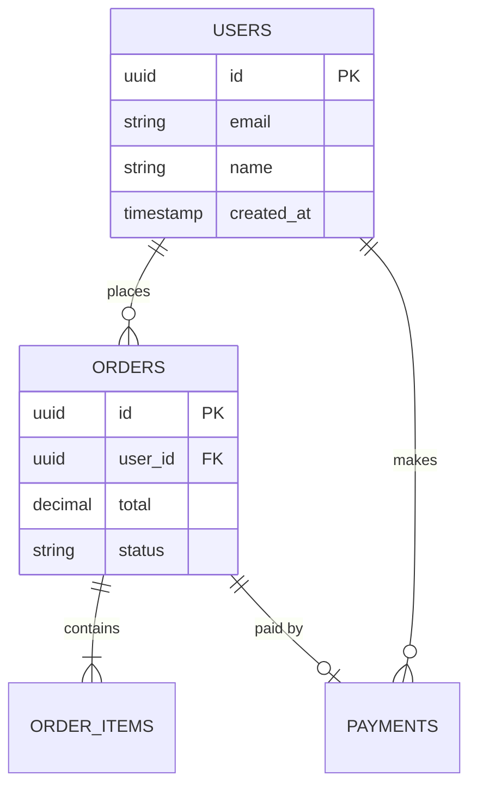
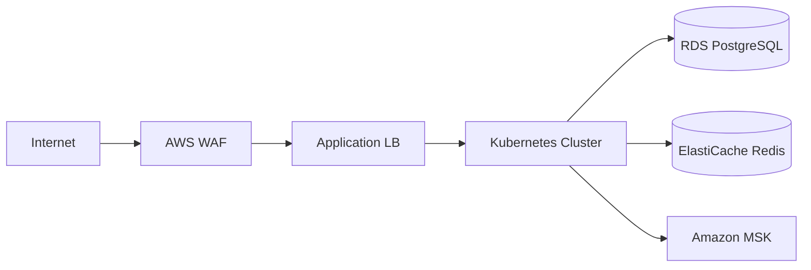
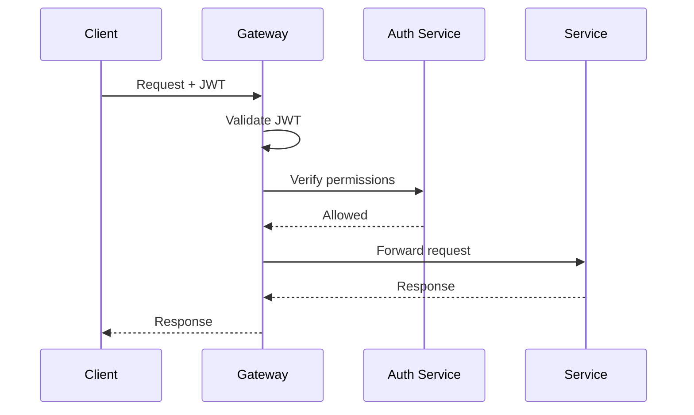

# System Architecture

> **Purpose:** High-level architecture documentation for engineers working with the platform. Review before making major changes or during onboarding.

## Quick Reference

| Component | Technology | Owner |
|-----------|------------|-------|
| API Gateway | Kong | @platform-team |
| Services | Go, Python | Various |
| Database | PostgreSQL | @data-team |
| Cache | Redis | @platform-team |
| Queue | Kafka | @data-team |
| Orchestration | Kubernetes | @infra-team |

---

## 1. System Overview



---

## 2. Service Architecture

### Core Services

| Service | Port | Repository | Purpose |
|---------|------|------------|---------|
| api-gateway | 8000 | `org/api-gateway` | Request routing, rate limiting |
| auth-service | 8001 | `org/auth-service` | Authentication, authorization |
| user-service | 8002 | `org/user-service` | User management, profiles |
| payment-service | 8003 | `org/payment-service` | Payment processing |
| order-service | 8004 | `org/order-service` | Order management |

### Service Communication

| From | To | Protocol | Auth |
|------|------|----------|------|
| Client | Gateway | HTTPS | JWT |
| Gateway | Services | gRPC | mTLS |
| Services | Kafka | TCP | SASL |
| Services | Database | TCP | TLS + credentials |

---

## 3. Data Architecture

### Database Schema



### Data Flow

1. **Write Path:** Client → Gateway → Service → Database → Kafka
2. **Read Path:** Client → Gateway → Cache (hit) or Service → Database
3. **Analytics:** Kafka → Flink → Data Warehouse

---

## 4. Infrastructure

### Kubernetes Cluster

```yaml
Clusters:
  production:
    region: us-east-1
    nodes: 10
    node_type: m5.xlarge

  staging:
    region: us-east-1
    nodes: 3
    node_type: m5.large
```

### Network Topology



---

## 5. Security Architecture

### Authentication Flow



### Security Boundaries

| Zone | Access | Examples |
|------|--------|----------|
| Public | Internet | CDN, Load Balancer |
| DMZ | VPN only | API Gateway |
| Private | Service mesh | Core services |
| Restricted | Bastion only | Databases |

---

## 6. Scalability

### Auto-scaling Configuration

| Service | Min | Max | Trigger |
|---------|-----|-----|---------|
| api-gateway | 3 | 20 | CPU > 70% |
| user-service | 2 | 10 | CPU > 70% |
| payment-service | 3 | 15 | Request latency > 200ms |

### Database Scaling

- **Read replicas:** 2 replicas in production
- **Connection pooling:** PgBouncer with max 1000 connections
- **Sharding:** Not implemented (planned for 2026)

---

## 7. Disaster Recovery

| Component | RPO | RTO | Backup Strategy |
|-----------|-----|-----|-----------------|
| Database | 1 hour | 4 hours | Automated snapshots |
| Secrets | 0 | 1 hour | Multi-region Vault |
| Configuration | 0 | 30 min | GitOps |

---

## Related Documents

| Document | Purpose |
|----------|---------|
| [Service Catalog](./21-SERVICE_CATALOG.md) | Individual service docs |
| [API Documentation](./18-API_DOCUMENTATION.md) | API specifications |
| [Operations](./06-OPERATIONS.md) | Runbooks and procedures |
