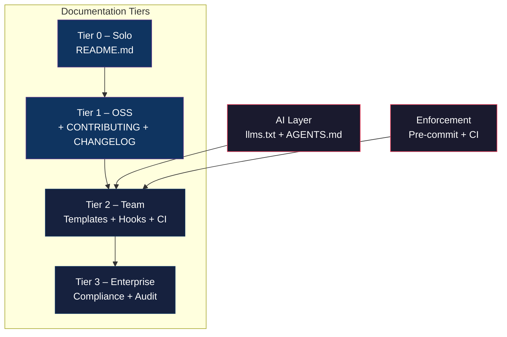

# Universal AI-Driven Documentation Standard


A documentation standard that makes AI coding agents actually useful — instead of letting them hallucinate because your codebase has zero context.

I've been using this on my production repo, and a few others have tried it and found it useful. There's still a lot to improve and new features to add, but the core works, and it's solving a real problem. If you're doing any kind of agentic coding, give it a try.

**Start here →** `bash init.sh --solo` (30 seconds) or pick your path in the [decision tree](INDEX.md)

---

## Why this exists

I've been agentic coding for a while. It's great when the project is small, just throw a prompt at Claude or Codex, and it writes exactly what you need. But as the repo grows and the project gets more complex, you start noticing something: the agents stop updating the documentation. They write code, they refactor, they add features — but they never touch the docs.

At first, you don't care. Then six months later, you're trying to get an agent to work on a part of the codebase it hasn't seen before, and it's hallucinating. It doesn't know why you chose Kafka over RabbitMQ. It doesn't know your auth flow. It doesn't know about the service boundary decision you made three months ago. Because none of that was written down.

The turning point for me was Architecture Decision Records. I started writing ADRs for every major decision, why I chose this database, why I structured the services this way, and why I went with this auth pattern. Then, when I was working with an agent, I could say, "Refer to ADR-007; we already decided this," and the agent would read it, understand the context, and write code that actually fit the project. The quality of the output went from "close enough, I'll fix it" to genuinely production-ready.

That's when I realised: good documentation isn't just for humans anymore. It's how you teach AI agents to write better code for your specific project. And the problem isn't that people are lazy about docs, it's that there's no standard for how to do it. Every team reinvents the wheel, writes docs in a different format, puts them in a different place, and six months later, nobody can find anything.

This standard fixes that. 45 modular standards, pre-commit hooks that block undocumented code, CI workflows that enforce it, and templates you can copy and fill in. I've been running this on my own production repo, and it's made a noticeable difference in the quality of agent output. A few other people have tried it and found it useful too. There's still plenty to improve — new features to add, rough edges to smooth out — but the foundation works, and it's solving a real problem right now.

You don't need all 45 standards. Most projects use 3–5. Start small, add what you need.

## Quick start

| Your situation | Command | Time |
|---|---|---|
| Solo dev, side project | `bash init.sh --solo` | 30 sec |
| Open source project | `bash init.sh --oss` | 2 min |
| Team (5–50 engineers) | `bash init.sh --team` | 5 min |
| Enterprise / compliance | `bash init.sh` | 10 min |

```bash
# Recommended: run from your repo root
cd /path/to/your/repo
mkdir -p docs/standards
cd docs/standards
bash init.sh --solo    # Just README.md
bash init.sh --oss     # README + CONTRIBUTING + CHANGELOG
bash init.sh --team    # Full setup: templates + hooks + workflows
bash init.sh --help    # See all options
```

### Add as a git submodule

```bash
git submodule add https://github.com/daddal001/Universal-AI-Driven-Documentation-Standard.git docs/standards
git submodule update --init --recursive
bash docs/standards/init.sh --team
```

To pull updates later:

```bash
git submodule update --remote --merge
```

### Don't want YAML frontmatter?

```bash
bash docs/standards/init.sh --oss --no-frontmatter
```

### Don't want to run a script at all?

Just copy the [Copy-Paste README](examples/COPY_PASTE_README.md) and fill it in.

## What you get

| Mode | What's copied | Best for |
|---|---|---|
| `--solo` | README.md | Side projects, hackathons |
| `--oss` | README, CONTRIBUTING, CHANGELOG | Open source projects |
| `--team` | + Templates, scripts, hooks, CI workflows, pre-commit config | Teams, startups |
| Enterprise | + Compliance, audit trails | Regulated industries |

<p align="center">
<strong>Documentation tiers</strong><br>
</p>



## Automated doc enforcement

Code changes that skip documentation are automatically caught at commit time and in CI.

### Pre-commit hooks

The `--team` mode installs a scope-aware documentation enforcement hook. When a developer changes code in `services/auth/`, the hook checks for a corresponding doc update in `services/auth/`. Same scope. If there's no doc change, the commit is blocked.

```bash
# Install hooks
bash scripts/git-hooks/install.sh

# What happens when you commit code without docs:
$ git commit -m "Add login endpoint"
Doc-enforcement: FAIL
  Changed: services/auth/src/login.ts
  Scope:   services/auth/ (nearest README.md)
  Missing: No .md file changed in services/auth/
  Fix:     Update services/auth/README.md or add --no-verify to bypass
```

Works with any repo structure — monorepos, multi-service repos, single-app repos. The hook walks up the directory tree to find the nearest README.md and uses that as the documentation scope.

### CI workflows

```bash
cp docs/standards/templates/ci-cd/*.yml .github/workflows/
```

| Workflow | What it does |
|---|---|
| `docs-validation.yml` | Frontmatter, structure, links, markdownlint, Vale |
| `documentation-check.yml` | Blocks PRs that change code without updating docs |
| `frontmatter-date-check.yml` | Blocks PRs if `last_updated` is unchanged on modified files |
| `freshness-check.yml` | Weekly scan for docs older than 90 days |

### Markdownlint + pre-commit

| File | What it does |
|---|---|
| `.pre-commit-config.yaml` | Docs enforcement, markdownlint with `--fix`, trailing whitespace, YAML checks |
| `.markdownlint-cli2.yaml` | Sensible defaults — 13 rules disabled to avoid false positives |

## AI assistant support

This is the part that changed how I work. When your codebase has structured context that AI tools can read, the quality of agent output goes from "I'll need to fix this" to "that's actually production-ready."

- **llms.txt** — project context that AI tools parse automatically
- **AGENTS.md** — coding rules your AI agents should follow in your project
- **ADRs** — Architecture Decision Records that let you tell an agent "we already decided this, read ADR-007" instead of re-explaining your architecture every session
- **Structured schemas** — config, errors, and architecture in machine-readable formats
- Works with Claude, Codex, Cursor, and others

## Repo structure

```
docs/standards/
├── 00-45*.md                  # 45 modular standards
├── templates/                  # Copy-paste ready templates
│   ├── tier-oss/              # Open source essentials
│   ├── tier-1-system/         # Architecture, APIs, ADRs, Config, Errors
│   ├── tier-2-operational/    # Runbooks, on-call guides, SLOs
│   ├── tier-enterprise/       # Compliance, audit trails
│   └── ci-cd/                 # GitHub Actions workflows
├── examples/                   # 19 real-world examples
├── scripts/
│   ├── git-hooks/             # Docs enforcement hooks
│   └── docs/                  # Validation scripts
├── .pre-commit-config.yaml    # Pre-commit configuration
└── .markdownlint-cli2.yaml    # Markdownlint rules
```

## Quick links

| I want to... | Go here |
|---|---|
| Set up llms.txt + AGENTS.md for AI | [04-AI_AGENTS.md](04-AI_AGENTS.md) |
| Start in 30 seconds | `bash init.sh --solo` |
| Enforce docs in my team | [scripts/git-hooks/README.md](scripts/git-hooks/README.md) |
| Add CI doc checks | [templates/ci-cd/README.md](templates/ci-cd/README.md) |
| See what good docs look like | [Examples](examples) |
| Choose which docs I need | [INDEX.md](INDEX.md) |
| Understand the philosophy | [01-PHILOSOPHY.md](01-PHILOSOPHY.md) |

## FAQ

**Do I need all 45 standards?**
No. Most projects use 3–5. Start with what you need.

**Does this work with my existing docs?**
Yes. The installer won't overwrite existing files.

**Will the pre-commit hooks break my workflow?**
The docs enforcement hook only runs on code changes. Pure documentation PRs, test files, and CI config changes are exempt. You can always bypass with `--no-verify` (logged for audit).

**Does this work with monorepos or microservice repo structures?**
Yes. The hook uses the nearest README.md file as the documentation scope, so it works perfectly with monorepos where each service has its own folder and README. If you're using a structure like [repo-101](https://github.com/daddal001/Repo-101), it slots right in.

**What's llms.txt?**
A machine-readable summary of your project. AI assistants read it to understand the context of your codebase. [Learn more →](04-AI_AGENTS.md)

## Contributing

We welcome contributions. See [CONTRIBUTING.md](CONTRIBUTING.md). Pick a side, explain the tradeoff, and back it properly.

## License

MIT. Do whatever you want with it. Just don't blame me if your team still doesn't write docs.

---

*This is a work in progress. The core is solid and battle-tested in production, but there's more to build. If you find it useful, star it, share it, or open a PR. If you find something broken, open an issue. Built because AI agents kept hallucinating on my codebase and I got tired of fixing their work.*
