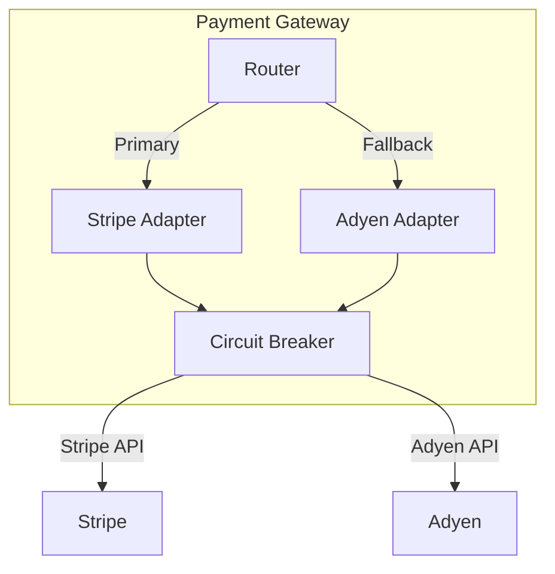

# ADR-012: Use Stripe as Primary Payment Processor

## Status

**Accepted** — Implemented in Q2 2025

## Context

### Problem Statement

Our current payment processor (PaymentCo Legacy) has several limitations:

1. **Uptime issues** — 3 outages in the past 6 months (totaling 8 hours)
2. **Limited global coverage** — Only supports 12 countries
3. **No fraud protection** — Requires separate integration
4. **Outdated API** — SOAP-based, no webhooks
5. **Contract renewal** — Current contract expires June 2025

We need to select a new primary payment processor that supports our growth plans (expanding to EU, APAC) while improving reliability.

### Business Requirements

| Requirement | Priority | PaymentCo | Stripe | Adyen |
|-------------|----------|-----------|--------|-------|
| 99.99% uptime SLA | Must Have | No (99.9%) | Yes | Yes |
| EU expansion (20 countries) | Must Have | No | Yes | Yes |
| Built-in fraud detection | Should Have | No | Yes | Yes |
| REST API + Webhooks | Must Have | No | Yes | Yes |
| Apple/Google Pay | Should Have | Partial | Yes | Yes |
| Setup time < 3 months | Must Have | N/A | Yes | No (6 mo) |
| Transaction fee < 3% | Should Have | 2.5% | 2.9% | 2.7% |

### Technical Requirements

- Must support idempotent requests
- Must provide PCI-DSS Level 1 compliance
- Must support webhooks for async events
- Must have SDKs for Go and TypeScript
- Should support 3D Secure 2.0

## Decision

**We will use Stripe as our primary payment processor, with Adyen as a fallback.**

### Architecture

### Implementation Details

1. **Stripe as Primary (95% of traffic)**
   - Lower fees for US transactions
   - Better developer experience
   - Faster integration timeline

2. **Adyen as Fallback (5% of traffic + failover)**
   - Better EU coverage
   - Used when Stripe is unavailable
   - 5% always routed for health checks

3. **Circuit Breaker Pattern**
   - Automatic failover when Stripe error rate > 10%
   - Manual override via feature flag
   - Metrics on failover frequency

## Consequences

### Positive

- **Improved reliability:** Dual-processor architecture eliminates single point of failure
- **Faster time-to-market:** Stripe integration complete in 6 weeks vs. 6 months for Adyen-only
- **Better DX:** Modern REST API, excellent documentation, SDKs maintained by Stripe
- **Built-in fraud:** Stripe Radar reduces fraud by estimated 40%
- **Global expansion:** Supports all 35 target countries

### Negative

- **Higher cost:** Stripe fees (2.9%) higher than PaymentCo (2.5%) = ~$50K/year increase
- **Vendor lock-in risk:** Stripe-specific features (Radar, Billing) create switching costs
- **Dual integration:** Maintaining two processor integrations increases complexity
- **Learning curve:** Team needs to learn new API (mitigated by good docs)

### Neutral

- **PCI scope unchanged:** Both processors handle card data; we remain out of scope
- **Reporting:** Need to aggregate reports from both processors

## Alternatives Considered

### Alternative 1: Adyen Only

**Pros:**
