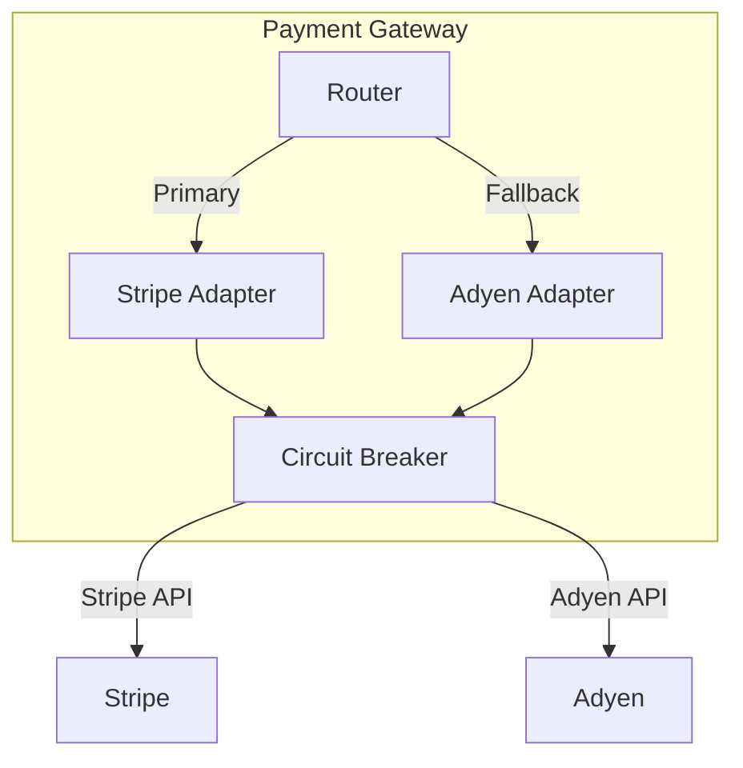
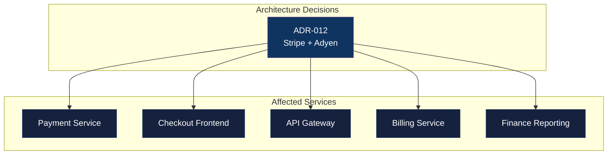

# ADR-012: Use Stripe as Primary Payment Processor

This decision record documents the choice of payment processor for the platform's billing system. It affects the payments team, frontend checkout flows, and finance reporting. Review on 2025-09-20 or when transaction volume exceeds 100K/month.

**Status:** Accepted — Implemented in Q2 2025
**Date:** 2025-03-20
**Decision makers:** @cto, @payments-tech-lead, @finance-director

---

## Context

### Problem statement

Our current payment processor (PaymentCo Legacy) has several limitations:

1. **Uptime issues** — 3 outages in the past 6 months (totaling 8 hours)
2. **Limited global coverage** — only supports 12 countries
3. **No fraud protection** — requires separate integration
4. **Outdated API** — SOAP-based, no webhooks
5. **Contract renewal** — current contract expires June 2025

We need a new primary payment processor that supports our growth plans (expanding to EU, APAC) while improving reliability.

### Business requirements

| Requirement | Priority | PaymentCo | Stripe | Adyen |
|-------------|----------|-----------|--------|-------|
| 99.99% uptime SLA | Must Have | No (99.9%) | Yes | Yes |
| EU expansion (20 countries) | Must Have | No | Yes | Yes |
| Built-in fraud detection | Should Have | No | Yes | Yes |
| REST API + Webhooks | Must Have | No | Yes | Yes |
| Apple/Google Pay | Should Have | Partial | Yes | Yes |
| Setup time < 3 months | Must Have | N/A | Yes | No (6 mo) |
| Transaction fee < 3% | Should Have | 2.5% | 2.9% | 2.7% |

## Decision drivers

- 99.99% uptime SLA required for PCI-DSS Level 1 compliance
- EU expansion to 20 countries by Q4 2025
- Built-in fraud detection to replace manual review process
- REST API with webhooks for event-driven architecture
- Integration timeline < 3 months before contract expiry

## Considered options

### Option 1: Adyen only

- **Pros:** Better EU coverage, lower fees (2.7%), strong enterprise support
- **Cons:** 6-month setup time (misses contract expiry), complex onboarding
- **Estimated effort:** High (6 months)
- **Evidence:** Adyen's own [integration timeline estimates](https://docs.adyen.com/development-resources/) confirm 4-6 month onboarding for new merchants

### Option 2: Stripe as primary + Adyen fallback

- **Pros:** Fast setup (6 weeks), best developer experience, built-in fraud (Radar), dual-processor resilience
- **Cons:** Higher fees (2.9%), Stripe-specific feature lock-in, dual integration complexity
- **Estimated effort:** Medium (8 weeks for both)
- **Evidence:** Stripe's [quick start guide](https://stripe.com/docs/development/quickstart) confirms 1-2 week basic integration; our team completed a proof-of-concept in 3 days

### Option 3: Renew PaymentCo Legacy

- **Pros:** Zero migration effort, known system
- **Cons:** Same uptime issues, no EU expansion, no fraud protection, SOAP API
- **Estimated effort:** Low (contract only)
- **Evidence:** PaymentCo's incident history over the past 6 months — 3 outages, 8 hours total downtime

## Decision

**We chose Stripe as the primary payment processor, with Adyen as a fallback.**

### Architecture

```mermaid
graph TB
    subgraph "Payment Gateway"
        R[Router]
        S[Stripe Adapter]
        A[Adyen Adapter]
        CB[Circuit Breaker]
    end

    R -->|Primary| S
    R -->|Fallback| A
    S --> CB
    A --> CB
    CB -->|Stripe API| SE[Stripe]
    CB -->|Adyen API| AE[Adyen]
```

### Implementation details

1. **Stripe as primary (95% of traffic):** Lower fees for US transactions, better developer experience, faster integration timeline
2. **Adyen as fallback (5% of traffic + failover):** Better EU coverage, used when Stripe is unavailable, 5% always routed for health checks
3. **Circuit breaker pattern:** Automatic failover when Stripe error rate > 10%, manual override via feature flag

## Consequences

### Positive

- **Improved reliability:** Dual-processor architecture eliminates single point of failure
- **Faster time-to-market:** Stripe integration complete in 6 weeks vs. 6 months for Adyen-only
- **Better developer experience:** Modern REST API, excellent documentation, SDKs maintained by Stripe
- **Built-in fraud:** Stripe Radar reduces fraud by estimated 40%
- **Global expansion:** Supports all 35 target countries

### Negative

- **Higher cost:** Stripe fees (2.9%) higher than PaymentCo (2.5%) = ~$50K/year increase
- **Vendor lock-in risk:** Stripe-specific features (Radar, Billing) create switching costs
- **Dual integration:** Maintaining two processor integrations increases complexity

### Risks

- **Stripe pricing increase:** Mitigated by Adyen fallback — we can shift traffic if Stripe raises rates
- **Adyen integration rot:** Mitigated by always routing 5% of traffic through Adyen for continuous testing
- **PCI scope creep:** Mitigated by using Stripe.js / Adyen Drop-in for card data — we stay out of PCI scope

---

## Y-statement

> In the context of the platform's billing system, facing contract expiry, uptime requirements, and EU expansion deadlines, we decided for Stripe as primary with Adyen fallback and against Adyen-only or renewing PaymentCo Legacy, to achieve 99.99% uptime, sub-3-month integration, and built-in fraud detection, accepting that we pay higher transaction fees (2.9% vs 2.5%) and take on dual-integration complexity.

---

## Assumptions

| # | Assumption | Impact if Wrong | Monitoring |
|---|-----------|-----------------|------------|
| 1 | Stripe maintains 99.99% uptime SLA | Must shift primary to Adyen | Blackbox probe every 30s |
| 2 | EU expansion stays at 20 countries | May need additional processor for unsupported regions | Quarterly business review |
| 3 | Transaction volume stays < 500K/month | Volume discounts may make Adyen cheaper at scale | Monthly finance review |
| 4 | Stripe Radar fraud detection rate > 95% | Manual review process needed again | Monthly fraud report |

---

## Confirmation

Compliance with this ADR is confirmed by:

- [x] Architecture review approved dual-processor pattern
- [x] Stripe integration complete and processing live traffic
- [x] Adyen fallback tested via chaos engineering (monthly circuit breaker trigger)
- [ ] Metric threshold: transaction success rate > 99.5% (Grafana dashboard)
- [ ] Load test: 10K concurrent transactions with < 500ms p99 latency

---

## Service impact diagram

```mermaid
graph TB
    subgraph "Architecture Decisions"
        ADR012["ADR-012<br/>Stripe + Adyen"]
    end

    subgraph "Affected Services"
        PAY["Payment Service"]
        CHECKOUT["Checkout Frontend"]
        GATEWAY["API Gateway"]
        BILLING["Billing Service"]
        FINANCE["Finance Reporting"]
    end

    ADR012 --> PAY
    ADR012 --> CHECKOUT
    ADR012 --> GATEWAY
    ADR012 --> BILLING
    ADR012 --> FINANCE

    style ADR012 fill:#0f3460,stroke:#533483,color:#fff
    style PAY fill:#16213e,stroke:#0f3460,color:#fff
    style CHECKOUT fill:#16213e,stroke:#0f3460,color:#fff
    style GATEWAY fill:#16213e,stroke:#0f3460,color:#fff
    style BILLING fill:#16213e,stroke:#0f3460,color:#fff
    style FINANCE fill:#16213e,stroke:#0f3460,color:#fff
```

---

## Compliance mapping

| Framework | Control | How This ADR Addresses It |
|-----------|---------|--------------------------|
| PCI-DSS | Req 3 — Protect stored cardholder data | Card data handled by Stripe.js/Adyen Drop-in — never touches our servers |
| PCI-DSS | Req 6 — Develop secure systems | Stripe SDK maintained by Stripe; we don't handle raw card numbers |
| SOC 2 | CC6.7 — Restrict data transmission | All payment API calls over TLS 1.3 with certificate pinning |
| ISO 27001 | A.8.24 — Use of cryptography | Payment tokens encrypted at rest via processor-managed KMS |

---

## References

| # | Source | Type | URL |
|---|--------|------|-----|
| 1 | Stripe API Documentation | Vendor Docs | <https://stripe.com/docs/api> |
| 2 | Adyen Integration Guide | Vendor Docs | <https://docs.adyen.com/development-resources/> |
| 3 | PCI DSS v4.0 Requirements | Standard | <https://www.pcisecuritystandards.org/document_library/> |
| 4 | Circuit Breaker Pattern — Martin Fowler | Best Practice | <https://martinfowler.com/bliki/CircuitBreaker.html> |
| 5 | ADR-0003: Database Selection | Internal | ../architecture/decisions/0003-database-selection.md |

## Related documents

- [ADR-0003: Database Selection](../architecture/decisions/0003-database-selection.md) — **Superseded** by this ADR
- [ADR-0011: ArgoCD Deployment](../architecture/decisions/0011-argocd-image-updater-for-automated-deployments.md) — Deployment strategy for payment service
- [Payment Service README](../../services/payment-service/README.md)
- [PCI Compliance Checklist](../compliance/TIER_2_CLIENT_DRIVEN/PCI/checklist.md)

---

> **Note:** This is a fictional example demonstrating the ADR template format v3.0.
> See `docs/standards/33-ADR.md` for the full standard.
