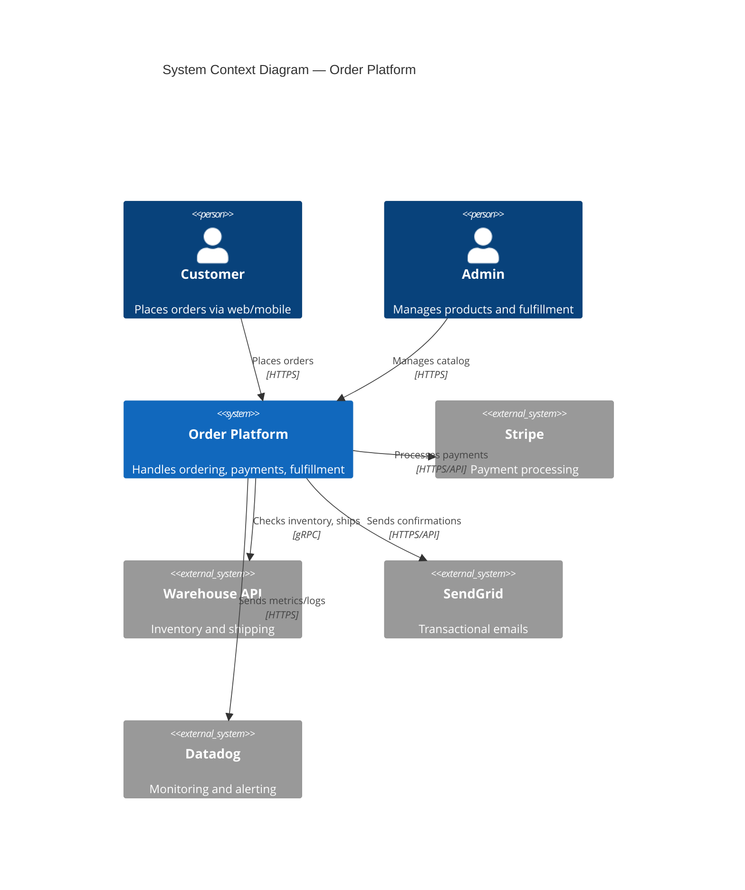
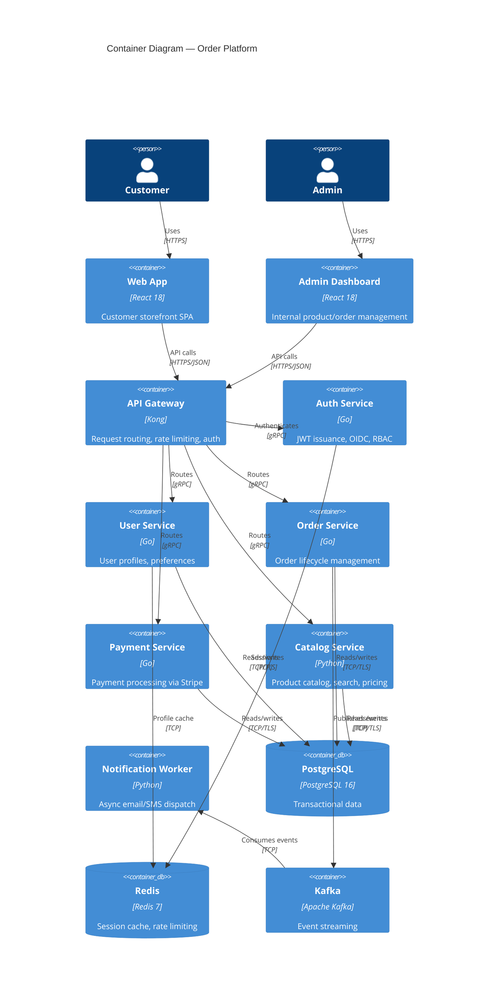
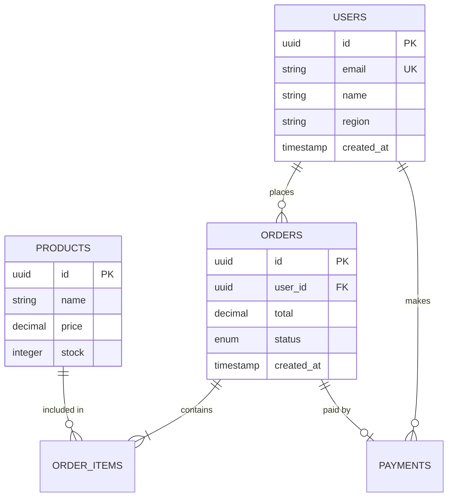
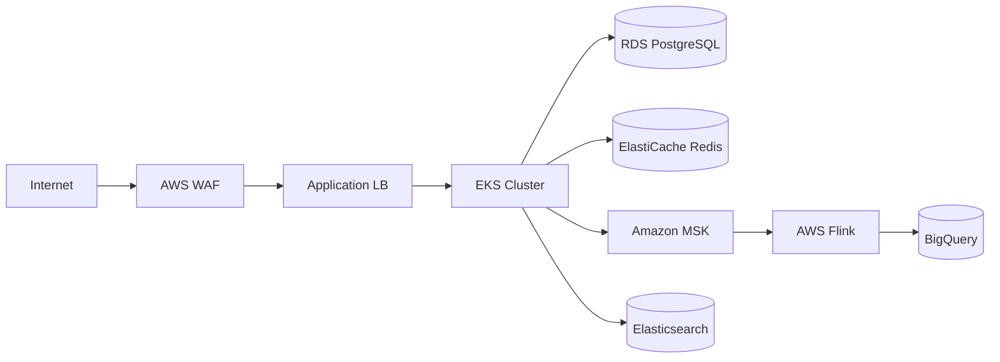
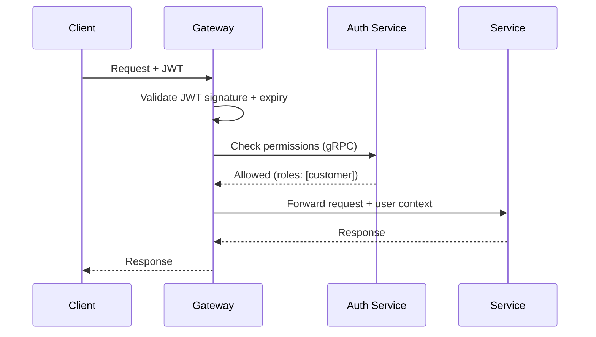

# System Architecture — Order Platform

> **Purpose:** Architecture documentation for the Order Platform. Engineers should review this before making major changes, during onboarding, or when designing new integrations.

---

## 1. Overview

The Order Platform is a microservices-based e-commerce system that handles product catalog management, order processing, payment collection, and fulfillment coordination. It serves customers via web and mobile apps, and internal operators via an admin dashboard.

The platform processes ~5,000 orders/day across 3 regions, integrating with Stripe for payments, a third-party warehouse API for fulfillment, and SendGrid for transactional emails.

### Quality Attributes

| Attribute | Target | Rationale |
|-----------|--------|-----------|
| Availability | 99.9% | Customer-facing SLA — 8.7h downtime/year max |
| Latency (p99) | < 200ms | User experience — checkout flow critical |
| Throughput | 1,000 RPS | Peak traffic during sales events |
| Data Residency | US + EU | GDPR compliance for EU customers |

---

## 2. System Context (C4 Level 1)

---

## 3. Container Diagram (C4 Level 2)

---

## 4. Key Components

| Component | Technology | Purpose | Owner | Repository |
|-----------|------------|---------|-------|------------|
| API Gateway | Kong 3.x | Request routing, rate limiting, JWT validation | @platform | `org/api-gateway` |
| Auth Service | Go 1.22 | JWT issuance, OIDC integration, RBAC | @identity | `org/auth-service` |
| User Service | Go 1.22 | User profiles, preferences, account management | @identity | `org/user-service` |
| Order Service | Go 1.22 | Order creation, state machine, fulfillment coordination | @commerce | `org/order-service` |
| Payment Service | Go 1.22 | Stripe integration, refunds, billing | @commerce | `org/payment-service` |
| Catalog Service | Python 3.12 | Product catalog, search (Elasticsearch), pricing | @catalog | `org/catalog-service` |
| Notification Worker | Python 3.12 | Async email/SMS via SendGrid/Twilio | @platform | `org/notification-worker` |

### Service Communication

| From | To | Protocol | Auth | Retry Policy |
|------|----|----------|------|-------------|
| Client | Gateway | HTTPS | JWT | Client-side retry |
| Gateway | Services | gRPC | mTLS | 3 retries, exponential backoff |
| Services | Kafka | TCP | SASL/SCRAM | Idempotent producer |
| Services | Database | TCP | TLS + IAM | Connection pool reconnect |
| Services | Redis | TCP | AUTH | Automatic reconnect |

---

## 5. Data Architecture

### Data Stores

| Store | Technology | Data Classification | Backup | Retention |
|-------|------------|-------------------|--------|-----------|
| Primary DB | PostgreSQL 16 (RDS) | Confidential (PII) | Hourly snapshots | 7 years (financial) |
| Cache | Redis 7 (ElastiCache) | Internal | None (ephemeral) | TTL: 15min-24h |
| Event Log | Kafka (MSK) | Internal | 7-day retention | 30 days |
| Search Index | Elasticsearch 8 | Internal | Daily snapshots | Rebuilt from DB |

### Database Schema (Simplified)

### Data Flow

1. **Write Path:** Client → Gateway → Service → Database → Kafka (event published)
2. **Read Path:** Client → Gateway → Cache (hit) or Service → Database (miss)
3. **Search:** Client → Gateway → Catalog Service → Elasticsearch
4. **Analytics:** Kafka → Flink → Data Warehouse (BigQuery)

---

## 6. Infrastructure & Deployment

### Environments

| Environment | Region | Nodes | Node Type | Purpose |
|-------------|--------|-------|-----------|---------|
| Production | us-east-1, eu-west-1 | 10 | m5.xlarge | Live traffic |
| Staging | us-east-1 | 3 | m5.large | Pre-production |
| Development | us-east-1 | 2 | m5.large | Developer testing |

### Deployment Diagram

### Auto-scaling

| Service | Min | Max | Trigger |
|---------|-----|-----|---------|
| api-gateway | 3 | 20 | CPU > 70% |
| order-service | 3 | 15 | Request latency p99 > 200ms |
| payment-service | 3 | 15 | Request latency p99 > 200ms |
| catalog-service | 2 | 10 | CPU > 70% |
| notification-worker | 1 | 5 | Kafka consumer lag > 1000 |

### Database Scaling

- **Read replicas:** 2 replicas per region in production
- **Connection pooling:** PgBouncer with max 500 connections per service
- **Sharding:** Not implemented (planned for 2026 — see ADR-0012)

---

## 7. Cross-Cutting Concerns

### Security

- **Authentication:** OIDC via Auth0, JWT with RS256 signing
- **Authorization:** RBAC with per-service permission checks, gateway pre-validation
- **Data Encryption:** AES-256 at rest (RDS, S3), TLS 1.3 in transit
- **Secrets Management:** AWS Secrets Manager, rotated every 90 days
- **PII Handling:** EU customer data stays in eu-west-1 (data residency)

### Security Boundaries

| Zone | Access Level | Components | Controls |
|------|-------------|------------|----------|
| Public | Internet | CloudFront CDN, ALB | AWS WAF, Shield, DDoS protection |
| DMZ | VPN only | API Gateway | mTLS, rate limiting (100 req/s per IP) |
| Private | Service mesh | Core services | mTLS via Istio, network policies |
| Restricted | Bastion only | RDS, ElastiCache, Secrets Manager | IAM, security groups, encryption |

### Authentication Flow

### Observability

- **Logging:** Structured JSON → Datadog (via Fluentd DaemonSet)
- **Tracing:** OpenTelemetry SDK → Datadog APM (100% sampling in staging, 10% in prod)
- **Metrics:** Prometheus → Datadog (custom dashboards per service)
- **Alerting:** Datadog monitors → PagerDuty (P1: 5min, P2: 30min, P3: next business day)

### Error Handling

- **Error format:** Namespaced error codes (see [Error Catalog](./errors/))
- **Retry policy:** Exponential backoff with jitter, max 3 retries, circuit breaker at 5 consecutive failures
- **Dead letter queue:** Failed Kafka messages → DLQ topic, alerting on DLQ depth > 100

---

## 8. Technology Decisions

| Decision | Choice | Rationale | ADR |
|----------|--------|-----------|-----|
| API Protocol | gRPC (internal), REST (external) | Performance for inter-service, compatibility for clients | [ADR-0003](docs/adr/0003-api-protocol.md) |
| Primary Database | PostgreSQL 16 | ACID compliance, JSON support, team expertise | [ADR-0005](docs/adr/0005-database-selection.md) |
| Authentication | OIDC via Auth0 | Managed service, FAPI 2.0 support, SSO | [ADR-0007](docs/adr/0007-authentication.md) |
| Event Streaming | Kafka (MSK) | Ordering guarantees, replay capability, ecosystem maturity | [ADR-0008](docs/adr/0008-event-streaming.md) |
| Search | Elasticsearch | Full-text search, faceted filtering, catalog team expertise | [ADR-0009](docs/adr/0009-search-engine.md) |
| API Gateway | Kong | Plugin ecosystem, Kubernetes-native, team familiarity | [ADR-0002](docs/adr/0002-api-gateway.md) |

---

## 9. Disaster Recovery

| Component | RPO | RTO | Backup Strategy |
|-----------|-----|-----|-----------------|
| Database (RDS) | 1 hour | 4 hours | Automated snapshots + cross-region replica |
| Secrets | 0 | 1 hour | Multi-region Secrets Manager |
| Configuration | 0 | 30 min | GitOps (ArgoCD) |
| Kafka topics | 24 hours | 2 hours | MSK multi-AZ, S3 tiered storage |

---

## Related Documents

| Document | Purpose |
|----------|---------|
| [Service Catalog](./service-catalog.md) | Individual service documentation |
| [API Documentation](./api/) | OpenAPI specs for all services |
| [ADR Index](./adr/) | All architecture decision records |
| [Error Catalog](./errors/) | Error code reference |
| [Runbooks](./runbooks/) | Operational procedures |
| [SLO Dashboard](./slo.md) | Service level objectives |
