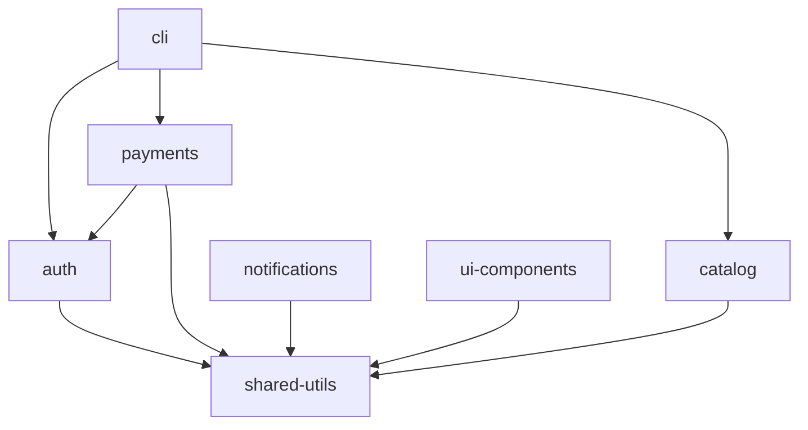

# Acme Platform

> Monorepo for all Acme Platform services and shared libraries.

See [45-MONOREPO_PATTERNS.md](../45-MONOREPO_PATTERNS.md) for the standard this follows.

---

## Packages

| Package | Description | Version | Status |
|---------|-------------|---------|--------|
| [`@acme/auth`](packages/auth/) | Authentication and authorization library | 2.1.0 | Stable |
| [`@acme/payments`](packages/payments/) | Payment processing (Stripe integration) | 1.3.0 | Stable |
| [`@acme/catalog`](packages/catalog/) | Product catalog and search | 1.0.0 | Beta |
| [`@acme/notifications`](packages/notifications/) | Email/SMS notification dispatch | 1.2.0 | Stable |
| [`@acme/shared-utils`](packages/shared-utils/) | Shared TypeScript utilities (logging, config, errors) | 3.0.0 | Stable |
| [`@acme/ui-components`](packages/ui-components/) | Shared React component library | 0.9.0 | Alpha |
| [`@acme/cli`](tools/cli/) | Developer CLI tool | 0.5.0 | Alpha |

---

## Getting Started

```bash
# Clone and setup
git clone https://github.com/acme/platform.git
cd platform
pnpm install          # Installs all packages
pnpm build            # Builds all packages in dependency order
pnpm test             # Runs all tests

# Working on a specific package
cd packages/auth
pnpm dev              # Start dev server with hot reload
pnpm test:watch       # Run tests in watch mode
```

### Prerequisites

- Node.js 20+
- pnpm 9+
- Docker (for integration tests)
- PostgreSQL 16 (or use `docker compose up db`)

---

## Dependency Map



**Rule:** `shared-utils` has zero internal dependencies. All other packages depend on it. Avoid circular dependencies.

---

## Repository Structure

```text
platform/
├── README.md                          # This file (Tier 1: Repo overview)
├── docs/                              # Cross-cutting documentation
│   ├── architecture.md                # System architecture
│   ├── contributing.md                # How to contribute
│   ├── getting-started.md             # Detailed onboarding guide
│   └── adr/                           # Architecture Decision Records
│       ├── 0001-monorepo-tooling.md
│       ├── 0002-shared-utils-design.md
│       └── 0003-api-protocol.md
├── packages/                          # Tier 2: Per-package docs
│   ├── auth/
│   │   ├── README.md                  # Package overview + API
│   │   ├── CHANGELOG.md               # Per-package changelog
│   │   ├── docs/
│   │   │   ├── configuration.md       # Auth config reference
│   │   │   └── api.md                 # Auth API reference
│   │   ├── src/
│   │   └── package.json
│   ├── payments/
│   │   ├── README.md
│   │   ├── CHANGELOG.md
│   │   ├── docs/
│   │   │   └── stripe-integration.md
│   │   └── src/
│   ├── shared-utils/
│   │   ├── README.md
│   │   ├── CHANGELOG.md
│   │   └── src/
│   └── ...
├── tools/                             # Tier 3: Tooling docs
│   ├── cli/
│   │   ├── README.md
│   │   └── src/
│   └── scripts/
│       └── README.md
├── .changeset/                        # Changesets for versioning
├── turbo.json                         # Turborepo pipeline config
├── pnpm-workspace.yaml                # Workspace definition
└── package.json                       # Root package.json
```

---

## Per-Package README Example

Each package README follows the template from [45-MONOREPO_PATTERNS.md](../45-MONOREPO_PATTERNS.md):

### `packages/auth/README.md`

```markdown
# @acme/auth

> Authentication and authorization library for Acme Platform services.

## Installation

pnpm add @acme/auth

## Quick Start

import { createAuthClient, verifyToken } from '@acme/auth';

const auth = createAuthClient({
  issuer: 'https://auth.acme.com',
  audience: 'https://api.acme.com',
});

// Verify a JWT
const claims = await auth.verifyToken(token);

// Check permissions
if (auth.hasPermission(claims, 'orders:write')) {
  // proceed
}

## API Reference

See [API documentation](./docs/api.md).

## Configuration

See [Configuration guide](./docs/configuration.md).

## Changelog

See [CHANGELOG.md](./CHANGELOG.md).
```

---

## Versioning & Changelogs

We use [Changesets](https://github.com/changesets/changesets) for per-package versioning:

```bash
# After making changes, create a changeset
pnpm changeset

# Review pending changesets
pnpm changeset status

# CI creates a version PR that bumps versions and updates changelogs
```

### Root Changelog (Summary)

```markdown
## 2026-03-07

### @acme/auth v2.1.0
- Add WebAuthn/Passkey support ([changelog](packages/auth/CHANGELOG.md))

### @acme/payments v1.3.0
- Add Stripe Checkout v3 integration ([changelog](packages/payments/CHANGELOG.md))

### @acme/shared-utils v3.0.0
- BREAKING: Rename `createLogger` to `initLogger` ([changelog](packages/shared-utils/CHANGELOG.md))
```

---

## CI/CD

### Per-Package Validation

CI only validates packages that changed:

```yaml
# turbo.json
{
  "pipeline": {
    "build": { "dependsOn": ["^build"] },
    "test": { "dependsOn": ["build"] },
    "lint": {},
    "docs:validate": {
      "inputs": ["**/*.md", "docs/**"]
    }
  }
}
```

### Documentation Enforcement

The [docs-enforcement hook](../scripts/git-hooks/README.md) resolves scopes per package:

| Changed File | Nearest README | Required Doc Update Scope |
|-------------|----------------|--------------------------|
| `packages/auth/src/login.ts` | `packages/auth/README.md` | `packages/auth/` |
| `packages/payments/src/charge.ts` | `packages/payments/README.md` | `packages/payments/` |
| `tools/cli/src/main.ts` | `tools/cli/README.md` | `tools/cli/` |

---

## Cross-Package Linking Rules

| Scenario | Link Format |
|----------|-------------|
| Same package | `[Config](./docs/configuration.md)` |
| Sibling package | `[Auth API](../auth/docs/api.md)` |
| Root docs | `[Architecture](../../docs/architecture.md)` |
| External | `[Stripe Docs](https://stripe.com/docs)` |

**Shared concepts** (error handling patterns, logging conventions) live in `docs/` — packages link UP, never duplicate.

---

## Related Documents

| Document | Purpose |
|----------|---------|
| [Architecture](docs/architecture.md) | System-level architecture |
| [Contributing](docs/contributing.md) | How to contribute |
| [ADR Index](docs/adr/) | Architecture decisions |
