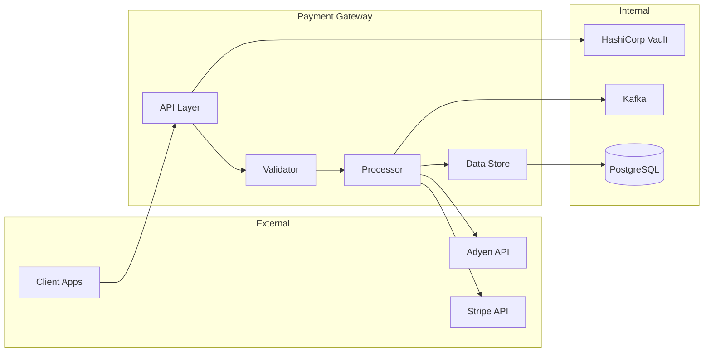

# Payment Gateway Service

> Processes credit card transactions, handles PCI-DSS compliance, and integrates with Stripe and Adyen payment processors.

## Quick Reference

| Property | Value |
|----------|-------|
| **Port** | 8080 (HTTP), 8443 (HTTPS) |
| **Language** | Go 1.21 |
| **Framework** | Chi router |
| **Database** | PostgreSQL 15 |
| **Message Queue** | Kafka |
| **Health Check** | `GET /health` |
| **Metrics** | `GET /metrics` (Prometheus) |

## Architecture



## Getting Started

### Prerequisites

- Go 1.21+
- Docker & Docker Compose
- Access to HashiCorp Vault (for secrets)
- Stripe/Adyen sandbox credentials

### Local Development

```bash
# Clone the repo
git clone git@github.com:example/payment-gateway.git
cd payment-gateway

# Copy environment template
cp .env.example .env

# Start dependencies
docker-compose up -d postgres kafka vault

# Run database migrations
make migrate

# Start the service
make run

# Service is now available at http://localhost:8080
```

### Environment Variables

| Variable | Required | Default | Description |
|----------|----------|---------|-------------|
| `DATABASE_URL` | Yes | - | PostgreSQL connection string |
| `KAFKA_BROKERS` | Yes | - | Comma-separated Kafka brokers |
| `STRIPE_API_KEY` | Yes | - | Stripe secret key (from Vault) |
| `ADYEN_API_KEY` | Yes | - | Adyen API key (from Vault) |
| `LOG_LEVEL` | No | `info` | Log verbosity (debug, info, warn, error) |
| `PORT` | No | `8080` | HTTP server port |

## API Reference

Full OpenAPI specification: [`openapi.yaml`](./openapi.yaml)

### Key Endpoints

#### Create Payment

```http
POST /v1/payments
Content-Type: application/json
Authorization: Bearer <token>

{
  "amount": 1999,
  "currency": "USD",
  "payment_method": "pm_card_visa",
  "idempotency_key": "unique-request-id-123"
}
```

**Response (201 Created):**

```json
{
  "id": "pay_abc123",
  "status": "succeeded",
  "amount": 1999,
  "currency": "USD",
  "created_at": "2025-12-10T14:30:00Z"
}
```

#### Get Payment Status

```http
GET /v1/payments/{payment_id}
Authorization: Bearer <token>
```

### Error Codes

| Code | HTTP Status | Description | Resolution |
|------|-------------|-------------|------------|
| `INSUFFICIENT_FUNDS` | 402 | Card declined | Ask customer for different card |
| `INVALID_CARD` | 400 | Card number invalid | Validate card before submission |
| `RATE_LIMITED` | 429 | Too many requests | Implement exponential backoff |
| `PROCESSOR_ERROR` | 502 | Payment processor down | Retry or use fallback processor |

## Configuration

### Feature Flags

Managed via LaunchDarkly. Key flags:

| Flag | Default | Description |
|------|---------|-------------|
| `enable-adyen-fallback` | `false` | Route to Adyen when Stripe fails |
| `3ds-required` | `true` | Require 3D Secure for EU cards |
| `fraud-scoring` | `true` | Enable ML fraud detection |

### Rate Limits

| Endpoint | Limit | Window |
|----------|-------|--------|
| `POST /v1/payments` | 100 | 1 minute |
| `GET /v1/payments/*` | 1000 | 1 minute |
| `POST /v1/refunds` | 50 | 1 minute |

## Operations

### Health Checks

```bash
# Liveness (is the process running?)
curl http://localhost:8080/health/live

# Readiness (can it serve traffic?)
curl http://localhost:8080/health/ready

# Deep health (all dependencies)
curl http://localhost:8080/health/deep
```

### Monitoring

**Dashboards:**

|--------|------|-------------|-----------------|
| `payment_requests_total` | Counter | Total payment attempts | N/A |
| `payment_success_rate` | Gauge | Success percentage | < 95% |
| `payment_latency_seconds` | Histogram | Request latency | P99 > 2s |
| `processor_errors_total` | Counter | Processor failures | > 10/min |

### Runbooks

| Scenario | Runbook |
|----------|---------|
| High error rate | [payment-high-errors.md](../runbooks/payment-high-errors.md) |
| Processor failover | [processor-failover.md](../runbooks/processor-failover.md) |
| Database recovery | [db-recovery.md](../runbooks/db-recovery.md) |

### On-Call

- **Primary:** @payments-oncall (PagerDuty)
- **Escalation:** @platform-oncall
- **Slack:** #payments-incidents

## Testing

```bash
# Unit tests
make test

# Integration tests (requires Docker)
make test-integration

# Load tests
make test-load

# Security scan
make security-scan
```

### Test Coverage

Target: **80% line coverage**

Current coverage: [View in SonarQube](https://sonar.internal/payment-gateway)

## Deployment

### Pipeline


### Rollback

```bash
# Via ArgoCD
argocd app rollback payment-gateway

# Manual (emergency)
kubectl rollout undo deployment/payment-gateway -n payments
```

## Security

### PCI-DSS Compliance

This service is in scope for PCI-DSS. Key controls:

- Card data encrypted at rest (AES-256)
- TLS 1.3 for all external communication
- No card numbers in logs (masked)
- Access logged and auditable

### Secrets Management

All secrets stored in HashiCorp Vault:

- `secret/payments/stripe` - Stripe credentials
- `secret/payments/adyen` - Adyen credentials
- `secret/payments/db` - Database credentials

## Related Documentation

- [Payment Flow Architecture](../architecture/payment-flow.md)
- [ADR-012: S<payments@example.com>cessor](../adrs/012-stripe-primary.md)
- [Fraud Dete<payments@example.com>vices/fraud-detection/README.md)
<payments@example.com>

## Contact<payments@example.com>

<payments@example.com>

- **Team:** @<payments@example.com>
- **Slack:** <payments@example.com>

- **Email:** <payments@example.com>

---

*Last reviewed: 2025-12-10 by @payments-tech-lead*
