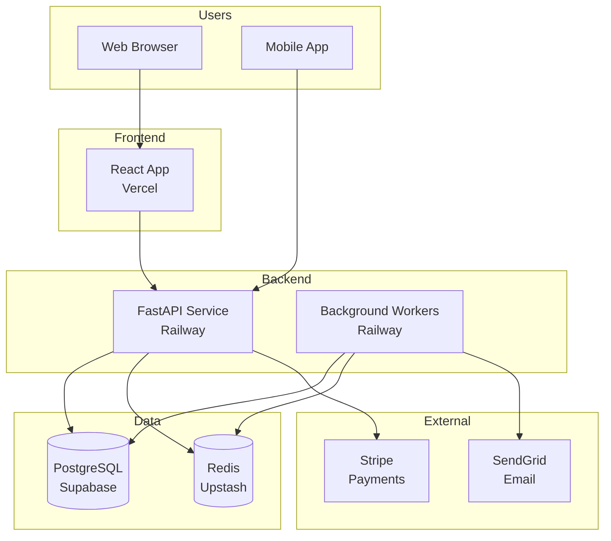

# Example: Startup Architecture Document

> **Context:** This example shows a startup architecture document that's comprehensive enough to onboard new engineers but not over-engineered. It focuses on what matters for a small, fast-moving team.

---

## System Architecture: TaskFlow

TaskFlow is a task management SaaS platform built for small teams. This document provides a high-level overview of the system architecture for engineers joining the team.

**Last Updated:** 2025-12-15
**Maintained By:** @engineering-team
**Review Cadence:** Quarterly (or when major changes occur)

---

## Overview

TaskFlow helps teams organize, prioritize, and track work. The system consists of:

- **Web Application** — React frontend for users
- **API Service** — REST API for all operations
- **Background Workers** — Process async tasks (emails, notifications)
- **Database** — PostgreSQL for persistent data

---

## High-Level Architecture



---

## Technology Stack

### Frontend

| Component | Technology | Why |
|-----------|------------|-----|
| **Framework** | React 18 | Team familiarity, large ecosystem |
| **Language** | TypeScript | Type safety, better DX |
| **Styling** | Tailwind CSS | Rapid UI development |
| **State** | React Query | Server state management |
| **Hosting** | Vercel | Zero-config deployment, great DX |

### Backend

| Component | Technology | Why |
|-----------|------------|-----|
| **Framework** | FastAPI (Python) | Fast development, auto docs |
| **Language** | Python 3.11 | Team expertise, rapid iteration |
| **Database** | PostgreSQL 15 | Reliable, ACID compliance |
| **Cache** | Redis | Session storage, rate limiting |
| **Hosting** | Railway | Simple deployment, good free tier |

### Infrastructure

- **Database:** Supabase (managed PostgreSQL)
- **Cache:** Upstash (serverless Redis)
- **Email:** SendGrid
- **Payments:** Stripe
- **Monitoring:** Sentry (error tracking)

---

## Data Flow

### Creating a Task

```
1. User submits form in React app
2. React app calls POST /api/tasks
3. FastAPI validates request
4. FastAPI saves to PostgreSQL
5. FastAPI publishes event to Redis
6. Background worker processes event
7. Worker sends notification email via SendGrid
8. API returns task ID to frontend
9. React app updates UI
```

### Key Design Decisions

**Why Redis for events?** Simple, fast, and sufficient for our scale. We'll migrate to a proper message queue (like RabbitMQ) when we hit 10k+ users.

**Why Supabase?** Managed PostgreSQL with great DX. We can self-host later if needed.

**Why Vercel?** Zero-config deployments, automatic HTTPS, great for React apps.

---

## Database Schema

### Core Tables

#### users

- Application logs in Railway
- Structured logging (JSON format)

- Log retention: 7 days

## Scaling Considerations

- **Users:** ~500 active users

- **Tasks:** ~10,000 tasks created/month

### When We'll Need to Scale

**At 50,000 users:**

- Add horizontal scaling for API

- Consider microservices for high-traffic endpoints

**At 500,000 users:**

---

```bash
# Start database (Docker)

cd frontend && npm install


cd ../backend && pip install -r requirements.txt


# Run migrations

cd frontend && npm run dev


```

1. Open PR with description

2. At least one approval required

3. CI must pass
4. Merge to `main`

- **No real-time updates** — Users must refresh to see changes
These are intentional trade-offs for speed. We'll address as we grow.

- [ ] Advanced search and filtering

- [ ] Task templates

- [ ] Integrations (Slack, GitHub, etc.)

- [Database Schema](./docs/DATABASE.md) — Detailed schema docs
- [Deployment Guide](./docs/DEPLOYMENT.md) — How to deploy

---

- Provides enough detail for new engineers to understand the system

- Focuses on what matters (not over-engineered)

- Documents key decisions and trade-offs
- Includes practical information (setup, deployment)
