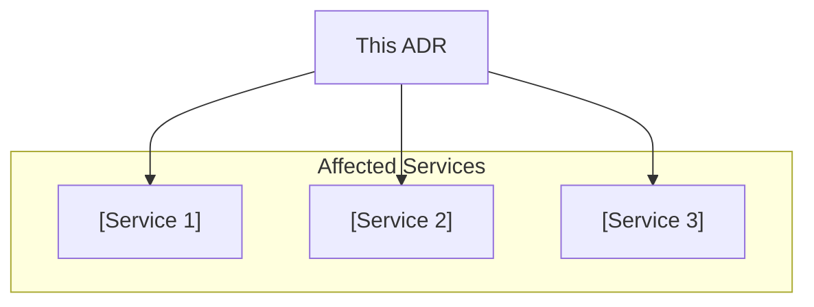

# ADR-[NUMBER]: [TITLE]

This decision record documents the choice of [technology/approach] for [component/system]. It affects engineers working on [affected areas]. Review on [review_date] or when assumptions change.

**Status:** [proposed | accepted | deprecated | superseded | implemented | rejected]
**Date:** [YYYY-MM-DD]
**Decision makers:** [@username1, @username2]

---

## Context

[What's the problem you're solving? Describe the business requirements, technical constraints, and forces at play. State facts, not opinions.]

## Decision drivers

- [Driver 1: e.g., performance requirements]
- [Driver 2: e.g., team expertise]
- [Driver 3: e.g., cost constraints]
- [Driver 4: e.g., compliance requirements]

## Considered options

### Option 1: [Name]

- **Pros:** [List advantages]
- **Cons:** [List disadvantages — don't hide them]
- **Estimated effort:** [Low/Medium/High]
- **Evidence:** [Benchmarks, vendor docs, or team experience]

### Option 2: [Name]

- **Pros:** [List advantages]
- **Cons:** [List disadvantages]
- **Estimated effort:** [Low/Medium/High]
- **Evidence:** [Benchmarks, vendor docs, or team experience]

### Option 3: [Name]

- **Pros:** [List advantages]
- **Cons:** [List disadvantages]
- **Estimated effort:** [Low/Medium/High]
- **Evidence:** [Benchmarks, vendor docs, or team experience]

## Decision

[State the decision and rationale. Why this option over the alternatives? Use active voice: "We chose X because..."]

## Consequences

### Positive

- [Positive consequence 1]
- [Positive consequence 2]

### Negative

- [Negative consequence 1 — every decision has trade-offs. If you can't name one, you haven't thought hard enough]
- [Mitigation for the above]

### Risks

- [Risk 1 and mitigation]
- [Risk 2 and mitigation]

---

## Y-statement

> In the context of [use case/component], facing [concern/requirement], we decided for [chosen option] and against [rejected options], to achieve [quality goal/benefit], accepting that [trade-off/downside].

---

## Assumptions

| # | Assumption | Impact if Wrong | Monitoring |
|---|-----------|-----------------|------------|
| 1 | [Assumption 1] | [What breaks] | [How you detect it] |
| 2 | [Assumption 2] | [What breaks] | [How you detect it] |

---

## Confirmation

Compliance with this ADR is confirmed by:

- [ ] [Design review / architecture review approved]
- [ ] [Implementation matches the decided pattern]
- [ ] [Automated test or metric threshold that validates the decision]

---

## Service impact diagram

---

## Compliance mapping

<!-- Map to any compliance framework relevant to your project. -->
<!-- If no compliance framework applies, state "N/A — no compliance implications." -->

| Framework | Control | How This ADR Addresses It |
|-----------|---------|--------------------------|
| [e.g., ISO 27001, SOC 2, GDPR, PCI-DSS, HIPAA, FedRAMP] | [Control ID — Control name] | [How this decision satisfies the control] |

---

## References

External sources that informed this decision (minimum 2–3):

| # | Source | Type | URL |
|---|--------|------|-----|
| 1 | [Technology Official Documentation] | Vendor Docs | [https://...] |
| 2 | [Research Paper / Blog Post] | Research | [https://...] |
| 3 | [Benchmark / Case Study] | Benchmark | [https://...] |

*Source types: Standard, Best Practice, Benchmark, Vendor Docs, Research, Internal*

## Related documents

- [Link to related ADRs]
- [Link to implementation PRs]
- [Link to runbooks or deployment guides]
