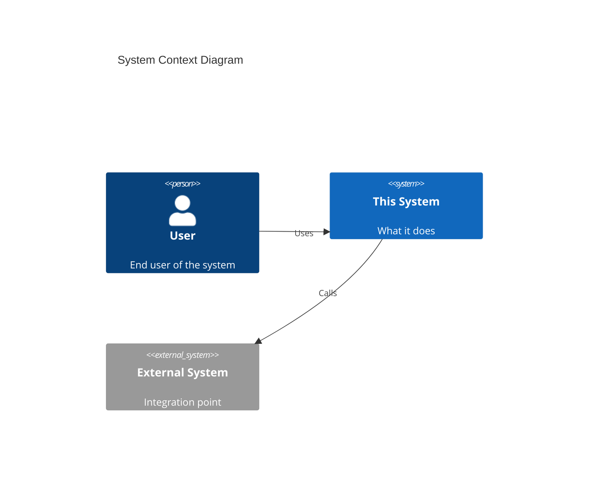
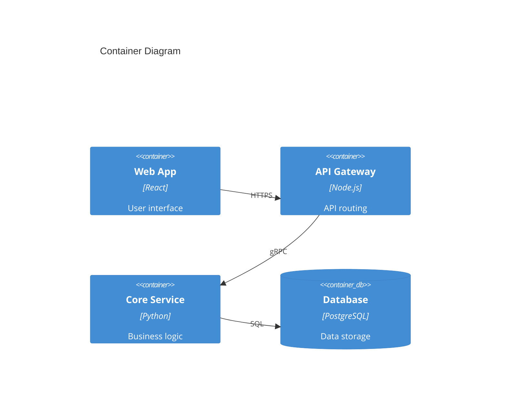
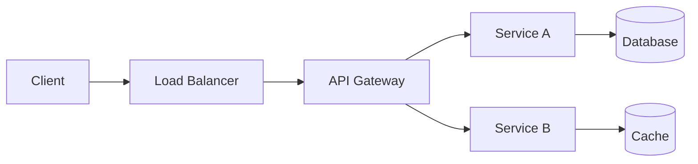

# [System/Component] Architecture

High-level architecture documentation for engineers working with [system/component]. This document covers system design, component relationships, and key technology decisions. Review before making major changes or during onboarding.

---

## Overview

[1-2 paragraph high-level description of the system]

## System Context

## Container Diagram

## Data Flow

## Key Components

| Component | Technology | Purpose | Owner |
|-----------|------------|---------|-------|
| [Component 1] | [Tech stack] | [What it does] | @team |
| [Component 2] | [Tech stack] | [What it does] | @team |

## Technology Decisions

| Decision | Choice | Rationale | ADR |
|----------|--------|-----------|-----|
| [Decision 1] | [Choice] | [Why] | [ADR-XXX](../adr/ADR-XXX.md) |
| [Decision 2] | [Choice] | [Why] | [ADR-XXX](../adr/ADR-XXX.md) |

## Non-Functional Requirements

| Requirement | Target | Current |
|-------------|--------|---------|
| Availability | 99.9% | [XX%] |
| Latency (p99) | < 200ms | [XXms] |
| Throughput | 1000 RPS | [XXX RPS] |

## Security

- **Authentication:** [Method]
- **Authorization:** [Method]
- **Data Encryption:** [At rest / In transit]
- **Secrets Management:** [Tool/method]

## Deployment

- **Infrastructure:** [Cloud provider / On-prem]
- **Orchestration:** [Kubernetes / ECS / etc.]
- **Regions:** [List of regions]

## Related Documents

| Document | Purpose |
|----------|---------|
| [ADRs](../adr/) | Architecture decisions |
| [Runbooks](../operations/runbooks/) | Operational procedures |
| [API Reference](../api/) | API documentation |
