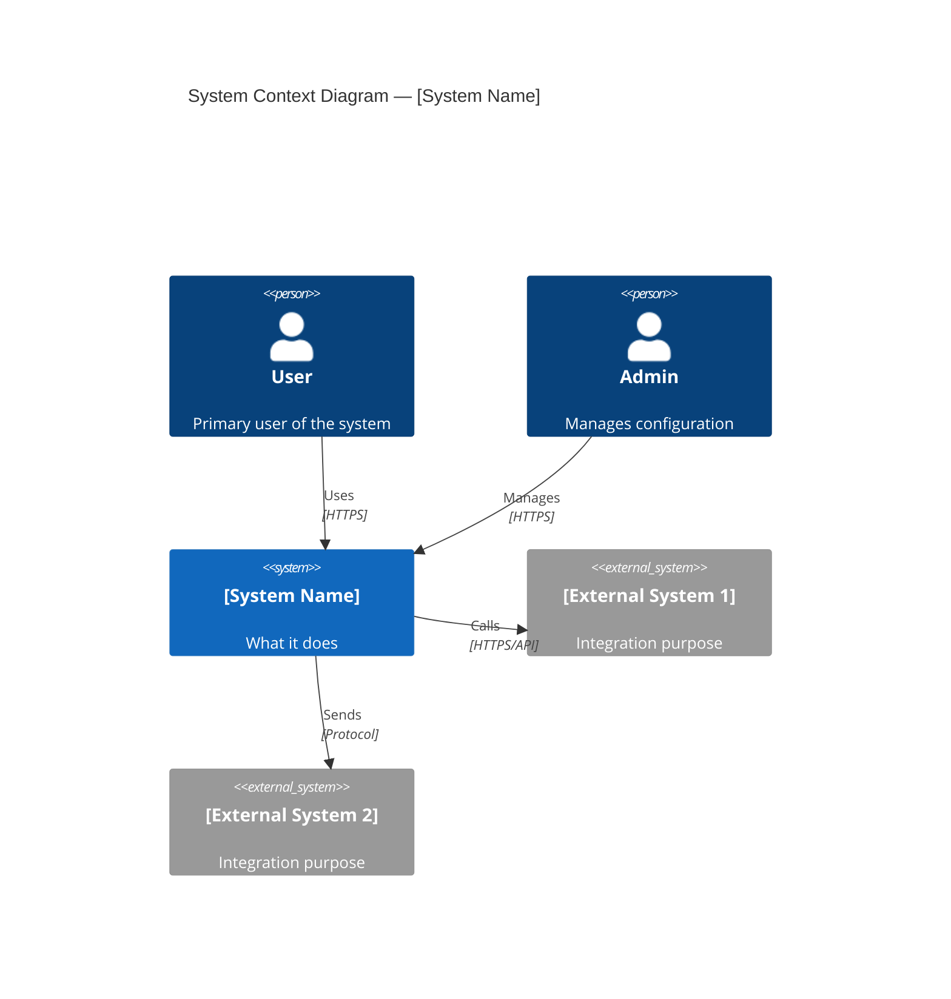
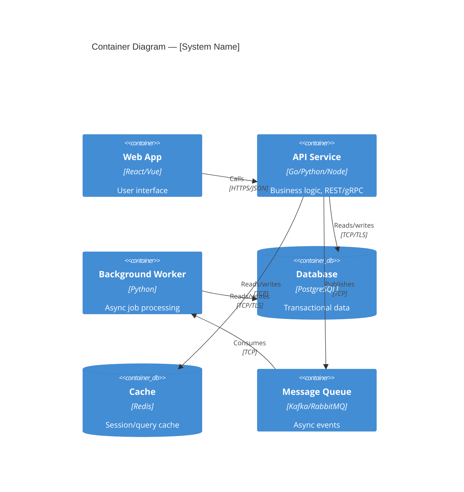
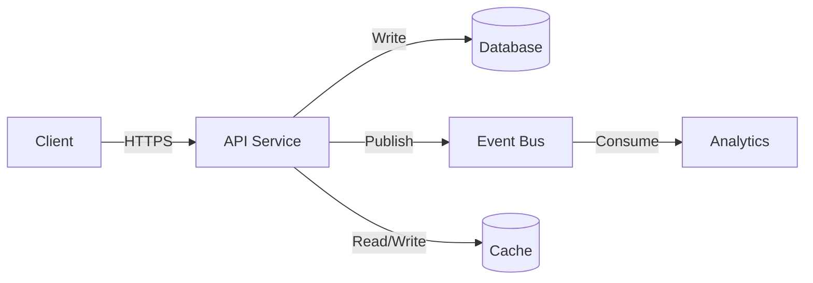
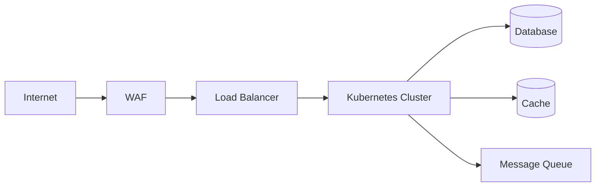

# [System/Component] Architecture

> **Purpose:** [1-2 sentences: what this system does and why this document exists.]
> Review before making major changes or during onboarding.

---

## 1. Overview

[1-2 paragraph high-level description of the system, its purpose, and key users.]

### Quality Attributes

| Attribute | Target | Rationale |
|-----------|--------|-----------|
| Availability | [e.g., 99.9%] | [e.g., Customer-facing SLA] |
| Latency (p99) | [e.g., < 200ms] | [e.g., User experience requirement] |
| Throughput | [e.g., 1000 RPS] | [e.g., Peak traffic estimate] |
| Data Residency | [e.g., EU-only] | [e.g., GDPR compliance] |

---

## 2. System Context (C4 Level 1)

```mermaid
C4Context
    title System Context Diagram — [System Name]

    Person(user, "User", "Primary user of the system")
    Person(admin, "Admin", "Manages configuration")

    System(system, "[System Name]", "What it does")

    System_Ext(external1, "[External System 1]", "Integration purpose")
    System_Ext(external2, "[External System 2]", "Integration purpose")

    Rel(user, system, "Uses", "HTTPS")
    Rel(admin, system, "Manages", "HTTPS")
    Rel(system, external1, "Calls", "HTTPS/API")
    Rel(system, external2, "Sends", "Protocol")
```

---

## 3. Container Diagram (C4 Level 2)

```mermaid
C4Container
    title Container Diagram — [System Name]

    Container(web, "Web App", "React/Vue", "User interface")
    Container(api, "API Service", "Go/Python/Node", "Business logic, REST/gRPC")
    Container(worker, "Background Worker", "Python", "Async job processing")
    ContainerDb(db, "Database", "PostgreSQL", "Transactional data")
    ContainerDb(cache, "Cache", "Redis", "Session/query cache")
    Container(queue, "Message Queue", "Kafka/RabbitMQ", "Async events")

    Rel(web, api, "Calls", "HTTPS/JSON")
    Rel(api, db, "Reads/writes", "TCP/TLS")
    Rel(api, cache, "Reads/writes", "TCP")
    Rel(api, queue, "Publishes", "TCP")
    Rel(queue, worker, "Consumes", "TCP")
    Rel(worker, db, "Reads/writes", "TCP/TLS")
```

---

## 4. Key Components

| Component | Technology | Purpose | Owner | Repository |
|-----------|------------|---------|-------|------------|
| [Component 1] | [Tech stack] | [What it does] | @team | `org/repo` |
| [Component 2] | [Tech stack] | [What it does] | @team | `org/repo` |
| [Component 3] | [Tech stack] | [What it does] | @team | Managed service |

---

## 5. Data Architecture

### Data Stores

| Store | Technology | Data Classification | Backup | Retention |
|-------|------------|-------------------|--------|-----------|
| Primary DB | PostgreSQL | Confidential | Daily snapshots | 7 years |
| Cache | Redis | Internal | None (ephemeral) | TTL-based |
| Event Log | Kafka | Internal | 7-day retention | 30 days |

### Data Flow

```mermaid
flowchart LR
    A[Client] -->|HTTPS| B[API Service]
    B -->|Write| C[(Database)]
    B -->|Publish| D[Event Bus]
    D -->|Consume| E[Analytics]
    B -->|Read/Write| F[(Cache)]
```

1. **Write Path:** Client → API → Database → Event Bus
2. **Read Path:** Client → API → Cache (hit) or Database (miss)
3. **Analytics:** Event Bus → Stream Processor → Data Warehouse

<!-- If you handle PII, add a PII data flow diagram showing where personal data flows and where it's stored -->

---

## 6. Infrastructure & Deployment

### Environments

| Environment | Region | Nodes | Purpose |
|-------------|--------|-------|---------|
| Production | [Region] | [N] | Live traffic |
| Staging | [Region] | [N] | Pre-production testing |
| Development | [Region] | [N] | Developer testing |

### Deployment Diagram

```mermaid
graph LR
    Internet --> WAF[WAF]
    WAF --> LB[Load Balancer]
    LB --> K8s[Kubernetes Cluster]
    K8s --> DB[(Database)]
    K8s --> Cache[(Cache)]
    K8s --> Queue[Message Queue]
```

### Auto-scaling

| Service | Min | Max | Trigger |
|---------|-----|-----|---------|
| [Service 1] | [N] | [N] | [e.g., CPU > 70%] |
| [Service 2] | [N] | [N] | [e.g., Queue depth > 100] |

---

## 7. Cross-Cutting Concerns

### Security

- **Authentication:** [Method — e.g., OIDC via Keycloak, JWT]
- **Authorization:** [Method — e.g., RBAC, ABAC]
- **Data Encryption:** [At rest: AES-256 / In transit: TLS 1.3]
- **Secrets Management:** [Tool — e.g., HashiCorp Vault, AWS Secrets Manager]

### Security Boundaries

| Zone | Access Level | Components | Controls |
|------|-------------|------------|----------|
| Public | Internet | CDN, Load Balancer | WAF, DDoS protection |
| DMZ | VPN only | API Gateway | mTLS, rate limiting |
| Private | Service mesh | Core services | mTLS, network policies |
| Restricted | Bastion only | Databases, secrets | IAM, encryption at rest |

### Observability

- **Logging:** [Tool — e.g., structured JSON to ELK/Datadog]
- **Tracing:** [Tool — e.g., OpenTelemetry → Jaeger/Tempo]
- **Metrics:** [Tool — e.g., Prometheus → Grafana]
- **Alerting:** [Tool — e.g., PagerDuty, OpsGenie]

### Error Handling

- **Error format:** [e.g., Standard error catalog — see docs/errors/]
- **Retry policy:** [e.g., Exponential backoff with jitter, max 3 retries]
- **Circuit breaker:** [e.g., Hystrix/Resilience4j, 5-error threshold]

---

## 8. Technology Decisions

| Decision | Choice | Rationale | ADR |
|----------|--------|-----------|-----|
| [Decision 1] | [Choice] | [Why] | [ADR-XXX](../adr/ADR-XXX.md) |
| [Decision 2] | [Choice] | [Why] | [ADR-XXX](../adr/ADR-XXX.md) |
| [Decision 3] | [Choice] | [Why] | [ADR-XXX](../adr/ADR-XXX.md) |

---

## 9. Disaster Recovery

| Component | RPO | RTO | Backup Strategy |
|-----------|-----|-----|-----------------|
| Database | [e.g., 1 hour] | [e.g., 4 hours] | [e.g., Automated snapshots] |
| Secrets | [e.g., 0] | [e.g., 1 hour] | [e.g., Multi-region vault] |
| Configuration | [e.g., 0] | [e.g., 30 min] | [e.g., GitOps] |

---

## Related Documents

| Document | Purpose |
|----------|---------|
| [ADRs](../adr/) | Architecture decisions |
| [Service Catalog](./SERVICE_CATALOG.md) | Individual service docs |
| [Runbooks](../operations/runbooks/) | Operational procedures |
| [API Reference](../api/) | API documentation |
| [Error Catalog](../errors/) | Error code reference |

<!--
Scaling guide (from 44-ARCHITECTURE.md standard):
- Solo/OSS: Sections 1, 2, 4 only (Overview + Context diagram + Components)
- Team/Startup: All sections, C4 Levels 1-2, key ADRs
- Enterprise: All sections + compliance mapping + fitness functions
-->
