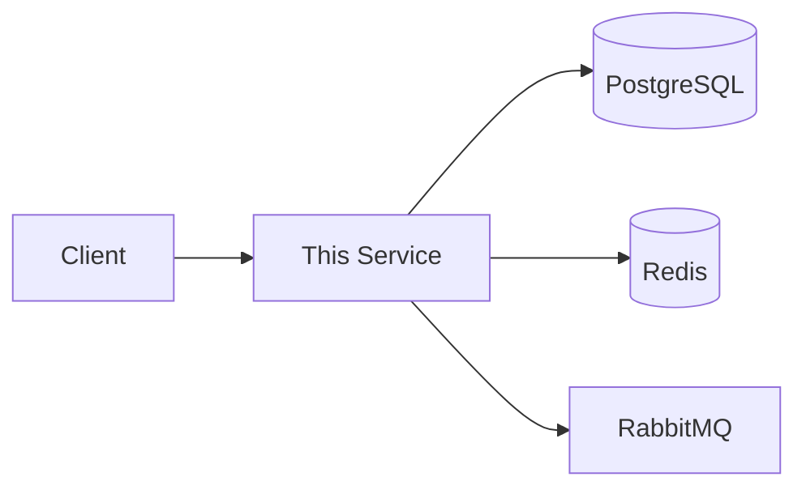

# [Service Name]

[One sentence describing what this service does and who uses it.]

This service handles [core functionality] for [target users/systems]. It's part of the [platform/system name] and provides [key business value]. Use this documentation when integrating with or maintaining this service.

---

## Overview

| Property | Value |
|----------|-------|
| **Owner** | @team-name |
| **Lifecycle** | production / staging / experimental |
| **Language** | Python / Node.js / Go / etc. |
| **Port** | 8080 |

## Quick Start

```bash
# Clone and setup
git clone https://github.com/org/[service-name].git
cd [service-name]

# Start dependencies
docker-compose up -d

# Run locally
make dev
# → http://localhost:8080
```

## Project Structure

This service follows the standard FastAPI microservice architecture:

```
[service-name]/
├── main.py                 # FastAPI application entry point
├── config.py               # Environment configuration
├── core/                   # Core utilities
│   ├── __init__.py
│   └── telemetry.py        # OpenTelemetry instrumentation
├── models/                 # Pydantic data models
│   ├── __init__.py
│   └── [domain].py
├── routes/                 # API route handlers
│   ├── __init__.py
│   └── [endpoint].py
├── services/               # Business logic layer
│   ├── __init__.py
│   └── [service]_client.py
├── middleware/             # Request/response middleware (optional)
│   ├── __init__.py
│   └── rate_limit.py
└── Dockerfile
```

### Import Conventions

- **Entry point**: `main.py` (not `app.py`)
- **Telemetry**: `from core.telemetry import setup_telemetry`
- **Business logic**: `from services.[name]_client import ...`
- **Models**: `from models.[domain] import ...`

> **Note**: This structure follows your organization's infrastructure code standards. Document your microservice structure rationale in your ARCHITECTURE.md.

## Architecture



## API

| Endpoint | Method | Description |
|----------|--------|-------------|
| `/health` | GET | Health check |
| `/api/v1/resources` | GET | List resources |
| `/api/v1/resources` | POST | Create resource |

See full API spec: [openapi.yaml](./docs/api/openapi.yaml)

## Configuration

| Variable | Required | Default | Description |
|----------|----------|---------|-------------|
| `DATABASE_URL` | Yes | - | PostgreSQL connection string |
| `REDIS_URL` | No | `redis://localhost:6379` | Redis connection |
| `LOG_LEVEL` | No | `info` | Logging level |

## Dependencies

| Service | Purpose | Required |
|---------|---------|----------|
| PostgreSQL | Primary data store | Yes |
| Redis | Session cache | No |
| RabbitMQ | Async jobs | No |

## Development

```bash
# Run tests
make test

# Run linter
make lint

# Build Docker image
make build
```

## Deployment

- **Staging:** Auto-deploy on merge to `main`
- **Production:** Deploy on release tag `v*`

See [deployment docs](./docs/DEPLOYMENT.md) for details.

## Monitoring

| Dashboard | Link |
|-----------|------|
| Grafana | [Service Dashboard](https://grafana.example.com/d/service-name) |
| Logs | [Loki](https://loki.example.com/explore?service=service-name) |
| Alerts | [PagerDuty](https://pagerduty.com/services/XXXXX) |

## On-Call

- **Runbook:** [docs/RUNBOOK.md](./docs/RUNBOOK.md)
- **Escalation:** @team-name → @platform-team → @engineering-leads

## Related Documents

| Document | Purpose |
|----------|---------|
| [Architecture](./docs/ARCHITECTURE.md) | System design |
| [API Reference](./docs/api/README.md) | API documentation |
| [Runbook](./docs/RUNBOOK.md) | Operational procedures |
